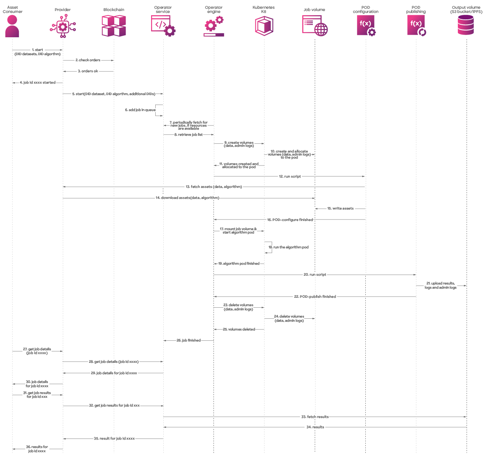

🚀  Now that we've introduced the key actors and provided an overview of the process, it's time to delve into the nitty-gritty of the compute workflow. We'll dissect each step, examining the inner workings of Compute-to-Data (C2D). From data selection to secure computations, we'll leave no stone unturned in this exploration. 

For visual clarity, here's an image of the workflow in action! 🖼️✨

<figure><figcaption>
Compute detailed flow diagram
</figcaption></figure>

Below, we'll outline each step in detail 📝

## Starting a C2D Job
The consumer selects a preferred environment from the provider's list and initiates a compute-to-data job by choosing a data asset-algorithm pair along with the preferred compute environment.
2. The provider checks the orders on the blockchain.
3. If the orders for data asset, algorithm and compute environment fees are valid, the provider can commence the compute flow.
4. The provider informs the consumer of the job number's successful creation.
5. With the job ID and confirmation of the orders, the consumer starts the job by calling the operator service.
6. The operator service communicates with the operator engine to initiate a new job.

## Creating the K8 Cluster and Allocating Job Volumes
7. As a new job begins, volumes are created on the Kubernetes cluster, a task handled by the operator engine.
8. The cluster creates and allocates volumes for the job using the job volumes
9. The volumes are created and allocated to the pod
10. After volume creation and allocation, the operator engine initiates the `run script` on the pod configuration.

## Loading Assets and Algorithms
11. The pod configuration requires the data asset and algorithm, prompting a request to the provider for retrieval.
12. The provider uploads assets to the allocated job volume.
13. Upon completion of file uploads, the provider notifies the pod configuration that the assets are ready for the job.
14. The pod configuration informs the operator engine that it's ready to start the job.

## Running the Algorithm on Data Asset(s)
15. The operator engine launches the algorithm pod on the Kubernetes cluster, with volume containing data asset(s) and algorithm mounted.
16. Kubernetes runs the algorithm pod.
17. When the algorithm completes processing the dataset, the operator engine receives confirmation.
18. Now that the results are available, the operator engine runs the script on the pod publishing component.
19. The pod publishing uploads the results, logs, and admin logs to the output volume.
20. Upon successful upload, the operator engine receives notification from the pod publishing, allowing it to clean up the job volumes.

## Cleaning Up Volumes and Allocated Space
21. The operator engine deletes the K8 volumes.
22. The Kubernetes cluster removes all used volumes.
23. Once volumes are deleted, the operator engine finalizes the job.
24. The operator engine informs the operator service that the job is completed, and the results are now accessible.

## Retrieving Job Details
25. The consumer retrieves job details by calling the provider's `get job details`.
26. The provider communicates with the operator service to fetch job details.
27. The operator service returns the job details to the provider.
28. With the job details, the provider can share them with the asset consumer.

## Retrieving Job Results
29. Equipped with job details, the asset consumer can retrieve the results from the recently executed job.
30. The provider engages the operator engine to access the job results.
31. As the operator service lacks access to this information, it uses the output volume to fetch the results.
32. The output volume provides the stored job results to the operator service.
33. The operator service shares the results with the provider.
34. The provider then delivers the results to the asset consumer.

