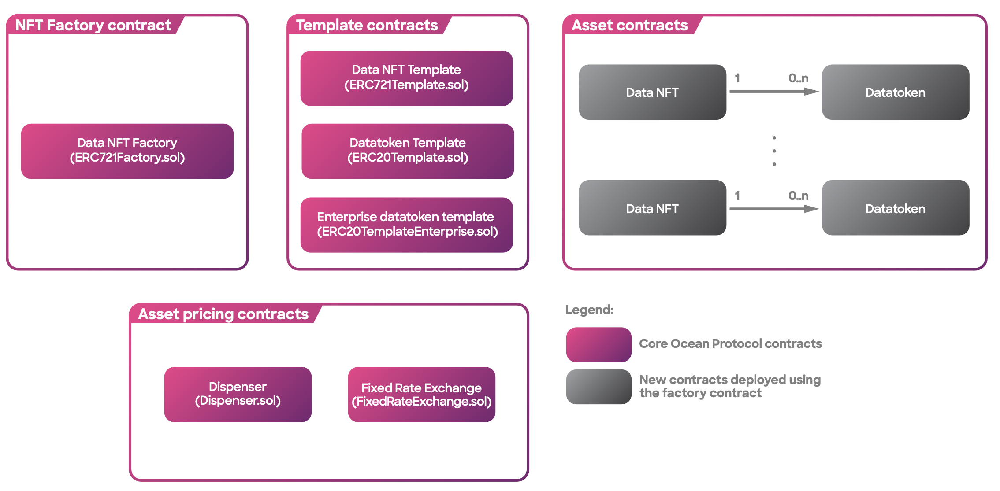

# Contracts

The suite of smart contracts serve as the backbone of the decentralized data economy. These contracts facilitate secure, transparent, and efficient interactions among data providers, consumers, and ecosystem participants.

The smart contracts have been deployed across multiple [networks](networks.md) and are readily accessible through the GitHub [repository](https://github.com/oceanprotocol/contracts/tree/main/contracts). They introduced significant enhancements that encompass the following key **features**:

### [**Data NFTs**](data-nfts.md) **for Enhanced Data IP Management**

In Ocean V3, the publication of a dataset involved deploying an ERC20 "datatoken" contract along with relevant [metadata](../metadata.md). This process allowed the dataset publisher to claim copyright or exclusive rights to the underlying Intellectual Property (IP). Upon obtaining 1.0 ERC20 datatokens for a particular dataset, users were granted a license to consume that dataset, utilizing the Ocean infrastructure by spending the obtained datatokens.

However, Ocean V3 faced limitations in terms of flexibility. It lacked support for different licenses associated with the same base IP, such as 1-day versus 1-month access, and the transferability of the base IP was not possible. Additionally, the ERC20 datatoken template was hardcoded, restricting customization options.

Ocean V4 effectively tackles these challenges by adopting **ERC721** **tokens** to explicitly represent the **base IP** as "data NFTs" (Non-Fungible Tokens). [**Data NFT**](data-nfts.md) owners can now deploy ERC20 "datatoken" contracts specific to their data NFTs, with each datatoken contract offering its own distinct licensing terms.

By utilizing ERC721 tokens, Ocean **grants data creators greater flexibility and control over licensing arrangements**. The introduction of data NFTs allows for the representation of [base IP](../../discover/glossary.md) and the creation of customized ERC20 datatoken contracts tailored to individual licensing requirements.

<figure><figcaption>
Ocean Protocol Smart Contracts
</figcaption></figure>

### [**Community monetization**](broken-reference), to help the community create sustainable businesses.

Ocean brings forth enhanced opportunities for dApp owners, creating a conducive environment for the emergence of a thriving market of **third-party Providers**.

With Ocean, dApp owners can unlock additional benefits. Firstly, the smart contracts empower dApp owners to collect [fees](fees.md) not only during **data consumption** but also through **fixed-rate exchanges**. This expanded revenue model allows owners to derive more value from the ecosystem. Moreover, in Ocean, the dApp operator has the authority to determine the fee value, providing them with **increased control** over their pricing strategies.

In addition to empowering dApp owners, Ocean facilitates the participation of third-party [Providers](../old-infrastructure/provider/) who can offer compute services in exchange for a fee. This paves the way for the development of a diverse marketplace of Providers. This model supports both centralized trusted providers, where data publishers and consumers have established trust relationships, as well as trustless providers that leverage decentralization or other privacy-preserving mechanisms.

By enabling a marketplace of [Providers](../old-infrastructure/provider/), Ocean fosters competition, innovation, and choice. It creates an ecosystem where various providers can offer their compute services, catering to the diverse needs of data publishers and consumers. Whether based on trust or privacy-preserving mechanisms, this expansion in provider options enhances the overall functionality and accessibility of the Ocean Protocol ecosystem.

Key features of the smart contracts:

* Base IP is now represented by a data [NFT](data-nfts.md), from which a data publisher can create multiple ERC20s [datatokens](datatokens.md) representing different types of access for the same dataset.
* Interoperability with the NFT ecosystem (and DeFi & DAO tools).
* Allows new data [NFT & datatoken templates](datatoken-templates.md), for flexibility and future-proofing.
* Besides base data IP, you can use data NFTs to **implement comments & ratings, verifiable claims, identity credentials, and social media posts**. They can point to parent data NFTs, enabling the nesting of comments on comments, or replies to tweets. All on-chain, GDPR-compliant, easily searched, with js & py drivers 🤯
* Introduce an advanced [Fee](fees.md) structure both for dApp and provider runners 💰
* [Roles](roles.md) Administration: there are now multiple roles for a more flexible administration both at [NFT](data-nfts.md) and [ERC20](datatokens.md) levels 👥
* When the NFT is transferred, it auto-updates all permissions, e.g. who receives payment, or who can mint derivative ERC20 datatokens.
* Key-value store in the NFT contract: NFT contract can be used to store custom key-value pairs (ERC725Y standard) enabling applications like soulbound tokens and Sybil protection approaches 🗃️
* Multiple NFT template support: the Factory can deploy different types of NFT templates 🖼️
* Multiple datatoken template support: the Factory can deploy different types of [datatoken templates](datatoken-templates.md).

In the forthcoming pages, you will discover more information about the key features. If you have any inquiries or find anything missing, feel free to contact the core team on [Discord](https://discord.com/invite/TnXjkR5) 💬
