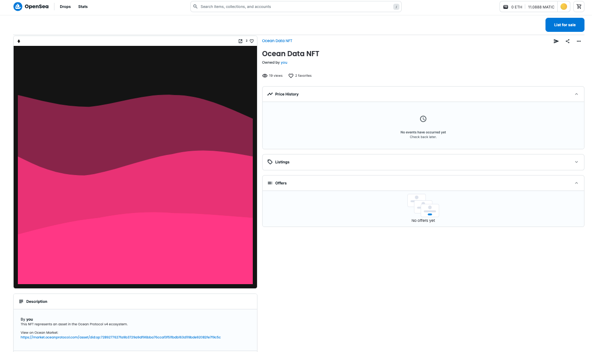

# Data NFTs

A non-fungible token stored on the blockchain represents a unique asset. NFTs can represent images, videos, digital art, or any piece of information. NFTs can be traded, and allow the transfer of copyright/base IP. [EIP-721](https://eips.ethereum.org/EIPS/eip-721) defines an interface for handling NFTs on EVM-compatible blockchains. The creator of the NFT can deploy a new contract on Ethereum or any Blockchain supporting NFT-related interface and also, transfer the ownership of copyright/base IP through transfer transactions.

## What is a Data NFT?

A data NFT represents the **copyright** (or **exclusive license** against copyright) for a data asset on the blockchain — we call this the “**base IP**”. When a user publishes a dataset in Ocean, they create a new NFT as part of the process. This data NFT is proof of your claim of base IP. Assuming a valid claim, you are entitled to the revenue from that asset, just like a title deed gives you the right to receive rent.

The data NFT smart contract holds metadata about the data asset, stores roles like “who can mint datatokens” or “who controls fees”, and an open-ended key-value store to enable custom fields.

If you have the private key that controls the NFT, you own that NFT. The owner has the claim on the base IP and is the default recipient of any revenue. They can also assign another account to receive revenue. This enables the publisher to sell their base IP and the revenues that come with it. When the Data NFT is transferred to another user, all the information about roles and where the revenue should be sent is reset. The default recipient of the revenue is the new owner of the data NFT.

### Key Features and Functionality

Data NFTs offer several key features and functionalities within the Ocean Protocol ecosystem:

1. **Ownership and Transferability**: Data NFTs establish ownership rights, enabling data owners to transfer or sell their data assets to other participants in the network.
2. **Metadata and Descriptions**: Each Data NFT contains metadata that describes the associated dataset, providing essential information such as title, description, creator, and licensing terms.
3. **Access Control and Permissions**: Data NFTs can include access control mechanisms, allowing data owners to define who can access and utilize their datasets, as well as the conditions and terms of usage.
4. **Interoperability**: Data NFTs conform to the ERC721 token standard, ensuring interoperability across various platforms, wallets, and marketplaces within the Ethereum ecosystem.

#### Data NFTs Open Up New Possibilities

By tokenizing data assets into Data NFTs, data owners can establish clear ownership rights and enable seamless transferability of the associated datasets. Data NFTs serve as digital certificates of authenticity, enabling data consumers to trust the origin and integrity of the data they access.

With data NFTs, you are able to take advantage of the broader NFT ecosystem and all the tools and possibilities that come with it. As a first example, many leading crypto wallets have first-class support for NFTs, allowing you to manage data NFTs from those wallets. Or, you can post your data NFT for sale on a popular NFT marketplace like [OpenSea](https://www.opensea.io/) or [Rarible](https://www.rarible.com/). As a final example, we’re excited to see [data NFTs linked to physical items via WiseKey chips](https://www.globenewswire.com/news-release/2021/05/19/2232106/0/en/WISeKey-partners-with-Ocean-Protocol-to-launch-TrustedNFT-io-a-decentralized-marketplace-for-objects-of-value-designed-to-empower-artists-creators-and-collectors-with-a-unique-solu.html).

### Implementation in Ocean Protocol

We have implemented data NFTs using the [ERC721 standard](https://erc721.org/). Ocean Protocol defines the [ERC721Factory](https://github.com/oceanprotocol/contracts/blob/main/contracts/ERC721Factory.sol) contract, allowing **Base IP holders** to create their ERC721 contract instances on any supported networks. The deployed contract stores Metadata, ownership, sub-license information, and permissions. The contract creator can also create and mint ERC20 token instances for sub-licensing the **Base IP**.

ERC721 tokens are non-fungible, and thus cannot be used for automatic price discovery like ERC20 tokens. ERC721 and ERC20 combined together can be used for sub-licensing. Ocean Protocol's [ERC721Template](https://github.com/oceanprotocol/contracts/blob/main/contracts/templates/ERC721Template.sol) solves this problem by using ERC721 for tokenizing the **Base IP** and tokenizing sub-licenses by using ERC20. To save gas fees, it uses [ERC1167](https://eips.ethereum.org/EIPS/eip-1167) proxy approach on the **ERC721 template**.

Our implementation has been built on top of the battle-tested [OpenZeppelin contract library](https://docs.openzeppelin.com/contracts/4.x/erc721). However, there are a bunch of interesting parts of our implementation that go a bit beyond an out-of-the-box NFT. The data NFTs can be easily managed from any NFT marketplace like [OpenSea](https://opensea.io/).

<figure><figcaption>
Data NFT on Open Sea
</figcaption></figure>

Ocean’s data NFT factory can deploy different types of data NFTs based on a variety of templates. Some templates could be tuned for data unions, others for DeFi, and others yet for enterprise use cases.

Something else that we’re super excited about in our data NFTs is a cutting-edge standard called [ERC725](https://github.com/ERC725Alliance/erc725/blob/main/docs/ERC-725.md) being driven by our friends at [Lukso](https://lukso.network/about). The ERC725y feature enables the NFT owner (or a user with the “store updater” role) to input and update information in a key-value store. These values can be viewed externally by anyone.

ERC725y is incredibly flexible and can be used to store any string; you could use it for anything from additional metadata to encrypted values. This helps future-proof the data NFTs and ensure that they are suitable for a wide range of projects that have not been launched yet. As you can imagine, the inclusion of ERC725y has huge potential and we look forward to seeing the different ways people end up using it. If you’re interested in using this, take a look at [EIP725](https://eips.ethereum.org/EIPS/eip-725#erc725y).
