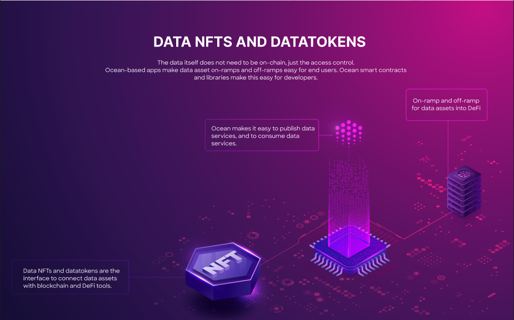
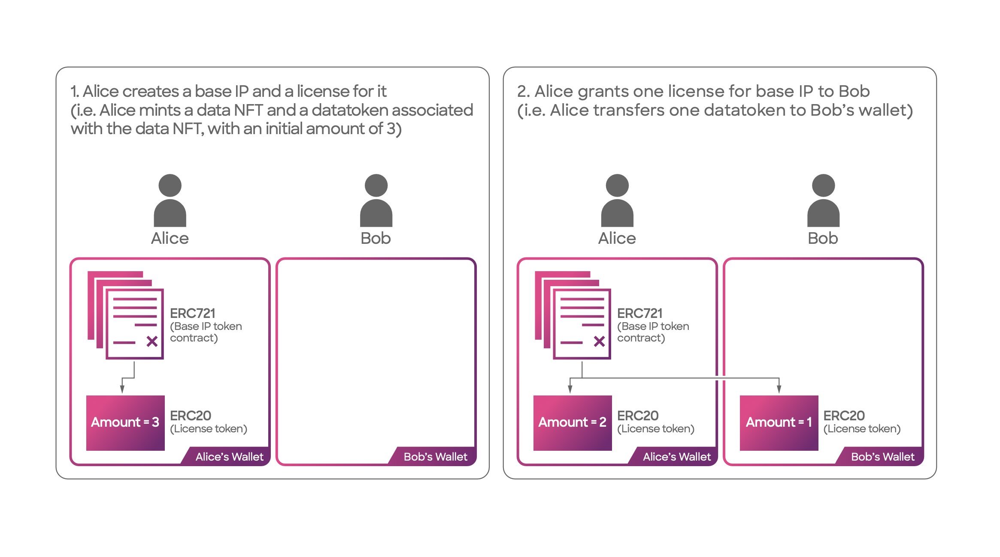

# Data NFTs and Datatokens

<figure><figcaption>
Data NFTs and Datatokens
</figcaption></figure>

In summary: A [**data NFT**](data-nfts.md) serves as a **representation of the copyright** or exclusive license for a data asset on the blockchain, known as the [**base IP**](../../discover/glossary.md). **Datatokens**, on the other hand, function as a crucial mechanism for **decentralized access** to data assets.

For a specific data NFT, multiple ERC20 datatoken contracts can exist. Here's the main concept: Owning 1.0 datatokens grants you the ability to **consume** the corresponding dataset. Essentially, it acts as a **sub-license** from the [base IP](../../discover/glossary.md), allowing you to utilize the dataset according to the specified license terms (when provided by the publisher). License terms can be established with a "good default" or by the Data NFT owner.

The choice to employ the ERC20 fungible token standard for datatokens is logical, as licenses themselves are fungible. This standard ensures compatibility and interoperability of datatokens with ERC20-based wallets, decentralized exchanges (DEXes), decentralized autonomous organizations (DAOs), and other relevant platforms. Datatokens can be transferred, acquired through marketplaces or exchanges, distributed via airdrops, and more.

You can [publish](../../discover/glossary.md) a data NFT initially with no ERC20 datatoken contracts. This means you simply aren’t ready to grant access to your data asset yet (sub-license it). Then, you can publish one or more ERC20 datatoken contracts against the data NFT. One datatoken contract might grant consume rights for **1 day**, another for **1 week**, etc. Each different datatoken contract is for **different** license terms.

For a more comprehensive exploration of intellectual property and its practical connections with ERC721 and ERC20, you can read the blog post written by [Trent McConaghy](http://www.trent.st/), co-founder of Ocean Protocol. It delves into the subject matter in detail and provides valuable insights.



**DataNFTs and Datatokens example:**

* In step 1, Alice **publishes** her dataset with Ocean: this means deploying an ERC721 data NFT contract (claiming copyright/base IP), then an ERC20 datatoken contract (license against base IP). Then Alice mints an ERC20 datatokens
* In step 2, Alice **transfers** 1.0 of them to Bob's wallet; now he has a license to be able to download that dataset.

<figure><figcaption>
Data NFT &#x26; Datatokens flow
</figcaption></figure>

What happends under the hood? 🤔

Publishing with V4 smart contracts in Ocean Protocol involves a well-defined process that streamlines the publishing of data assets. It provides a systematic approach to ensure efficient management and exchange of data within the Ocean Protocol ecosystem. By leveraging smart contracts, publishers can securely create and deploy data NFTs, allowing them to tokenize and represent their data assets. Additionally, the flexibility of V4 smart contracts enables publishers to define pricing schemas for datatokens, facilitating fair and transparent transactions. This publishing framework empowers data publishers by providing them with greater control and access to a global marketplace, while ensuring trust, immutability, and traceability of their published data assets.

The V4 smart contracts publishing includes the following steps:

1. The data publisher initiates the creation of a new data NFT.
2. The data NFT factory deploys the template for the new data NFT.
3. The data NFT template creates the data NFT contract.
4. The address of the newly created data NFT is available to the data publisher.
5. The publisher is now able to create datatokens with pricing schema for the data NFT. To accomplish this, the publisher initiates a call to the data NFT contract, specifically requesting the creation of a new datatoken with a fixed rate schema.
6. The data NFT contract deploys a new datatoken and a fixed rate schema by interacting with the datatoken template contract.
7. The datatoken contract is created (Datatoken-1 contract).
8. The datatoken template generates a new fixed rate schema for Datatoken-1.
9. The address of Datatoken-1 is now available to the data publisher.
10. Optionally, the publisher can create a new datatoken (Datatoken-2) with a free price schema.
11. The data NFT contract interacts with the Datatoken Template contract to create a new datatoken and a dispenser schema.
12. The datatoken templated deploys the Datatoken-2 contract.
13. The datatoken templated creates a dispenser for the Datatoken-2 contract.

Below is a visual representation that illustrates the flow:

<figure><figcaption>
Data NFT &#x26; Datatokens flow
</figcaption></figure>

We have some awesome hands-on experience when it comes to publishing a data NFT and minting datatokens.

* Publish using [ocean.py](../ocean.py/publish-flow.md)
* Publish using [ocean.js](../ocean.js/publish.md)

### Other References

* [Data & NFTs 1: Practical Connections of ERC721 with Intellectual Property](https://blog.oceanprotocol.com/nfts-ip-1-practical-connections-of-erc721-with-intellectual-property-dc216aaf005d)
* [Data & NFTs 2: Leveraging ERC20 Fungibility](https://blog.oceanprotocol.com/nfts-ip-2-leveraging-erc20-fungibility-bcee162290e3)
* [Data & NFTs 3: Combining ERC721 & ERC20](https://blog.oceanprotocol.com/nfts-ip-3-combining-erc721-erc20-b69ea659115e)
* [Fungibility sightings in NFTs](https://blog.oceanprotocol.com/on-difficult-to-explain-fungibility-sightings-in-nfts-26bc18620f70)
