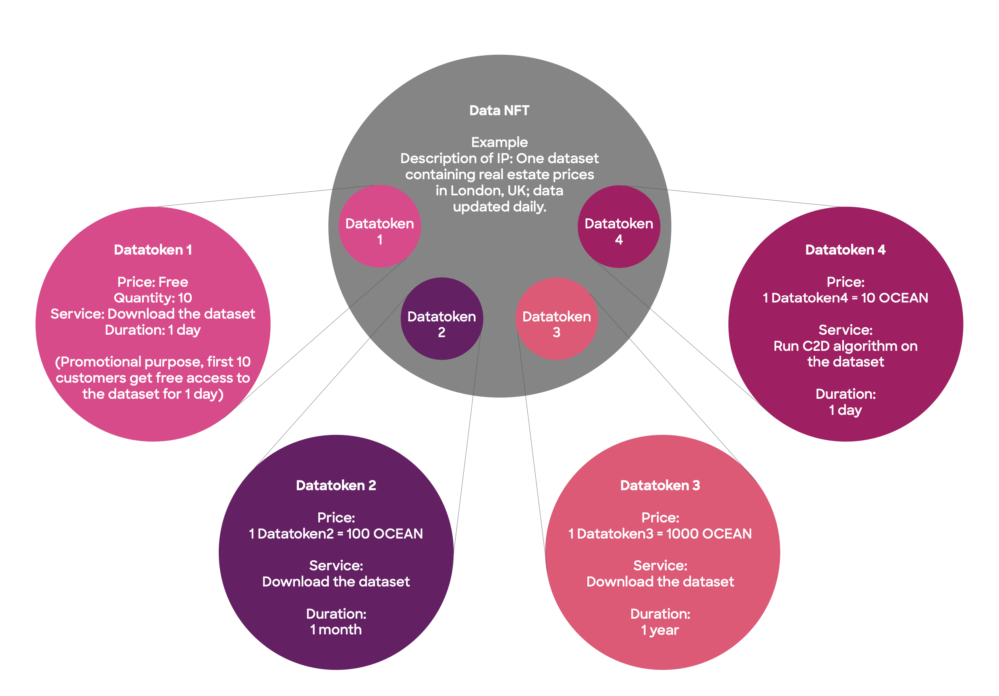

# Pricing Schemas

Ocean Protocol offers you flexible and customizable pricing options to monetize your valuable data assets. You have two main pricing models to choose from:

* [Fixed pricing](pricing-schemas.md#fixed-pricing)
* [Free pricing](pricing-schemas.md#free-pricing)

These models are designed to cater to your specific needs and ensure a smooth experience for data consumers.

The price of an asset is determined by the number of tokens (this can be OCEAN or any ERC20 Token configured when published the asset) a buyer must pay to access the data. When users pay the tokens, they get a _datatoken_ in their wallets, a tokenized representation of the access right stored on the blockchain. To read more about datatoken and data NFT click [here](datanft-and-datatoken.md).

To provide you with even greater flexibility in monetizing your data assets, Ocean Protocol allows you to customize the pricing schema by configuring your own ERC20 token when publishing the asset. This means that instead of using OCEAN as the pricing currency, you can utilize your own token, aligning the pricing structure with your specific requirements and preferences.

You can customised your token this way:



```javascript
NEXT_PUBLIC_OCEAN_TOKEN_ADDRESS='0x00000' // YOUR TOKEN'S ADDRESS
```



<pre class="language-javascript"><code class="lang-javascript"><strong>// https://github.com/oceanprotocol/ocean.js/blob/main/CodeExamples.md#61-publish-a-dataset-create-nft--datatoken-with-a-fixed-rate-exchange
</strong><strong>const freParams: FreCreationParams = {
</strong>    fixedRateAddress: addresses.FixedPrice,
    baseTokenAddress: addresses.Ocean, // you can customize this with any ERC20 token
    owner: await publisherAccount.getAddress(),
    marketFeeCollector: await publisherAccount.getAddress(),
    baseTokenDecimals: 18,
    datatokenDecimals: 18,
    fixedRate: '1',
    marketFee: '0.001',
    allowedConsumer: ZERO_ADDRESS,
    withMint: true
}
</code></pre>



```python
exchange_args = ExchangeArguments(
 rate=to_wei(1), # you can customize this with any price
 base_token_addr=OCEAN.address, # you can customize this with any ERC20 token
 owner_addr=publisher_wallet.address,
 publish_market_fee_collector=ZERO_ADDRESS,
 publish_market_fee=0,
 allowed_swapper=ZERO_ADDRESS,
 full_info=False,
 dt_decimals=datatoken.decimals()
)
```



Furthermore, Ocean Protocol recognizes that different data assets may have distinct pricing needs. That's why the platform supports multiple pricing schemas, allowing you to implement various pricing models for different datasets or use cases. This flexibility ensures that you can tailor the pricing strategy to each specific asset, maximizing its value and potential for monetization.

<figure><figcaption><p>Pricing Schemas</p></figcaption></figure>

### Fixed pricing

With the fixed pricing model, you have the power to set a specific price for your data assets. This means that buyers interested in accessing your data will need to pay the designated amount of configured tokens. To make things even easier, Ocean automatically creates a special token called a "datatoken" behind the scenes.

This datatoken represents the access right to your data, so buyers don't have to worry about the technical details. If you ever want to adjust the price of your dataset, you have the flexibility to do so whenever you need.

The fixed pricing model relies on the [createWithDecimals](https://github.com/oceanprotocol/contracts/blob/d288e3f94cf6ba2be151a3284da0a3606a263bb9/contracts/pools/fixedRate/FixedRateExchange.sol#L201) in the smart contract, which securely stores the pricing information for assets published using this model.

<details>

<summary>Create NFT with Fixed Rate Pricing</summary>

```javascript
/**
 * @dev createNftWithErc20WithFixedRate
 *      Creates a new NFT, then a ERC20, then a FixedRateExchange, all in one call
 *      Use this carefully, because if Fixed Rate creation fails, you are still going to pay a lot of gas
 * @param _NftCreateData input data for NFT Creation
 * @param _ErcCreateData input data for ERC20 Creation
 * @param _FixedData input data for FixedRate Creation
 */
function createNftWithErc20WithFixedRate(
NftCreateData calldata _NftCreateData,
ErcCreateData calldata _ErcCreateData,
FixedData calldata _FixedData
) external nonReentrant returns (address erc721Address, address erc20Address, bytes32 exchangeId){
//we are adding ourselfs as a ERC20 Deployer, because we need it in order to deploy the fixedrate
erc721Address = deployERC721Contract(
    _NftCreateData.name,
    _NftCreateData.symbol,
    _NftCreateData.templateIndex,
    address(this),
    address(0),
    _NftCreateData.tokenURI,
    _NftCreateData.transferable,
    _NftCreateData.owner);
erc20Address = IERC721Template(erc721Address).createERC20(
    _ErcCreateData.templateIndex,
    _ErcCreateData.strings,
    _ErcCreateData.addresses,
    _ErcCreateData.uints,
    _ErcCreateData.bytess
);
exchangeId = IERC20Template(erc20Address).createFixedRate(
    _FixedData.fixedPriceAddress,
    _FixedData.addresses,
    _FixedData.uints
    );
// remove our selfs from the erc20DeployerRole
IERC721Template(erc721Address).removeFromCreateERC20List(address(this));
}
```

</details>


There are two templates available: [ERC20Template](datatoken-templates.md#regular-template) and [ERC20TemplateEnterprise](datatoken-templates.md#enterprise-template).

In the case of [ERC20TemplateEnterprise](datatoken-templates.md#enterprise-template), when you deploy a fixed rate exchange, the funds generated as revenue are automatically sent to the owner's address. The owner receives the revenue without any manual intervention.

On the other hand, with [ERC20Template](datatoken-templates.md#regular-template), for a fixed rate exchange, the revenue is available at the fixed rate exchange level. The owner or the payment collector has the authority to manually retrieve the revenue.


### Free pricing

On the other hand, the free pricing model gives data consumers access to your asset without requiring them to make a direct payment. Users can freely access your data, with the only cost being the transaction fees associated with the blockchain network.

In this model, datatokens are allocated to a dispenser smart contract, which dispenses data tokens to users at no charge when they access your asset. This is perfect if you want to make your data widely available and encourage collaboration. It's particularly suitable for individuals and organizations working in the public domain or for assets that need to comply with open-access licenses.

The free pricing model relies on the [create](https://github.com/oceanprotocol/contracts/blob/d288e3f94cf6ba2be151a3284da0a3606a263bb9/contracts/pools/dispenser/Dispenser.sol#L154) in the smart contract, which securely stores the pricing information for assets published using this model.

<details>

<summary>Create NFT with Free Pricing</summary>

```javascript
/**
 * @dev createNftWithErc20WithDispenser
 *      Creates a new NFT, then a ERC20, then a Dispenser, all in one call
 *      Use this carefully
 * @param _NftCreateData input data for NFT Creation
 * @param _ErcCreateData input data for ERC20 Creation
 * @param _DispenserData input data for Dispenser Creation
 */
function createNftWithErc20WithDispenser(
    NftCreateData calldata _NftCreateData,
    ErcCreateData calldata _ErcCreateData,
    DispenserData calldata _DispenserData
) external nonReentrant returns (address erc721Address, address erc20Address){
    //we are adding ourselfs as a ERC20 Deployer, because we need it in order to deploy the fixedrate
    erc721Address = deployERC721Contract(
        _NftCreateData.name,
        _NftCreateData.symbol,
        _NftCreateData.templateIndex,
        address(this),
        address(0),
        _NftCreateData.tokenURI,
        _NftCreateData.transferable,
        _NftCreateData.owner);
    erc20Address = IERC721Template(erc721Address).createERC20(
        _ErcCreateData.templateIndex,
        _ErcCreateData.strings,
        _ErcCreateData.addresses,
        _ErcCreateData.uints,
        _ErcCreateData.bytess
    );
    IERC20Template(erc20Address).createDispenser(
        _DispenserData.dispenserAddress,
        _DispenserData.maxTokens,
        _DispenserData.maxBalance,
        _DispenserData.withMint,
        _DispenserData.allowedSwapper
        );
    // remove our selfs from the erc20DeployerRole
    IERC721Template(erc721Address).removeFromCreateERC20List(address(this));
}
```

</details>

To make the most of these pricing models, you can rely on user-friendly libraries such as [Ocean.js ](../ocean.js/)and [Ocean.py](../../data-scientists/ocean.py/), specifically developed for interacting with Ocean Protocol.

With Ocean.js, you can use the [createFRE() ](../ocean.js/publish.md)function to effortlessly deploy a data NFT (non-fungible token) and datatoken with a fixed-rate exchange pricing model. Similarly, in Ocean.py, the [create\_url\_asset()](../../data-scientists/ocean.py/publish-flow.md#create-an-asset--pricing-schema-simultaneously) function allows you to create an asset with fixed pricing. These libraries simplify the process of interacting with Ocean Protocol, managing pricing, and handling asset creation.

By taking advantage of Ocean Protocol's pricing options and leveraging the capabilities of [Ocean.js](../ocean.js/) and [Ocean.py](../../data-scientists/ocean.py/) (or by using the [Market](https://market.oceanprotocol.com)), you can effectively monetize your data assets while ensuring transparent and seamless access for data consumers.
