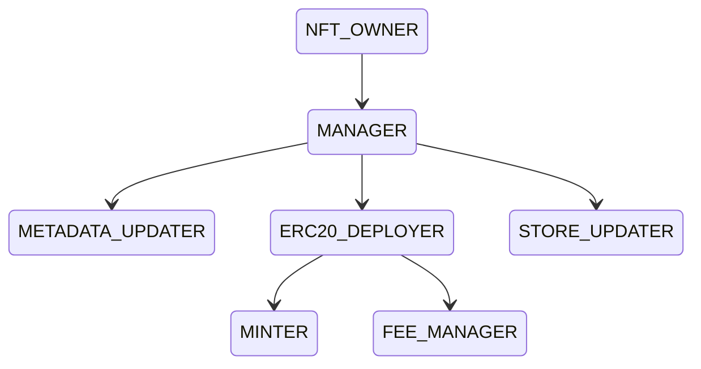

# Roles

The permissions governing access to the smart contract functions are stored within the [data NFT](data-nfts.md) (ERC721) smart contract. Both the [data NFT](data-nfts.md) (ERC721) and [datatoken](datatokens.md) (ERC20) smart contracts utilize this information to enforce restrictions on certain actions, limiting access to authorized users. The tables below outline the specific actions that are restricted and can only be accessed by allowed users.

The data NFT serves as the foundational intellectual property (IP) for the asset, and all datatokens are inherently linked to the data NFT smart contract. This linkage has enabled the introduction of various exciting capabilities related to role administration.&#x20;

### NFT Owner

The NFT owner is the owner of the base-IP and is therefore at the highest level. The NFT owner can perform any action or assign any role but crucially, the NFT owner is the only one who can assign the manager role. Upon deployment or transfer of the data NFT, the NFT owner is automatically added as a manager. The NFT owner is also the only role that can’t be assigned to multiple users — the only way to share this role is via multi-sig or a DAO.

### What Roles Can The Data NFT Owner Assign?




With the exception of the NFT owner role, all other roles can be assigned to multiple users.


If you prefer a simple method for adding or removing roles and permissions(eg. add a new minter), you can follow the live demo provided below. This allows you to perform these actions directly through the user-friendly interface of a network explorer. Alternatively, if you need more detailed instructions, we have provided additional information down below.



### Manager

The ability to add or remove Managers is exclusive to the NFT Owner. If you are the NFT Owner and wish to add/remove a new manager, simply call the [addManager](https://github.com/oceanprotocol/contracts/blob/9e29194d910f28a4f0ef17ce6dc8a70741f63309/contracts/templates/ERC721Template.sol#L426)/[removeManager](https://github.com/oceanprotocol/contracts/blob/9e29194d910f28a4f0ef17ce6dc8a70741f63309/contracts/templates/ERC721Template.sol#L438) function within the ERC721Template contract. This function enables you to grant managerial permissions to the designated individual.

```solidity
function addManager(address _managerAddress) external onlyNFTOwner {
   _addManager(_managerAddress);
}
function removeManager(address _managerAddress) external onlyNFTOwner {
   _removeManager(_managerAddress);
}
```

The **manager** can assign or revoke three main roles (**deployer, metadata updater, store updater**). The manager is also able to interact with the ERC725 data.

### ERC20 Deployer

The Deployer has a bunch of privileges at the ERC20 datatoken level. They can deploy new datatokens with fixed price exchange, or free pricing. They can also update the ERC725Y key-value store and assign roles at the ERC20 level.

To add/remove an ERC20 deployer, the manager can use the [addToCreateERC20List](https://github.com/oceanprotocol/contracts/blob/9e29194d910f28a4f0ef17ce6dc8a70741f63309/contracts/utils/ERC721RolesAddress.sol#L111)/[removeFromCreateERC20List](https://github.com/oceanprotocol/contracts/blob/9e29194d910f28a4f0ef17ce6dc8a70741f63309/contracts/utils/ERC721RolesAddress.sol#L129) functions from the ERC721RolesAddress.

```solidity
function addToCreateERC20List(address _allowedAddress) public onlyManager {
    _addToCreateERC20List(_allowedAddress);
}

function removeFromCreateERC20List(address _allowedAddress)
    public
{
    if(permissions[msg.sender].manager == true ||
    (msg.sender == _allowedAddress && permissions[msg.sender].deployERC20 == true)
    )......
}
```

### Metadata Updater

There is also a specific role for updating the metadata. The [Metadata](metadata.md) updater has the ability to update the information about the data asset (title, description, sample data etc) that is displayed to the user on the asset detail page within the market.

To add/remove a metadata updater, the manager can use the [addToMetadataList](https://github.com/oceanprotocol/contracts/blob/9e29194d910f28a4f0ef17ce6dc8a70741f63309/contracts/utils/ERC721RolesAddress.sol#L164)/[removeFromMetadataList](https://github.com/oceanprotocol/contracts/blob/9e29194d910f28a4f0ef17ce6dc8a70741f63309/contracts/utils/ERC721RolesAddress.sol#L183) functions from the ERC721RolesAddress.

```solidity
function addToMetadataList(address _allowedAddress) public onlyManager {
    _addToMetadataList(_allowedAddress);
}
function removeFromMetadataList(address _allowedAddress)
    public
{
    if(permissions[msg.sender].manager == true ||
    (msg.sender == _allowedAddress && permissions[msg.sender].updateMetadata == true)
    )
    .....
}
```

### Store Updater

The store updater can store, remove or update any arbitrary key value using the ERC725Y implementation (at the ERC721 level). The use case for this role depends a lot on what data is being stored in the ERC725Y key-value pair — as mentioned above, this is highly flexible.

To add/remove a store updater, the manager can use the [addTo725StoreList](https://github.com/oceanprotocol/contracts/blob/9e29194d910f28a4f0ef17ce6dc8a70741f63309/contracts/utils/ERC721RolesAddress.sol#L61)/[removeFrom725StoreList](https://github.com/oceanprotocol/contracts/blob/9e29194d910f28a4f0ef17ce6dc8a70741f63309/contracts/utils/ERC721RolesAddress.sol#L76) functions from the ERC721RolesAddress.

```solidity
function addTo725StoreList(address _allowedAddress) public onlyManager {
    if(_allowedAddress != address(0)){
        ...
    }
}
function removeFrom725StoreList(address _allowedAddress) public {
    if(permissions[msg.sender].manager == true ||
    (msg.sender == _allowedAddress && permissions[msg.sender].store == true)
    )
    ...
}
```


To assign/remove all the above roles(ERC20 Deployer, Metadata Updater or Store Updater), the manager can use the [**addMultipleUsersToRoles**](https://github.com/oceanprotocol/contracts/blob/9e29194d910f28a4f0ef17ce6dc8a70741f63309/contracts/utils/ERC721RolesAddress.sol#L268) function from the ERC721RolesAddress:

```solidity
function addMultipleUsersToRoles(address[] memory addresses, RolesType[] memory roles) external onlyManager {
    require(addresses.length == roles.length && roles.length>0 && roles.length<50, "Invalid array size");
    ...
}
```

### Minter

The Minter has the ability to mint new datatokens, provided the limit has not been exceeded.&#x20;

To add/remove a minter, the ERC20 deployer can use the [addMinter](https://github.com/oceanprotocol/contracts/blob/9e29194d910f28a4f0ef17ce6dc8a70741f63309/contracts/templates/ERC20Template.sol#L617)/[removeMinter](https://github.com/oceanprotocol/contracts/blob/9e29194d910f28a4f0ef17ce6dc8a70741f63309/contracts/templates/ERC20Template.sol#L628) functions from the ERC20Template.

```solidity
function addMinter(address _minter) external onlyERC20Deployer {
        _addMinter(_minter);
}

function removeMinter(address _minter) external onlyERC20Deployer {
    _removeMinter(_minter);
}
```

### Fee Manager

Finally, we also have a fee manager which has the ability to set a new fee collector — this is the account that will receive the datatokens when a data asset is consumed. If no fee collector account has been set, the **datatokens will be sent by default to the NFT Owner**.&#x20;


The applicable fees (market and community fees) are automatically deducted from the datatokens that are received.


To add/remove a fee manager, the ERC20 deployer can use the [addPaymentManager](https://github.com/oceanprotocol/contracts/blob/9e29194d910f28a4f0ef17ce6dc8a70741f63309/contracts/templates/ERC20Template.sol#L639)/[removePaymentManager](https://github.com/oceanprotocol/contracts/blob/9e29194d910f28a4f0ef17ce6dc8a70741f63309/contracts/templates/ERC20Template.sol#L653) functions from the ERC20Template.

```solidity
function addPaymentManager(address _paymentManager)
        external
        onlyERC20Deployer
{
    _addPaymentManager(_paymentManager);
}

function removePaymentManager(address _paymentManager)
    external
    onlyERC20Deployer
{
    _removePaymentManager(_paymentManager);
}
```


When the NFT ownership is transferred to another wallet address, all the roles and permissions and [cleared](https://github.com/oceanprotocol/contracts/blob/9e29194d910f28a4f0ef17ce6dc8a70741f63309/contracts/templates/ERC721Template.sol#L511).

<pre class="language-solidity"><code class="lang-solidity"><strong>function cleanPermissions() external onlyNFTOwner {
</strong><strong>    _cleanPermissions();
</strong><strong>    //Make sure that owner still has permissions
</strong><strong>    _addManager(ownerOf(1));
</strong><strong>}   
</strong></code></pre>


### Roles & permissions in data NFT (ERC721) smart contract

<table><thead><tr><th width="255">Action ↓ / Role →</th><th width="121">NFT Owner</th><th width="102">Manager</th><th width="163">ERC20 Deployer</th><th width="145">Store Updater</th><th>Metadata Updater</th></tr></thead><tbody><tr><td>Set token URI</td><td></td><td></td><td></td><td></td><td></td></tr><tr><td>Add manager</td><td><strong>✓</strong></td><td></td><td></td><td></td><td></td></tr><tr><td>Remove manager</td><td><strong>✓</strong></td><td></td><td></td><td></td><td></td></tr><tr><td>Clean permissions</td><td><strong>✓</strong></td><td></td><td></td><td></td><td></td></tr><tr><td>Set base URI</td><td><strong>✓</strong></td><td></td><td></td><td></td><td></td></tr><tr><td>Set Metadata state</td><td></td><td></td><td></td><td></td><td><strong>✓</strong></td></tr><tr><td>Set Metadata</td><td></td><td></td><td></td><td></td><td><strong>✓</strong></td></tr><tr><td>Create new datatoken</td><td></td><td></td><td><strong>✓</strong></td><td></td><td></td></tr><tr><td>Executes any other smart contract</td><td></td><td><strong>✓</strong></td><td></td><td></td><td></td></tr><tr><td>Set new key-value in store</td><td></td><td></td><td></td><td><strong>✓</strong></td><td></td></tr></tbody></table>

### Roles & permission in datatoken (ERC20) smart contract

<table><thead><tr><th width="263">Action ↓ / Role →</th><th width="155">ERC20 Deployer</th><th width="93">Minter</th><th width="144">NFT owner</th><th>Fee manager</th></tr></thead><tbody><tr><td>Create Fixed Rate exchange</td><td><strong>✓</strong></td><td></td><td></td><td></td></tr><tr><td>Create Dispenser</td><td><strong>✓</strong></td><td></td><td></td><td></td></tr><tr><td>Add minter</td><td><strong>✓</strong></td><td></td><td></td><td></td></tr><tr><td>Remove minter</td><td><strong>✓</strong></td><td></td><td></td><td></td></tr><tr><td>Add fee manager</td><td><strong>✓</strong></td><td></td><td></td><td></td></tr><tr><td>Remove fee manager</td><td><strong>✓</strong></td><td></td><td></td><td></td></tr><tr><td>Set data</td><td><strong>✓</strong></td><td></td><td></td><td></td></tr><tr><td>Clean permissions</td><td></td><td></td><td><strong>✓</strong></td><td></td></tr><tr><td>Mint</td><td></td><td><strong>✓</strong></td><td></td><td></td></tr><tr><td>Set fee collector</td><td></td><td></td><td></td><td><strong>✓</strong></td></tr></tbody></table>
