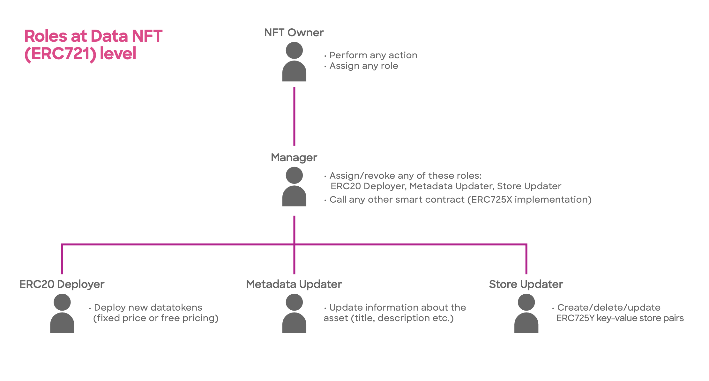
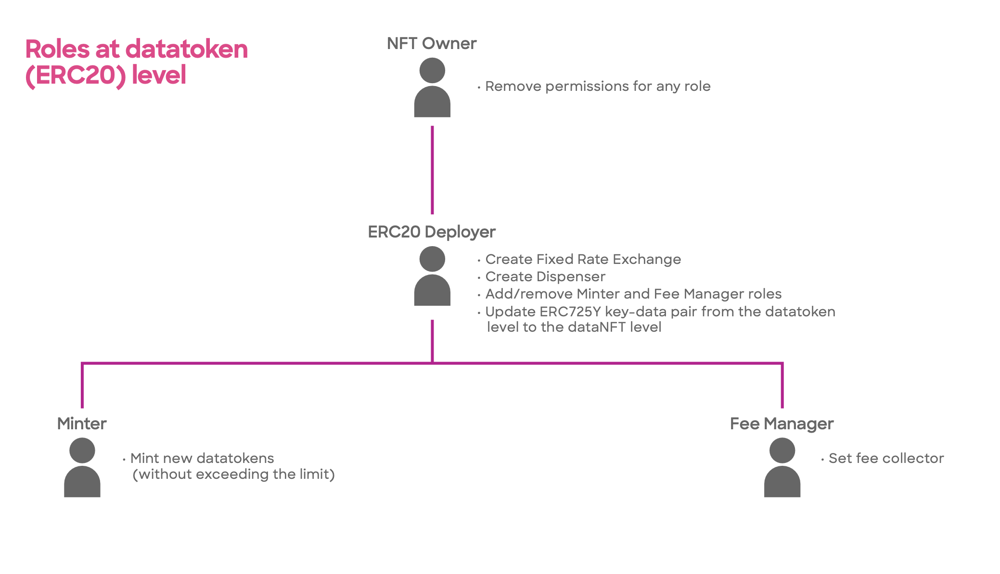

# Roles

The permissions governing access to the smart contract functions are stored within the [data NFT](data-nfts.md) (ERC721) smart contract. Both the [data NFT](data-nfts.md) (ERC721) and [datatoken](datatokens.md) (ERC20) smart contracts utilize this information to enforce restrictions on certain actions, limiting access to authorized users. The tables below outline the specific actions that are restricted and can only be accessed by allowed users.

The [data NFT](data-nfts.md) serves as the foundational intellectual property (IP) for the asset, and all datatokens are inherently linked to the data NFT smart contract. This linkage has enabled the introduction of various exciting capabilities related to role administration.

### NFT Owner

The NFT owner is the owner of the base-IP and is therefore at the highest level. The NFT owner can perform any action or assign any role but crucially, the NFT owner is the only one who can assign the manager role. Upon deployment or transfer of the data NFT, the NFT owner is automatically added as a manager. The NFT owner is also the only role that can’t be assigned to multiple users — the only way to share this role is via multi-sig or a DAO.

## Roles-NFT level

<figure><figcaption><p>Roles at the data NFT level</p></figcaption></figure>


With the exception of the NFT owner role, all other roles can be assigned to multiple users.


There are several methods available to assign roles and permissions. One option is to utilize the [ocean.py](../../data-scientists/ocean.py/README.md) and [ocean.js](../ocean.js/README.md) libraries that we provide. These libraries offer a streamlined approach for assigning roles and permissions programmatically.

Alternatively, for a more straightforward solution that doesn't require coding, you can utilize the network explorer of your asset's network. By accessing the network explorer, you can directly interact with the contracts associated with your asset. Below, we provide a few examples to help guide you through the process.

### Manager

The ability to add or remove Managers is exclusive to the **NFT Owner**. If you are the NFT Owner and wish to add/remove a new manager, simply call the [addManager](https://github.com/oceanprotocol/contracts/blob/9e29194d910f28a4f0ef17ce6dc8a70741f63309/contracts/templates/ERC721Template.sol#L426)/[removeManager](https://github.com/oceanprotocol/contracts/blob/9e29194d910f28a4f0ef17ce6dc8a70741f63309/contracts/templates/ERC721Template.sol#L438) function within the ERC721Template contract. This function enables you to grant managerial permissions to the designated individual.

<details>

<summary>Add/Remove Manager Contract functions</summary>

```solidity
/**
* @dev addManager
*      Only NFT Owner can add a new manager (Roles admin)
*      There can be multiple minters
* @param _managerAddress new manager address
*/

function addManager(address _managerAddress) external onlyNFTOwner {
       _addManager(_managerAddress);
}

/**
* @dev removeManager
*      Only NFT Owner can remove a manager (Roles admin)
*      There can be multiple minters
* @param _managerAddress new manager address
*/
function removeManager(address _managerAddress) external onlyNFTOwner {
        _removeManager(_managerAddress);
}
```

</details>

The **manager** can assign or revoke three main roles (**deployer, metadata updater, and store updater**). The manager is also able to call any other contract (ERC725X implementation).




### Metadata Updater

There is also a specific role for updating the metadata. The [Metadata](../metadata.md) updater has the ability to update the information about the data asset (title, description, sample data etc) that is displayed to the user on the asset detail page within the market.

To add/remove a metadata updater, the manager can use the [addToMetadataList](https://github.com/oceanprotocol/contracts/blob/9e29194d910f28a4f0ef17ce6dc8a70741f63309/contracts/utils/ERC721RolesAddress.sol#L164)/[removeFromMetadataList](https://github.com/oceanprotocol/contracts/blob/9e29194d910f28a4f0ef17ce6dc8a70741f63309/contracts/utils/ERC721RolesAddress.sol#L183) functions from the ERC721RolesAddress.

<details>

<summary>Add/Remove Metadata Updater Contract functions</summary>

```solidity
/**
* @dev addToMetadataList
*      Adds metadata role to an user.
*      It can be called only by a manager
* @param _allowedAddress user address
*/
function addToMetadataList(address _allowedAddress) public onlyManager {
    _addToMetadataList(_allowedAddress);
}


/**
* @dev removeFromMetadataList
*      Removes metadata role from an user.
*      It can be called by a manager or by the same user, if he already has metadata role
* @param _allowedAddress user address
*/
function removeFromMetadataList(address _allowedAddress) public {
        if(permissions[msg.sender].manager == true ||
        (msg.sender == _allowedAddress && permissions[msg.sender].updateMetadata == true)
        ){
        Roles storage user = permissions[_allowedAddress];
        user.updateMetadata = false;    
        emit RemovedFromMetadataList(_allowedAddress,msg.sender,block.timestamp,block.number);
        _SafeRemoveFromAuth(_allowedAddress);
    }
    else{
        revert("ERC721RolesAddress: Not enough permissions to remove from metadata list");
    }
}
```

</details>

### Store Updater

The store updater can store, remove or update any arbitrary key value using the ERC725Y implementation (at the ERC721 level). The use case for this role depends a lot on what data is being stored in the ERC725Y key-value pair — as mentioned above, this is highly flexible.

To add/remove a store updater, the manager can use the [addTo725StoreList](https://github.com/oceanprotocol/contracts/blob/9e29194d910f28a4f0ef17ce6dc8a70741f63309/contracts/utils/ERC721RolesAddress.sol#L61)/[removeFrom725StoreList](https://github.com/oceanprotocol/contracts/blob/9e29194d910f28a4f0ef17ce6dc8a70741f63309/contracts/utils/ERC721RolesAddress.sol#L76) functions from the ERC721RolesAddress.

<details>

<summary>Add/Remove Store Updater Contract functions</summary>

```solidity
/**
* @dev addTo725StoreList
*      Adds store role to an user.
*      It can be called only by a manager
* @param _allowedAddress user address
*/
function addTo725StoreList(address _allowedAddress) public onlyManager {
        if(_allowedAddress != address(0)){
            Roles storage user = permissions[_allowedAddress];
            user.store = true;
            _pushToAuth(_allowedAddress);
            emit AddedTo725StoreList(_allowedAddress,msg.sender,block.timestamp,block.number);
        }
}

/**
* @dev removeFrom725StoreList
*      Removes store role from an user.
*      It can be called by a manager or by the same user, if he already has store role
* @param _allowedAddress user address
*/
function removeFrom725StoreList(address _allowedAddress) public {
        if(permissions[msg.sender].manager == true ||
        (msg.sender == _allowedAddress && permissions[msg.sender].store == true)
        ){
            Roles storage user = permissions[_allowedAddress];
            user.store = false;
            emit RemovedFrom725StoreList(_allowedAddress,msg.sender,block.timestamp,block.number);
            _SafeRemoveFromAuth(_allowedAddress);
        }
        else{
            revert("ERC721RolesAddress: Not enough permissions to remove from 725StoreList");
        }
}
```

</details>

### ERC20 Deployer

The Deployer has a bunch of privileges at the ERC20 datatoken level. They can deploy new datatokens with fixed price exchange, or free pricing. They can also update the ERC725Y key-value store and **assign** **roles** at the ERC20 level(datatoken level).

To add/remove an ERC20 deployer, the manager can use the [addToCreateERC20List](https://github.com/oceanprotocol/contracts/blob/9e29194d910f28a4f0ef17ce6dc8a70741f63309/contracts/utils/ERC721RolesAddress.sol#L111)/[removeFromCreateERC20List](https://github.com/oceanprotocol/contracts/blob/9e29194d910f28a4f0ef17ce6dc8a70741f63309/contracts/utils/ERC721RolesAddress.sol#L129) functions from the ERC721RolesAddress.

<details>

<summary>Add/Remove ERC20 Deployer Contract functions</summary>

```solidity
/**
* @dev addToCreateERC20List
*      Adds deployERC20 role to an user.
*      It can be called only by a manager
* @param _allowedAddress user address
*/
function addToCreateERC20List(address _allowedAddress) public onlyManager {
    _addToCreateERC20List(_allowedAddress);
}

/**
* @dev removeFromCreateERC20List
*      Removes deployERC20 role from an user.
*      It can be called by a manager or by the same user, if he already has deployERC20 role
* @param _allowedAddress user address
*/
function removeFromCreateERC20List(address _allowedAddress) public {
        if(permissions[msg.sender].manager == true ||
        (msg.sender == _allowedAddress && permissions[msg.sender].deployERC20 == true)
        ){
            Roles storage user = permissions[_allowedAddress];
            user.deployERC20 = false;
            emit RemovedFromCreateERC20List(_allowedAddress,msg.sender,block.timestamp,block.number);
            _SafeRemoveFromAuth(_allowedAddress);
        }
        else{
            revert("ERC721RolesAddress: Not enough permissions to remove from ERC20List");
        }
}
```

</details>


To assign/remove all the above roles(ERC20 Deployer, Metadata Updater, or Store Updater), the manager can use the [**addMultipleUsersToRoles**](https://github.com/oceanprotocol/contracts/blob/9e29194d910f28a4f0ef17ce6dc8a70741f63309/contracts/utils/ERC721RolesAddress.sol#L268) function from the ERC721RolesAddress.


<details>

<summary>Assign multiple roles at once Contract function</summary>

```solidity
/**
* @dev addMultipleUsersToRoles
*      Add multiple users to multiple roles
* @param addresses Array of addresses
* @param roles Array of coresponding roles
*/
function addMultipleUsersToRoles(address[] memory addresses, RolesType[] memory roles) external onlyManager {
		require(addresses.length == roles.length && roles.length>0 && roles.length<50, "Invalid array size");
         uint256 i;
         for(i=0; i<roles.length; i++){
             if(addresses[i] != address(0)){
		Roles storage user = permissions[addresses[i]];
		if(roles[i] == RolesType.Manager) {
		     user.manager = true;
		     emit AddedManager(addresses[i],msg.sender,block.timestamp,block.number);
		}
		if(roles[i] == RolesType.DeployERC20) {
		     user.deployERC20 = true;
		     emit AddedToCreateERC20List(addresses[i],msg.sender,block.timestamp,block.number);
		}
		if(roles[i] == RolesType.UpdateMetadata) {
		      user.updateMetadata = true;
		      emit AddedToMetadataList(addresses[i],msg.sender,block.timestamp,block.number);
		}
		if(roles[i] == RolesType.Store) {
		      user.store = true;
		      emit AddedTo725StoreList(addresses[i],msg.sender,block.timestamp,block.number);
		}
		_pushToAuth(addresses[i]);
              }
         }
}

```

</details>

### Roles & permissions in data NFT (ERC721) smart contract

<table><thead><tr><th width="216">Action ↓ / Role →</th><th width="122">NFT Owner</th><th width="102">Manager</th><th width="160">ERC20 Deployer</th><th width="160">Store Updater</th><th width="170">Metadata Updater</th></tr></thead><tbody><tr><td>Set token URI</td><td></td><td></td><td></td><td></td><td></td></tr><tr><td>Add manager</td><td><strong>✓</strong></td><td></td><td></td><td></td><td></td></tr><tr><td>Remove manager</td><td><strong>✓</strong></td><td></td><td></td><td></td><td></td></tr><tr><td>Clean permissions</td><td><strong>✓</strong></td><td></td><td></td><td></td><td></td></tr><tr><td>Set base URI</td><td><strong>✓</strong></td><td></td><td></td><td></td><td></td></tr><tr><td>Set Metadata state</td><td></td><td></td><td></td><td></td><td><strong>✓</strong></td></tr><tr><td>Set Metadata</td><td></td><td></td><td></td><td></td><td><strong>✓</strong></td></tr><tr><td>Create new datatoken</td><td></td><td></td><td><strong>✓</strong></td><td></td><td></td></tr><tr><td>Executes any other smart contract</td><td></td><td><strong>✓</strong></td><td></td><td></td><td></td></tr><tr><td>Set new key-value in store</td><td></td><td></td><td></td><td><strong>✓</strong></td><td></td></tr></tbody></table>

## Roles-datatokens level

<figure><figcaption><p>Roles at the datatokens level</p></figcaption></figure>

### Minter

The Minter has the ability to mint new datatokens, provided the limit has not been exceeded.

To add/remove a minter, the ERC20 deployer can use the [addMinter](https://github.com/oceanprotocol/contracts/blob/9e29194d910f28a4f0ef17ce6dc8a70741f63309/contracts/templates/ERC20Template.sol#L617)/[removeMinter](https://github.com/oceanprotocol/contracts/blob/9e29194d910f28a4f0ef17ce6dc8a70741f63309/contracts/templates/ERC20Template.sol#L628) functions from the ERC20Template.

<details>

<summary>Add/Remove Minter Contract functions</summary>

```solidity
/**
* @dev addMinter
*      Only ERC20Deployer (at 721 level) can update.
*      There can be multiple minters
* @param _minter new minter address
*/

function addMinter(address _minter) external onlyERC20Deployer {
        _addMinter(_minter);
}

/**
* @dev removeMinter
*      Only ERC20Deployer (at 721 level) can update.
*      There can be multiple minters
* @param _minter minter address to remove
*/

function removeMinter(address _minter) external onlyERC20Deployer {
        _removeMinter(_minter);
}
```

</details>




### Fee Manager

Finally, we also have a fee manager which has the ability to set a new fee collector — this is the account that will receive the datatokens when a data asset is consumed. If no fee collector account has been set, the **datatokens will be sent by default to the NFT Owner**.


The applicable fees (market and community fees) are automatically deducted from the datatokens that are received.


To add/remove a fee manager, the ERC20 deployer can use the [addPaymentManager](https://github.com/oceanprotocol/contracts/blob/9e29194d910f28a4f0ef17ce6dc8a70741f63309/contracts/templates/ERC20Template.sol#L639)/[removePaymentManager](https://github.com/oceanprotocol/contracts/blob/9e29194d910f28a4f0ef17ce6dc8a70741f63309/contracts/templates/ERC20Template.sol#L653) functions from the ERC20Template.

<details>

<summary>Add/Remove Fee Manager Contract functions</summary>

```solidity
/**
* @dev addPaymentManager (can set who's going to collect fee when consuming orders)
*      Only ERC20Deployer (at 721 level) can update.
*      There can be multiple paymentCollectors
* @param _paymentManager new minter address
*/
function addPaymentManager(address _paymentManager) external onlyERC20Deployer
{
        _addPaymentManager(_paymentManager);
}

/**
* @dev removePaymentManager
*      Only ERC20Deployer (at 721 level) can update.
*      There can be multiple paymentManagers
* @param _paymentManager _paymentManager address to remove
*/

function removePaymentManager(address _paymentManager) external onlyERC20Deployer
{
        _removePaymentManager(_paymentManager);
}
```

</details>


When the NFT ownership is transferred to another wallet address, all the roles and permissions and [cleared](https://github.com/oceanprotocol/contracts/blob/9e29194d910f28a4f0ef17ce6dc8a70741f63309/contracts/templates/ERC721Template.sol#L511).

<pre class="language-solidity"><code class="lang-solidity"><strong>function cleanPermissions() external onlyNFTOwner {
</strong><strong>    _cleanPermissions();
</strong><strong>    //Make sure that owner still has permissions
</strong><strong>    _addManager(ownerOf(1));
</strong><strong>}   
</strong></code></pre>


### Roles & permission in datatoken (ERC20) smart contract

<table><thead><tr><th width="210">Action ↓ / Role →</th><th width="159">ERC20 Deployer</th><th width="93">Minter</th><th width="117">NFT owner</th><th>Fee manager</th></tr></thead><tbody><tr><td>Create Fixed Rate exchange</td><td><strong>✓</strong></td><td></td><td></td><td></td></tr><tr><td>Create Dispenser</td><td><strong>✓</strong></td><td></td><td></td><td></td></tr><tr><td>Add minter</td><td><strong>✓</strong></td><td></td><td></td><td></td></tr><tr><td>Remove minter</td><td><strong>✓</strong></td><td></td><td></td><td></td></tr><tr><td>Add fee manager</td><td><strong>✓</strong></td><td></td><td></td><td></td></tr><tr><td>Remove fee manager</td><td><strong>✓</strong></td><td></td><td></td><td></td></tr><tr><td>Set data</td><td><strong>✓</strong></td><td></td><td></td><td></td></tr><tr><td>Clean permissions</td><td></td><td></td><td><strong>✓</strong></td><td></td></tr><tr><td>Mint</td><td></td><td><strong>✓</strong></td><td></td><td></td></tr><tr><td>Set fee collector</td><td></td><td></td><td></td><td><strong>✓</strong></td></tr></tbody></table>
