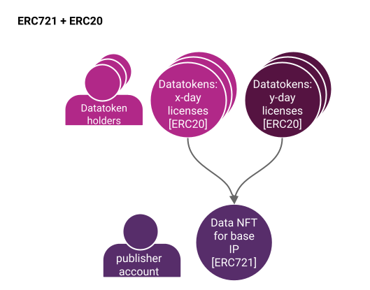
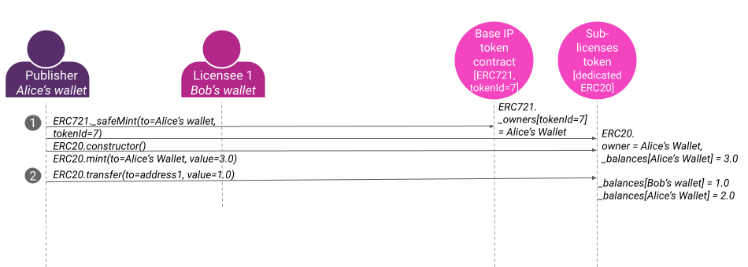

# Data NFTs and Datatokens

## ------Work in progress-------

## What is a Data NFT?

### Data NFTs Open Up New Possibilities

## High-Level Architecture

The image above describes how ERC721 data NFTs and ERC20 datatokens relate.

* Bottom: The publisher deploys an ERC721 data NFT contract representing the base IP for the data asset. They are now the manager of the data NFT.
* Top: The manager then deploys an ERC20 datatoken contract against the data NFT. The ERC20 represents a license with specific terms like "can download for the next 3 days". They could even publish further ERC20 datatoken contracts, to represent different license terms or for compute-to-data.

### Terminology

* **Base IP** means the artifact being copyrighted. Represented by the {ERC721 address, tokenId} from the publish transactions.
* **Base IP holder** means the holder of the Base IP. Represented as the actor that did the initial "publish" action.
* **Sub-licensee** is the holder of the sub-license. Represented as the entity that controls address ERC721.\_owners\[tokenId=x].
* **To Publish**: Claim copyright or exclusive base license.
* **To Sub-license**: Transfer one (of many) sub-licenses to a new license: ERC20.transfer(to=licensee, value=1.0).

### Implementation in Ocean Protocol

Continuing the theme of flexibility, for a given data NFT, you can have one or more ERC20 datatoken contracts. Here’s the main idea: 1.0 datatokens allows you to consume the corresponding dataset. Put another way, it’s a sub-license from the base IP to be able to use the dataset according to the license terms (when you send it to the publisher). License terms can be set from a “good default”, or by the Data NFT owner. ERC20 fungible token standard is a natural choice for datatokens, because licenses themselves are fungible: one license can be exchanged 1:1 with another. Using the ERC20 standard enables interoperability of datatokens with ERC20-based wallets, DEXes, DAOs, and more. Datatokens can be given (simply transferred), purchased on a marketplace/exchange, airdropped, etc.

You can publish a data NFT initially with no ERC20 datatoken contracts. This means you simply aren’t ready to grant access to your data asset yet (sub-license it). Then, you can publish one or more ERC20 datatoken contracts against the data NFT. One datatoken contract might grant consume rights for 1 day, another for 1 week, etc. Each different datatoken contract is for different license terms.

Ocean provides convenient methods to list ERC20 datatokens for sale, with fixed-price (atomic swap), or for free. Like any ERC20 token, datatokens may be listed in many decentralized exchanges (DEXes), centralized exchanges (CEXes), over-the-counter, or otherwise.

### High-Level Behavior

Here's an example.

* In step 1, Alice **publishes** her dataset with Ocean: this means deploying an ERC721 data NFT contract (claiming copyright/base IP), then an ERC20 datatoken contract (license against base IP).
* In step 2, she **mints** some ERC20 datatokens and **transfers** 1.0 of them to Bob's wallet; now he has a license to be able to download that dataset.

### Revenue

TemplateIds

### Fractional Ownership

### Other References

* [Data & NFTs 1: Practical Connections of ERC721 with Intellectual Property](https://blog.oceanprotocol.com/nfts-ip-1-practical-connections-of-erc721-with-intellectual-property-dc216aaf005d)
* [Data & NFTs 2: Leveraging ERC20 Fungibility](https://blog.oceanprotocol.com/nfts-ip-2-leveraging-erc20-fungibility-bcee162290e3)
* [Data & NFTs 3: Combining ERC721 & ERC20](https://blog.oceanprotocol.com/nfts-ip-3-combining-erc721-erc20-b69ea659115e)
* [Fungibility sightings in NFTs](https://blog.oceanprotocol.com/on-difficult-to-explain-fungibility-sightings-in-nfts-26bc18620f70)

TODO:&#x20;

### Data NFTs, Datatokens and Access Control Tools

### Market Tools

### Metadata Tools

### Actor Identities

Actors like data providers and buyers have Ethereum addresses, aka web3 accounts. These are managed by crypto wallets, as one would expect. For most use cases, this is all that’s needed. There are cases where the Ocean community could layer on protocols like [Verifiable Credentials](https://www.w3.org/TR/vc-data-model/) or tools like [3Box](https://3box.io/).
