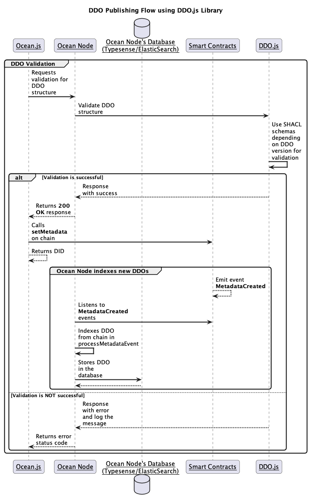

# Validate a DDO 📥

The DDO validation within the `DDO.js` library is performed based on SHACL schemas which enforce DDO fields types and structure based on DDO version.

**NOTE**: For more information regarding DDO structure, please consult [new DDO specification here](../new-ddo-specification.md).

<figure><figcaption><p>DDO Validation Flow using DDO.js</p></figcaption></figure>

The above diagram depicts the high level flow of Ocean core stack interaction for DDO validation using DDO.js, which will be called by Ocean Node whenever a new DDO is to be published.

Based on the DDO version, `ddo.js` will apply the corresponding SHACL schema to validate DDO fields against it.

Supported SHACL schemas can be found [here](https://github.com/oceanprotocol/ddo.js/tree/main/schemas).

**NOTE**: For DDO validation, `indexedMetadata` will not be taken in consideration in this process.

## Usage of DDO validation from Library

DDO example:

```
export const DDOExampleV4 = {
  '@context': ['https://w3id.org/did/v1'],
  id: 'did:op:fa0e8fa9550e8eb13392d6eeb9ba9f8111801b332c8d2345b350b3bc66b379d5',
  nftAddress: '0xBB1081DbF3227bbB233Db68f7117114baBb43656',
  version: '4.1.0',
  chainId: 137,
  metadata: {
    created: '2022-12-30T08:40:06Z',
    updated: '2022-12-30T08:40:06Z',
    type: 'dataset' as 'dataset' | 'algorithm',
    name: 'DEX volume in details',
    description:
      'Volume traded and locked of Decentralized Exchanges (Uniswap, Sushiswap, Curve, Balancer, ...), daily in details',
    tags: ['index', 'defi', 'tvl'],
    author: 'DEX',
    license: 'https://market.oceanprotocol.com/terms',
    additionalInformation: {
      termsAndConditions: true
    }
  },
  services: [
    {
      id: '24654b91482a3351050510ff72694d88edae803cf31a5da993da963ba0087648',
      type: 'access',
      files:
        '0x04beba2f90639ff7559618160df5a81729904022578e6bd5f60c3bebfe5cb2aca59d7e062228a98ed88c4582c290045f47cdf3824d1c8bb25b46b8e10eb9dc0763ce82af826fd347517011855ce1396ac94af8cc6f29b78012b679cb78a594d9064b6f6f4a8229889f0bb53262b6ab62b56fa5c608ea126ba228dd0f87290c0628fe07023416280c067beb01a42d0a4df95fdb5a857f1f59b3e6a13b0ae4619080369ba5bede6c7beff6afc7fc31c71ed8100e7817d965d1f8f1abfaace3c01f0bd5d0127df308175941088a1f120a4d9a0290be590d65a7b4de01ae1efe24286d7a06fadeeafba83b5eab25b90961abf1f24796991f06de6c8e1c2357fbfb31f484a94e87e7dba80a489e12fffa1adde89f113b4c8c4c8877914911a008dbed0a86bdd9d14598c35894395fb4a8ea764ed2f9459f6acadac66e695b3715536338f6cdee616b721b0130f726c78ca60ec02fc86c',
      datatokenAddress: '0xfF4AE9869Cafb5Ff725f962F3Bbc22Fb303A8aD8',
      serviceEndpoint: 'https://v4.provider.polygon.oceanprotocol.com',
      timeout: 604800
    }
  ],
  indexedMetadata: {
    event: {
      txid: '0xceb617f13a8db82ba9ef24efcee72e90d162915fd702f07ac6012427c31ac952',
      block: 39326976,
      from: '0x0DB823218e337a6817e6D7740eb17635DEAdafAF',
      contract: '0xBB1081DbF3227bbB233Db68f7117114baBb43656',
      datetime: '2023-02-15T16:42:22'
    },
    nft: {
      address: '0xBB1081DbF3227bbB233Db68f7117114baBb43656',
      name: 'Ocean Data NFT',
      symbol: 'OCEAN-NFT',
      state: 0,
      tokenURI:
        'data:application/json;base64,eyJuYW1lIjoiT2NlYW4gRGF0YSBORlQiLCJzeW1ib2wiOiJPQ0VBTi1ORlQiLCJkZXNjcmlwdGlvbiI6IlRoaXMgTkZUIHJlcHJlc2VudHMgYW4gYXNzZXQgaW4gdGhlIE9jZWFuIFByb3RvY29sIHY0IGVjb3N5c3RlbS5cblxuVmlldyBvbiBPY2VhbiBNYXJrZXQ6IGh0dHBzOi8vbWFya2V0Lm9jZWFucHJvdG9jb2wuY29tL2Fzc2V0L2RpZDpvcDpmYTBlOGZhOTU1MGU4ZWIxMzM5MmQ2ZWViOWJhOWY4MTExODAxYjMzMmM4ZDIzNDViMzUwYjNiYzY2YjM3OWQ1IiwiZXh0ZXJuYWxfdXJsIjoiaHR0cHM6Ly9tYXJrZXQub2NlYW5wcm90b2NvbC5jb20vYXNzZXQvZGlkOm9wOmZhMGU4ZmE5NTUwZThlYjEzMzkyZDZlZWI5YmE5ZjgxMTE4MDFiMzMyYzhkMjM0NWIzNTBiM2JjNjZiMzc5ZDUiLCJiYWNrZ3JvdW5kX2NvbG9yIjoiMTQxNDE0IiwiaW1hZ2VfZGF0YSI6ImRhdGE6aW1hZ2Uvc3ZnK3htbCwlM0Nzdmcgdmlld0JveD0nMCAwIDk5IDk5JyBmaWxsPSd1bmRlZmluZWQnIHhtbG5zPSdodHRwOi8vd3d3LnczLm9yZy8yMDAwL3N2ZyclM0UlM0NwYXRoIGZpbGw9JyUyM2ZmNDA5Mjc3JyBkPSdNMCw5OUwwLDIzQzEzLDIwIDI3LDE4IDM3LDE4QzQ2LDE3IDUyLDE4IDYyLDIwQzcxLDIxIDg1LDI0IDk5LDI3TDk5LDk5WicvJTNFJTNDcGF0aCBmaWxsPSclMjNmZjQwOTJiYicgZD0nTTAsOTlMMCw1MkMxMSw0OCAyMyw0NCAzMyw0NEM0Miw0MyA1MCw0NSA2MSw0OEM3MSw1MCA4NSw1MiA5OSw1NUw5OSw5OVonJTNFJTNDL3BhdGglM0UlM0NwYXRoIGZpbGw9JyUyM2ZmNDA5MmZmJyBkPSdNMCw5OUwwLDcyQzgsNzMgMTcsNzUgMjksNzZDNDAsNzYgNTMsNzYgNjYsNzdDNzgsNzcgODgsNzcgOTksNzhMOTksOTlaJyUzRSUzQy9wYXRoJTNFJTNDL3N2ZyUzRSJ9',
      owner: '0x0DB823218e337a6817e6D7740eb17635DEAdafAF',
      created: '2022-12-30T08:40:43'
    },
    purgatory: {
      state: false
    },
    stats: [
      {
        orders: 36,
        price: {
          value: 1000,
          tokenAddress: '0x282d8efCe846A88B159800bd4130ad77443Fa1A1',
          tokenSymbol: 'mOCEAN'
        }
      }
    ]
  },
  datatokens: [
    {
      address: '0xfF4AE9869Cafb5Ff725f962F3Bbc22Fb303A8aD8',
      name: 'Boorish Fish Token',
      symbol: 'BOOFIS-23',
      serviceId:
        '24654b91482a3351050510ff72694d88edae803cf31a5da993da963ba0087648'
    }
  ],
  accessDetails: {
    templateId: 2,
    publisherMarketOrderFee: '0',
    type: 'fixed',
    addressOrId:
      '0xd829c22afa50a25ad965e2c2f3d89940a6a27dbfabc2631964ea882883bc7d11',
    price: '1000',
    isPurchasable: true,
    baseToken: {
      address: '0x282d8efce846a88b159800bd4130ad77443fa1a1',
      name: 'Ocean Token (PoS)',
      symbol: 'mOCEAN',
      decimals: 18
    },
    datatoken: {
      address: '0xff4ae9869cafb5ff725f962f3bbc22fb303a8ad8',
      name: 'Boorish Fish Token',
      symbol: 'BOOFIS-23'
    }
  },
  credentials: null
};
```
Now let's use this DDO example, `DDOExampleV4` into the following javascript code:

```javascript
const { DDOManager } = require ('@oceanprotocol/ddo.js');

const ddoInstance = DDOManager.getDDOClass(DDOExampleV4)
const validation = await ddoInstance.validate();
console.log('Validation true/false: ' + validation[0]);
console.log('Validation message: ' + validation[1]);
```
**Execute script**

```bash
node validate-ddo.js
```
