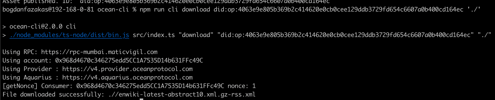

The process of consuming an asset is straightforward. To achieve this, you only need to execute a single command:

```bash
npm run cli download 'assetDID' 'download-location-path'
```

In this command, replace `assetDID`` with the specific DID of the asset you want to consume, and `download-location-path`` with the desired path where you wish to store the downloaded asset content

Once executed, this command orchestrates both the **ordering** of a [datatoken](../contracts/datatokens.md) and the subsequent download operation. The asset's content will be automatically retrieved and saved at the specified location, simplifying the consumption process for users.

<figure><figcaption>Consume</figcaption></figure>
