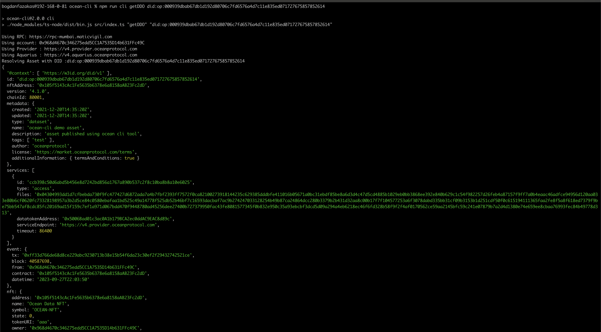

# Edit a Dataset ✏️

To make changes to a dataset, you'll need to start by retrieving the asset's [Decentralized Data Object](../ddo-specification.md) (DDO).

## Retrieve DDO

Obtaining the DDO of an asset is a straightforward process. You can accomplish this task by executing the following command:

```bash
npm run cli getDDO 'assetDID'
```

<figure><figcaption>Retrieve DDO</figcaption></figure>

## Edit the Dataset 

After retrieving the asset's DDO and saving it as a JSON file, you can proceed to edit the metadata as needed. Once you've made the necessary changes, you can utilize the following command to apply the updated metadata:

```bash
npm run cli editAsset 'DATASET_DID' 'PATH_TO_UPDATED_FILE`

```
