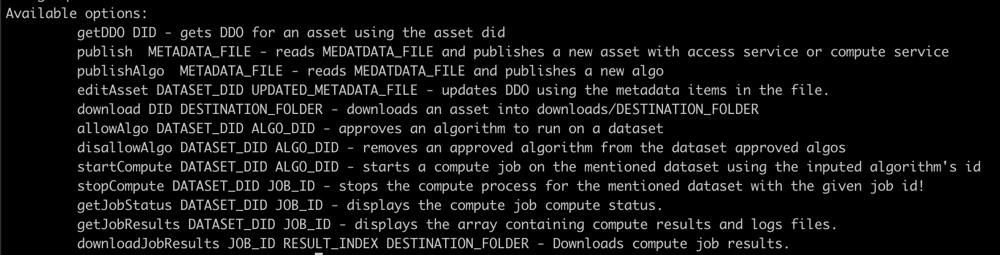

# Installation and Configuration 🛠️

To get started with the Ocean CLI, follow these steps for a seamless setup:

## Clone the Repository

Begin by cloning the repository. You can achieve this by executing the following command in your terminal:

```bash
$ git clone https://github.com/oceanprotocol/ocean-cli.git
```

Cloning the repository will create a local copy on your machine, allowing you to access and work with its contents.

## Install NPM Dependencies

After successfully cloning the repository, you should install the necessary npm dependencies to ensure that the project functions correctly. This can be done with the following command:

```bash
npm install
```

## Build the TypeScript code

To compile the TypeScript code and prepare the CLI for use, execute the following command:

```bash
npm run build
```

Now, let's configure the environment variables required for the CLI to function effectively. 🚀


## Setting Environment Variables 🌐

To successfully configure the CLI tool, two essential steps must be undertaken: the setting of the account's private key and the definition of the desired RPC endpoint. These actions are pivotal in enabling the CLI tool to function effectively.

### Private Key Configuration

The CLI tool necessitates the configuration of the account's private key. This private key serves as the means by which the CLI tool establishes a connection to the associated wallet. It plays a crucial role in authenticating and authorizing operations performed by the tool.

```bash
export MNEMONIC="XXXX"
```

### RPC Endpoint Specification
Additionally, it is imperative to specify the RPC endpoint that corresponds to the desired network for executing operations. The CLI tool relies on this user-provided RPC endpoint to connect to the network required for its functions. This connection to the network is vital as it enables the CLI tool to interact with the blockchain and execute operations seamlessly.

```bash
export RPC='XXXX'
```

Furthermore, there are additional environment variables that can be configured to enhance the flexibility and customization of the environment. These variables include options such as the metadataCache URL and Provider URL, which can be specified if you prefer to utilize a custom deployment of Aquarius or Provider in contrast to the default settings. Moreover, you have the option to provide a custom address file path if you wish to use customized smart contracts or deployments for your specific use case. Remember setting the next environment variables is optional.

```bash
export AQUARIUS_URL='XXXX'
export PROVIDER_URL='XXXX'
export ADDRESS_FILE='../path/to/your/address-file'
```

## Usage

To explore the commands and option flags available in the Ocean CLI, simply run the following command:

```bash
npm run cli h
```

<figure><figcaption>Available CLI commands & options</figcaption></figure>

With the Ocean CLI successfully installed and configured, you're ready to dive into its capabilities and unlock the full potential of Ocean Protocol. If you encounter any issues during the setup process or have questions, feel free to seek assistance from our [support](https://discord.com/invite/TnXjkR5) team. 🌊
