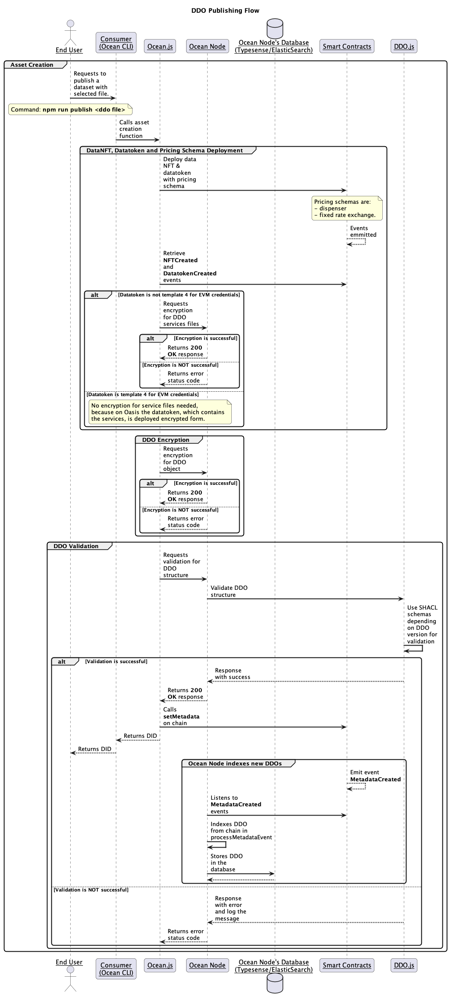

# Publish a Dataset 📤

## High Level Publish Flow using Ocean CLI

Let's remember the interaction with other components for DDO publishing flow! In this context, we address the following sequence diagram along with the explanations.

<figure><figcaption><p>DDO Publish Flow</p></figcaption></figure>

1. **Asset Creation Begins**
- The End User initiates the process by running the command: **_npm run publish <ddo file>_**.
This redirects to Ocean CLI (Consumer) to start publishing the dataset with the selected file.

- The Consumer then calls `ocean.js`, which handles the asset creation logic.

2. **Smart Contract Deployment**

- Ocean.js interacts with the Smart Contracts to deploy:
Data NFT, Datatoken, pricing schema such as __Dispenser__
from free assets and __Fixed Rate Exchange__ for priced assets.

- Once deployed, the smart contracts emit the **NFTCreated** and **DatatokenCreated** events (and additionally **DispenserCreated** and **FixedRateCreated** for pricing schema deployments).

- Ocean.js listens to these events and checks the datatoken template. If it is template 4, then no encryption is needed for service files, because [template 4 contract of ERC20](https://github.com/oceanprotocol/contracts/blob/main/contracts/templates/ERC20Template4.sol) is used on top of credential EVM chains, which already encrypt the information on-chain, e.g. Sapphire Testnet. Otherwise, service files need to be encrypted by Ocean Node's dedicated handler.

3. **DDO Validation**
Ocean.js requests Ocean Node to validate the DDO structure against the SHACL schemas, depending on DDO version. For this task, Ocean Node uses util functions from `DDO.js` library which is out dedicated tool for DDO interactions.

- ✅ _If Validation Succeeds_:
Ocean.js can call setMetadata on-chain and  then returns the DID to the Consumer, which is passed back to the End User. The DID gets indexed in parallel, because Ocean Node listens through Indexer to blockchain events, including `MetadataCreated` and the DDO will be processed and stored within `Ocean Node's Database`.

- ❌ _If Validation Fails_:
Ocean Node logs the issue and responds to Ocean.js with an error status and asset creation halts here.

## Hands-On Approach

Once you've configured the RPC environment variable, you're ready to publish a new dataset on the connected network. The flexible setup allows you to switch to a different network simply by substituting the RPC endpoint with one corresponding to another network. 🌐

To initiate the dataset publishing process, we'll start by updating the helper [DDO](../ddo-specification.md)(Decentralized Data Object) example named "SimpleDownloadDataset.json." This example can be found in the `./metadata` folder, located at the root directory of the cloned Ocean CLI project.

```json
{
	"@context": ["https://w3id.org/did/v1"],
	"id": "",
	"nftAddress": "",
	"version": "4.1.0",
	"chainId": 80001,
	"metadata": {
		"created": "2021-12-20T14:35:20Z",
		"updated": "2021-12-20T14:35:20Z",
		"type": "dataset",
		"name": "ocean-cli demo asset",
		"description": "asset published using ocean cli tool",
		"tags": ["test"],
		"author": "oceanprotocol",
		"license": "https://market.oceanprotocol.com/terms",
		"additionalInformation": {
			"termsAndConditions": true
		}
	},
	"services": [
		{
			"id": "ccb398c50d6abd5b456e8d7242bd856a1767a890b537c2f8c10ba8b8a10e6025",
			"type": "access",
			"files": {
				"datatokenAddress": "0x0",
				"nftAddress": "0x0",
				"files": [
					{
						"type": "url",
						"url": "https://dumps.wikimedia.org/enwiki/latest/enwiki-latest-abstract10.xml.gz-rss.xml",
						"method": "GET"
					}
				]
			},
			"datatokenAddress": "",
			"serviceEndpoint": "https://v4.provider.oceanprotocol.com",
			"timeout": 86400
		}
	],
	"event": {},
	"nft": {
		"address": "",
		"name": "Ocean Data NFT",
		"symbol": "OCEAN-NFT",
		"state": 5,
		"tokenURI": "",
		"owner": "",
		"created": ""
	},
	"purgatory": {
		"state": false
	},
	"datatokens": [],
	"stats": {
		"allocated": 0,
		"orders": 0,
		"price": {
			"value": "2"
		}
	}
}
```


The provided example creates a consumable asset with a predetermined price of 2 OCEAN. If you wish to modify this and create an asset that is freely accessible, you can do so by replacing the value of "stats.price.value" with 0 in the JSON example mentioned above.


Now, let's run the command to publish the dataset:

```bash
npm run cli publish metadata/simpleDownloadDataset.json
```

<figure><figcaption>Publish dataset</figcaption></figure>

Executing this command will initiate the dataset publishing process, making your dataset accessible and discoverable on the Ocean Protocol network. 🌊