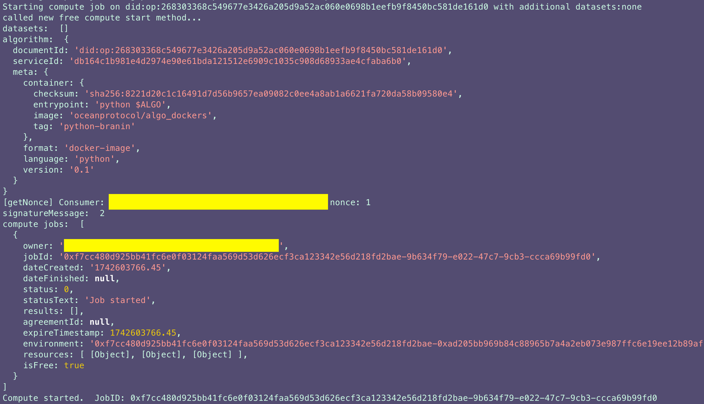

# Run C2D Jobs 🚀

## Get Compute Environments

To proceed with compute-to-data job creation, the prerequisite is
to select the preferred environment to run the algorithm on it. This can be
accomplished by running the CLI command `getComputeEnvironments` likewise:
```bash
npm run cli getComputeEnvironments
```


## Start a Compute Job 🎯

Initiating a compute job can be accomplished through two primary methods. 
1. The first approach involves publishing both the dataset and algorithm, as explained in the previous section, [Publish a Dataset](./publish.md) Once that's completed, you can proceed to initiate the compute job. 
2. Alternatively, you have the option to explore available datasets and algorithms and kickstart a compute-to-data job by combining your preferred choices.

To illustrate the latter option, you can use the following command:

```bash
npm run cli startCompute 'DATASET_DID' 'ALGO_DID'
```
In this command, replace `DATASET_DID` with the specific DID of the dataset you intend to utilize and `ALGO_DID` with the DID of the algorithm you want to apply. By executing this command, you'll trigger the initiation of a compute-to-data job that harnesses the selected dataset and algorithm for processing.

<figure><figcaption>Start a compute job</figcaption></figure>

## Start a Free Compute Job 🎯

For running the algorithms free by starting a compute job, these are the following steps.
**Note**
Only for free start compute, the dataset is **not mandatory** for user to provide in the command line. The required command line parameters are the algorithm DID and environment ID, retrieved from `getComputeEnvironments`
command. 
1. The first step involves publishing the algorithm, as explained in the previous section, [Publish a Dataset](./publish.md) Once that's completed, you can proceed to initiate the compute job. 
2. Alternatively, you have the option to explore available algorithms and kickstart a free compute-to-data job by combining your preferred choices.

To illustrate the latter option, you can use the following command:

```bash
npm run cli freeStartCompute 'DATASET_DID1' 'DATASET_DID2' 'ALGO_DID' 'ENV_ID'
```
In this command, replace `DATASET_DID` with the specific DID of the dataset you intend to utilize and `ALGO_DID` with the DID of the algorithm you want to apply and the environment for **free** start compute returned from `npm run cli getComputeEnvironments`.
By executing this command, you'll trigger the initiation of a free compute-to-data job with the alogithm provided.
Free start compute can be run without published datasets, only the algorithm is required:
```bash
npm run cli freeStartCompute [] 'ALGO_DID' 'ENV_ID'
```
**NOTE:** For `zsh` console, please surround `[]` with quotes like this: `"[]"`.
<figure><figcaption>Start a free compute job</figcaption></figure>

## Download Compute Results 🧮

To obtain the compute results, we'll follow a two-step process. First, we'll employ the `getJobStatus`` method, patiently monitoring its status until it signals the job's completion. Afterward, we'll utilize this method to acquire the actual results.

## Retriving Algorithm Logs

To monitor the algorithm logs execution and setup configuration for algorithm,
this command does the trick!

```bash
npm run cli computeStreamableLogs
```


###  Monitor Job Status
To track the status of a job, you'll require both the dataset DID and the compute job DID. You can initiate this process by executing the following command:

```bash
npm run cli getJobStatus 'DATASET_DID' 'JOB_ID'
```

Executing this command will allow you to observe the job's status and verify its successful completion.

<figure><figcaption>Get Job Status</figcaption></figure>

### Download C2D Results

For the second method, the dataset DID is no longer required. Instead, you'll need to specify the job ID, the index of the result you wish to download from the available results for that job, and the destination folder where you want to save the downloaded content. The corresponding command is as follows:

```bash
 npm run cli downloadJobResults 'JOB_ID' 'RESULT_INDEX' 'DESTINATION_FOLDER'
```

<figure><figcaption>Download C2D Job Results</figcaption></figure>
