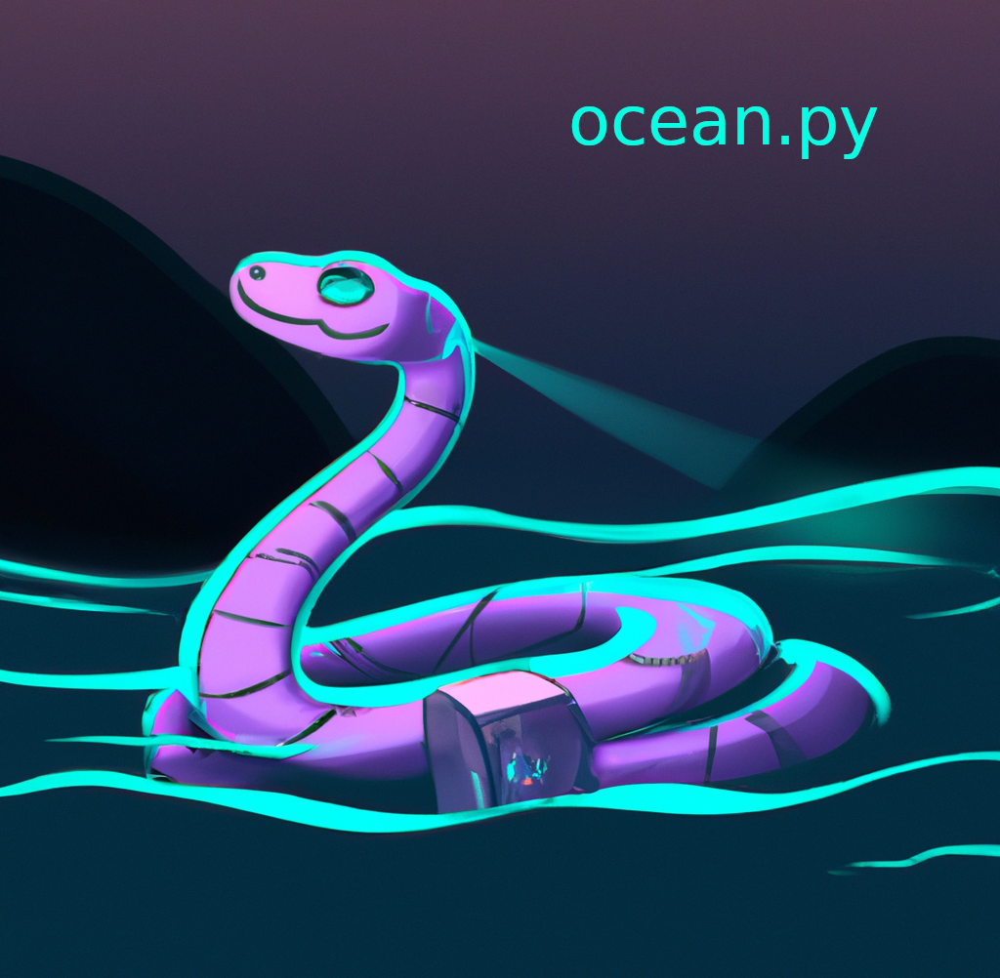

# Ocean.py

Attention all data enthusiasts! Are you an inquisitive data scientist intrigued by the world of Web3 and blockchain, but unsure of where to begin? Have you developed a groundbreaking AI algorithm and desire to transform it into profitable success? Perhaps you're engaged in training a highly lucrative model (LLM) and seek to define precise licensing terms for your valuable data. Or maybe you simply wish to sell your data while maintaining utmost privacy and control.

Well, brace yourselves for some exhilarating news! Introducing ocean.py, a Python library that possesses a touch of magic. 🎩🐍 It empowers you to discreetly and securely publish, exchange, and effortlessly consume data. 🐙💦 Collaborating with the Ocean Protocol 🌊, it unlocks a plethora of advantages mentioned earlier. So get ready to take the plunge into the vast ocean of data with a resounding splash of excitement! 💦🌊

<figure><figcaption>
ocean.py library
</figcaption></figure>

### Overview

ocean.py serves as a connection layer bridging the V4 smart contracts and various components such as [Provider](https://github.com/oceanprotocol/provider), [Aquarius](https://github.com/oceanprotocol/aquarius), and [Compute to Data engine](https://github.com/oceanprotocol/operator-service) within Ocean Protocol. This pythonic library brings all these elements together, facilitating seamless integration and interaction. By acting as an intermediary, ocean.py enables developers to easily leverage the functionalities offered by Ocean Protocol, making it a valuable tool in building applications and solutions that utilize decentralized data marketplaces. Its purpose is to simplify the process of connecting with smart contracts and accessing services provided by Provider, Aquarius, and Compute to Data engine, providing a convenient and efficient development experience for users.

#### Architectural point of view

ocean.py is like the conductor of an underwater orchestra, guiding different marine creatures (modules) to work together harmoniously. It's an open-source library that makes swimming in the vast sea of data a breeze! 🌊

The head of our library is the "[Ocean](technical-details.md)" class. It oversees everything and keeps track of the data flow.

Now, let's take a closer look at those amazing branches:

1. **Data Discovery Branch**: This branch acts as an intrepid explorer, delving into the vast seas of data to discover valuable datasets stored in the Ocean Protocol ecosystem. It navigates through metadata and identifies the hidden treasures.
2. **Data Access Branch**: Just like a skilled locksmith, this branch unlocks the doors to the datasets, facilitating seamless access and retrieval. It interacts with the Ocean Protocol's smart contracts to securely fetch the desired data.
3. **Data Cleaning Branch**: Here comes the meticulous cleaner! This branch ensures that the fetched data is pristine and free from any impurities. It scrubs away any inconsistencies or inaccuracies, leaving behind sparkling clean datasets.
4. **Data Transformation Branch**: Transforming data is like wielding magic, and this arm is the magician! It performs enchanting operations on the data, such as reformatting, reorganizing, or even enriching it, making it ready for the next steps.
5. **Model Training Branch**: This branch employs machine learning techniques to train models using the transformed data. It collaborates with the Ocean smart contracts to optimize the training process.
6. **Model Evaluation Branch**: It's time for a performance assessment! This branch thoroughly examines the trained models, assessing their accuracy, robustness, and compliance with predefined metrics. It ensures that our models are as reliable as a trustworthy companion.
7. **Model Deployment Branch**: Now, it's time to set our trained models free into the ocean of opportunities! This branch interacts with the Ocean smart contracts to deploy the models, making them accessible for utilization within the Ocean ecosystem.
8. **Model Monitoring Branch**: This branch monitors their behavior, tracks their performance, and detects any anomalies that may arise. It collaborates with the Ocean smart contracts to ensure the models swim smoothly.

So, in the realm of ocean.py's integration with Ocean Protocol's smart contracts, the eight versatile branches embark on an exciting journey, discovering, accessing, cleaning, transforming, training, evaluating, deploying, and monitoring data and models. Together, they form a powerful team, navigating the depths of the Ocean ecosystem. 🌊🐙

### ocean.py Strengths 💪

ocean.py lets you do the following things:

* Publish data services: downloadable files or compute-to-data. Create an ERC721 data NFT for each service, and ERC20 datatoken for access (1.0 datatokens to access).
* Sell datatokens via for a fixed price. Sell data NFTs.
* Transfer data NFTs & datatokens to another owner, and all other ERC721 & ERC20 actions using  Brownie.

If you prefer video format, please check this video below, otherwise let's move forward.



### ocean.py Quickstart 🚀

To kickstart your adventure with ocean.py, we set out the following steps to get you zooming ahead in no time!

1. [Install Ocean](install.md) 📥
2. Setup 🛠️ — [Remote ](remote-setup.md)(Win, MacOS, Linux) — or [Local ](local-setup.md)(Linux only)
3. [Publish asset](publish-flow.md), post for free / for sale, dispense it / buy it, and [consume ](consume-flow.md)it
4. Run algorithms through [Compute-to-Data flow](compute-flow.md) using Ocean environment.

After these quickstart steps, the main [README](https://github.com/oceanprotocol/ocean.py/blob/main/README.md) points to several other use cases, such as [Predict-ETH](https://github.com/oceanprotocol/predict-eth), [Data Farming](https://github.com/oceanprotocol/ocean.py/blob/main/READMEs/df.md), on-chain key-value stores ([public](https://github.com/oceanprotocol/ocean.py/blob/main/READMEs/key-value-public.md) or [private](https://github.com/oceanprotocol/ocean.py/blob/main/READMEs/key-value-private.md)), and other types of data assets ([REST API](https://github.com/oceanprotocol/ocean.py/blob/main/READMEs/publish-flow-restapi.md), [GraphQL](https://github.com/oceanprotocol/ocean.py/blob/main/READMEs/publish-flow-graphql.md), [on-chain](https://github.com/oceanprotocol/ocean.py/blob/main/READMEs/publish-flow-onchain.md)).
