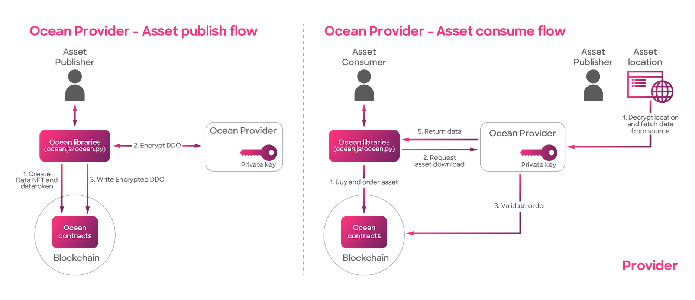

# Provider

### What is Provider?

It is a REST API designed specifically for the provision of data services. It essentially acts as a proxy that encrypts and decrypts the metadata and access information for the data asset.

Constructed using the Python Flask HTTP server, the Provider service is the only component in the Ocean Protocol stack with the ability to access your data, it is an important layer of security for your information.

The Provider service has several key functions. Firstly, it performs on-chain checks to ensure the buyer has permission to access the asset. Secondly, it encrypts the URL and metadata during the publication phase, providing security for your data during the initial upload.

The Provider decrypts the URL when a dataset is downloaded and it streams the data directly to the buyer, it never reveals the asset URL to the buyer. This provides a layer of security and ensures that access is only provided when necessary.

Additionally, the Provider service offers compute services by establishing a connection to the C2D environment. This enables users to compute and manipulate data within the Ocean Protocol stack, adding a new level of utility and function to this data services platform.

### What does the Provider do?

* The only component that can access your data
* Performs checks on-chain for buyer permissions and payments
* Encrypts the URL and metadata during publish
* Decrypts the URL when the dataset is downloaded or a compute job is started
* Provides access to data assets by streaming data (and never the URL)
* Provides compute services (connects to C2D environment)
* Typically run by the Data owner

<figure><figcaption>
Ocean Provider - publish &#x26; consume
</figcaption></figure>

In the publishing process, the provider plays a crucial role by encrypting the DDO using its private key. Then, the encrypted DDO is stored on the blockchain.

During the consumption flow, after a consumer obtains access to the asset by purchasing a datatoken, the provider takes responsibility for decrypting the DDO and fetching data from the source used by the data publisher.

### What technology is used?

* Python: This is the main programming language used in Provider.
* Flask: This Python framework is used to construct the Provider API.
* HTTP Server: Provider responds to HTTP requests from clients (like web browsers), facilitating the exchange of data and information over the internet.

### How to run the provider?

We recommend checking the README in the Provider [GitHub repository](https://github.com/oceanprotocol/provider) for the steps to run the Provider. If you see any errors in the instructions, please open an issue within the GitHub repository.

### Ocean Provider Endpoints Specification

The following pages in this section specify the endpoints for Ocean Provider that have been implemented by the core developers.

For inspecting the errors received from `Provider` and their reasons, please revise this [document](https://github.com/oceanprotocol/provider/blob/main/ocean\_provider/routes/README.md).
