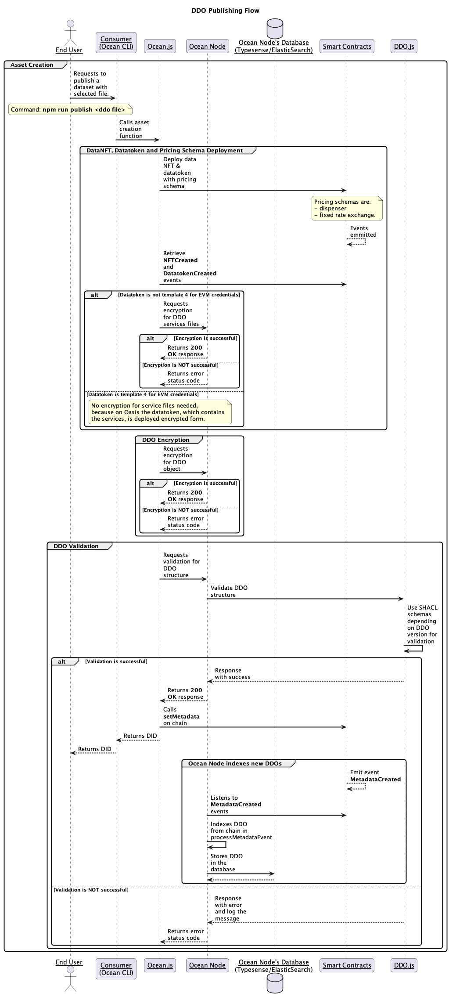

# Publish Flow Overview

Let's remember the interaction with Ocean's stack components for DDO publishing flow!

For this particular flow, we selected as consumer - Ocean CLI.\
To explore more details regarding Ocean CLI usage, kindly check [this dedicated section](ocean-cli/).

In this context, we address the following sequence diagram along with the explanations.

<figure><figcaption>
DDO Publish Flow
</figcaption></figure>

1. **Asset Creation Begins**

* The End User initiates the process by running the command: _**npm run publish**_ .\
  This redirects to Ocean CLI (Consumer) to start publishing the dataset with the selected file.
* The Consumer then calls `ocean.js`, which handles the asset creation logic.

2. **Smart Contract Deployment**

* Ocean.js interacts with the Smart Contracts to deploy:\
  Data NFT, Datatoken, pricing schema such as **Dispenser**\
  from free assets and **Fixed Rate Exchange** for priced assets.
* Once deployed, the smart contracts emit the **NFTCreated** and **DatatokenCreated** events (and additionally **DispenserCreated** and **FixedRateCreated** for pricing schema deployments).
* Ocean.js listens to these events and checks the datatoken template. If it is template 4, then no encryption is needed for service files, because [template 4 contract of ERC20](https://github.com/oceanprotocol/contracts/blob/main/contracts/templates/ERC20Template4.sol) is used on top of credential EVM chains, which already encrypt the information on-chain, e.g. Sapphire Testnet. Otherwise, service files need to be encrypted by Ocean Node's dedicated handler.

3. **DDO Validation**\
   Ocean.js requests Ocean Node to validate the DDO structure against the SHACL schemas, depending on DDO version. For this task, Ocean Node uses util functions from `DDO.js` library which is out dedicated tool for DDO interactions.

* ✅ _If Validation Succeeds_:\
  Ocean.js can call setMetadata on-chain and then returns the DID to the Consumer, which is passed back to the End User. The DID gets indexed in parallel, because Ocean Node listens through Indexer to blockchain events, including `MetadataCreated` and the DDO will be processed and stored within `Ocean Node's Database`.
* ❌ _If Validation Fails_:\
  Ocean Node logs the issue and responds to Ocean.js with an error status and asset creation halts here.

## Hands-On Approach

Regarding publishing new datasets through consumer, Ocean CLI, please consult [this dedicated section](ocean-cli/publish.md).
