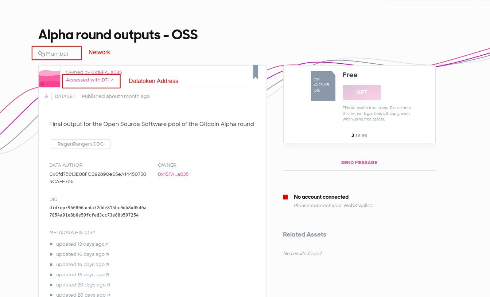
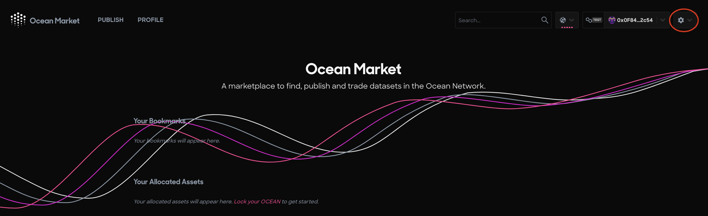
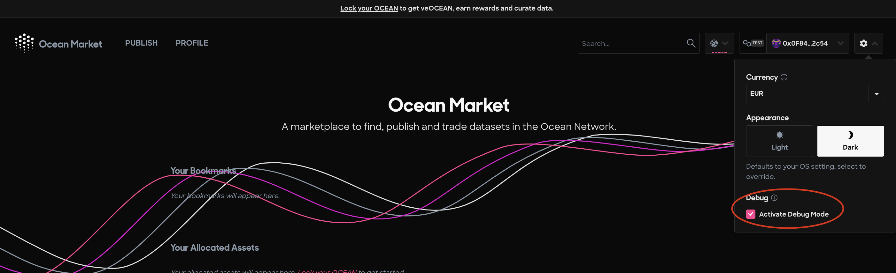
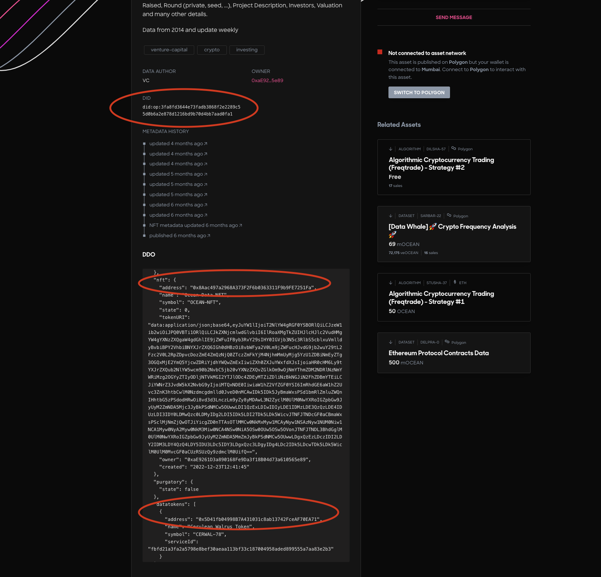
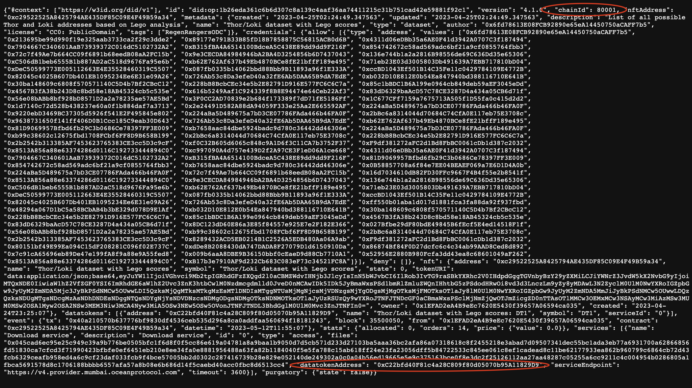

# List datatoken buyers

## Step 1: Find the Network and Datatoken address

### How to find the network and datatoken address from an Ocean Market link?

If you are given an Ocean Market link, then the network and datatoken address for the asset is visible on the Ocean Market webpage. For example, given this asset's Ocean Market link: [https://odc.oceanprotocol.com/asset/did:op:1b26eda361c6b6d307c8a139c4aaf36aa74411215c31b751cad42e59881f92c1](https://odc.oceanprotocol.com/asset/did:op:1b26eda361c6b6d307c8a139c4aaf36aa74411215c31b751cad42e59881f92c1) the webpage shows that this asset is hosted on the Mumbai network, and one simply clicks the datatoken's hyperlink to reveal the datatoken's address as shown in the screenshot below:

<figure><figcaption><p>See the Network and Datatoken Address for an Ocean Market asset by visiting the asset's Ocean Market page.</p></figcaption></figure>

#### More Detailed Info:

You can access all the information for the Ocean Market asset also by **enabling Debug mode**. To do this, follow these steps:

**Step 1** - Click the Settings button in the top right corner of the Ocean Market

<figure><figcaption><p>Click the Settings button</p></figcaption></figure>

**Step 2** - Check the Activate Debug Mode box in the dropdown menu

<figure><figcaption><p>Check 'Active Debug Mode'</p></figcaption></figure>

**Step 3** - Go to the page for the asset you would like to examine, and scroll through the DDO information to find the NFT address, datatoken address, chain ID, and other information.

<figure><figcaption></figcaption></figure>

### &#x20;How to find the network and datatoken address from a DID?

If you know the DID:op but you don't know the source link, then you can use Ocean Aquarius to resolve the metadata for the DID:op to find the `chainId`+ `datatoken address` of the asset. Simply enter in your browser "[https://v4.aquarius.oceanprotocol.com/api/aquarius/assets/ddo/](https://v4.aquarius.oceanprotocol.com/api/aquarius/assets/ddo/did:op:1b26eda361c6b6d307c8a139c4aaf36aa74411215c31b751cad42e59881f92c1)\<your did:op:XXX>" to fetch the metadata.

For example, for the following DID:op: "did:op:1b26eda361c6b6d307c8a139c4aaf36aa74411215c31b751cad42e59881f92c1" the Ocean Aquarius URL can be modified to add the DID:op and resolve its metadata. Simply add "[https://v4.aquarius.oceanprotocol.com/api/aquarius/assets/ddo/](https://v4.aquarius.oceanprotocol.com/api/aquarius/assets/ddo/did:op:1b26eda361c6b6d307c8a139c4aaf36aa74411215c31b751cad42e59881f92c1)" to the beginning of the DID:op and enter the link in your browser like this: [https://v4.aquarius.oceanprotocol.com/api/aquarius/assets/ddo/did:op:1b26eda361c6b6d307c8a139c4aaf36aa74411215c31b751cad42e59881f92c1](https://v4.aquarius.oceanprotocol.com/api/aquarius/assets/ddo/did:op:1b26eda361c6b6d307c8a139c4aaf36aa74411215c31b751cad42e59881f92c1)

<figure><figcaption><p>The metadata printout for this DID:op with the network's Chain ID and datatoken address circled in red</p></figcaption></figure>

Here are the networks and their corresponding chain IDs:

```
"mumbai: 80001"
"polygon: 137"
"bsc: 56"
"energyweb: 246"
"moonriver: 1285"
"mainnet: 1"
"goerli: 5"
"polygonedge: 81001"
"gaiaxtestnet: 2021000"
"alfajores: 44787"
"gen-x-testnet: 100"
"filecointestnet: 3141"
"oasis_saphire_testnet: 23295"
"development: 8996"
```

\
Step 2: Query the Subgraph to see all buyers of the datatoken
-------------------------------------------------------------

Select the corresponding subgraph URL for the asset's network. Below are some of the popular subgraph URLs, to show you the subgraph URL format.

```
https://v4.subgraph.mainnet.oceanprotocol.com/subgraphs/name/oceanprotocol/ocean-subgraph/graphql?
https://v4.subgraph.polygon.oceanprotocol.com/subgraphs/name/oceanprotocol/ocean-subgraph/graphql?
https://v4.subgraph.bsc.oceanprotocol.com/subgraphs/name/oceanprotocol/ocean-subgraph/graphql?
https://v4.subgraph.moonriver.oceanprotocol.com/subgraphs/name/oceanprotocol/ocean-subgraph/graphql?
https://v4.subgraph.energyweb.oceanprotocol.com/subgraphs/name/oceanprotocol/ocean-subgraph/graphql?
https://v4.subgraph.goerli.oceanprotocol.com/subgraphs/name/oceanprotocol/ocean-subgraph/graphql?
https://v4.subgraph.mumbai.oceanprotocol.com/subgraphs/name/oceanprotocol/ocean-subgraph/graphql?
```

You can then use the following example Javascript query to list the buyers of the datatoken.

Note, that you can also copy and paste the contents of the query function below to fetch the same info from the Ocean Subgraph [GraphiQL interface](https://v4.subgraph.mainnet.oceanprotocol.com/subgraphs/name/oceanprotocol/ocean-subgraph/graphql).&#x20;

```runkit  nodeVersion="18.x.x"
const axios = require('axios')

const datatoken = "0xc22bfd40f81c4a28c809f80d05070b95a11829d9".toLowerCase()

const query = `{ 
    token(id : "${datatoken}")  {
          id,
          orders(
            orderBy: createdTimestamp
            orderDirection: desc
            first: 1000
          ) {
            id
            consumer {
              id
            }
            payer {
              id
            }
            reuses {
              id
            }
            block
            createdTimestamp
            amount
          }
        }
}`

const network = "mumbai"
var config = {
  method: 'post',
  url: `https://v4.subgraph.${network}.oceanprotocol.com/subgraphs/name/oceanprotocol/ocean-subgraph`,
  headers: { "Content-Type": "application/json" },
  data: JSON.stringify({ "query": query })
};

axios(config)
  .then(function (response) {
    const orders = response.data.data.token.orders
    console.log(orders)
    for (let order of orders) {
        console.log('id:' + order.id + ' consumer: ' + order.consumer.id + ' payer: ' + order.payer.id)
    }
    console.log(response.data.data.token.orders)
  })
  .catch(function (error) {
    console.log(error);
});

```
