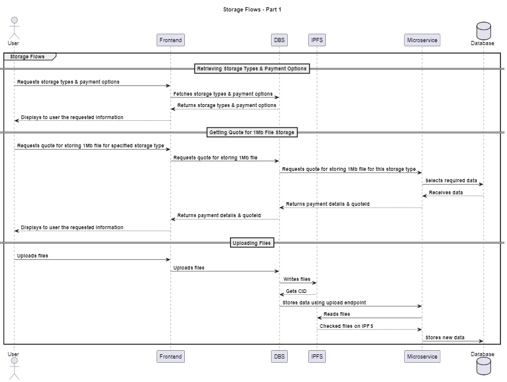
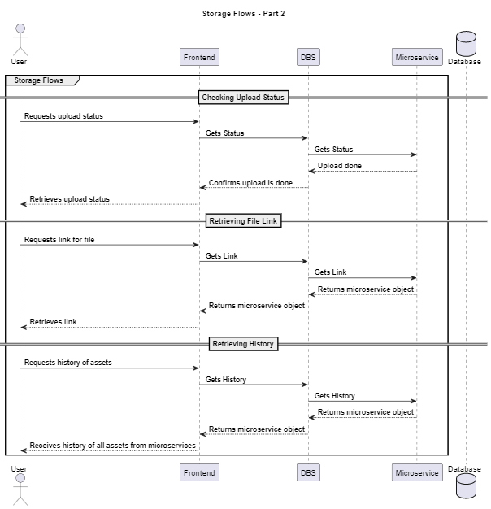

# Uploader

### What's DBS?

The Decentralized Backend Storage (DBS) system represents a cutting-edge solution designed to streamline the storage management process within a decentralized network. Built with efficiency and scalability in mind, DBS leverages advanced technologies to provide secure, reliable, and cost-effective storage solutions to users.

### Architecture Overview

DBS is built on a robust architecture that seamlessly integrates various components to ensure optimal performance. The architecture consists of:

- DBS API Layer: Exposes both public and private APIs for frontend and microservices interactions, respectively.
- 1-N Storage Microservices: Multiple microservices, each specializing in different storage types, responsible for handling storage operations.
- IPFS Integration: Temporary storage management using the InterPlanetary File System (IPFS).

### Features

DBS offers a range of powerful features tailored to meet the needs of decentralized storage management:

- User Content Uploads: Users can seamlessly upload their content through the user-friendly frontend interface.
- Payment Handling: DBS integrates with payment systems to manage the financial aspects of storage services.
- Decentralized Storage: Content is pushed to decentralized storage networks like Filecoin and Arweave for enhanced security and redundancy.
- API Documentation: Comprehensive API documentation on each repo to allow users to understand and interact with the system effortlessly.
- DBS.js: a TypeScript library designed to simplify interaction with the DBS API. This library provides a user-friendly and intuitive interface for calling API endpoints within the Ocean Decentralized Backend Storage system.

### Components

- DBS: https://github.com/oceanprotocol/decentralized_storage_backend
- DBS.js: https://github.com/oceanprotocol/dbs.js
- DBS UI: https://github.com/oceanprotocol/dbs-ui-lib

### Microservices:

- Filecoin: https://github.com/oceanprotocol/dbs_filecoin (WIP)
- Arweave: https://github.com/oceanprotocol/dbs_arweave

### User Workflow

DBS simplifies the user workflow, allowing for easy management of storage operations:

- Users fetch available storage types and payment options from the frontend.
- Quotes for storing files on the Microservice network.
Files are uploaded from the frontend to DBS, which handles temporary storage via IPFS.
- The Microservice takes over, ensuring data is stored on the selected network securely.
- Users can monitor upload status and retrieve links to access their stored content.

<figure><figcaption>
Ocean Uploader - storage flow 1
</figcaption></figure>
<figure><figcaption>
Ocean Uploader - storage flow 1
</figcaption></figure>

### API Documentation

Our detailed API documentation in our repos are provided to facilitate seamless integration and interaction with the DBS system. The documentation outlines all API endpoints, payload formats, and example use cases, empowering developers to effectively harness the capabilities of the DBS solution.

### Troubleshooting

Did you encounter a problem? Open an issue in our Repos:

- DBS: https://github.com/oceanprotocol/decentralized_storage_backend/issues
- DBS.js: https://github.com/oceanprotocol/dbs.js/issues
- Filecoin Microservice: https://github.com/oceanprotocol/dbs_filecoin/issues
- Arweave Microservice: https://github.com/oceanprotocol/dbs_arweave/issues
- DBS UI Library: https://github.com/oceanprotocol/dbs-ui-lib/issues
