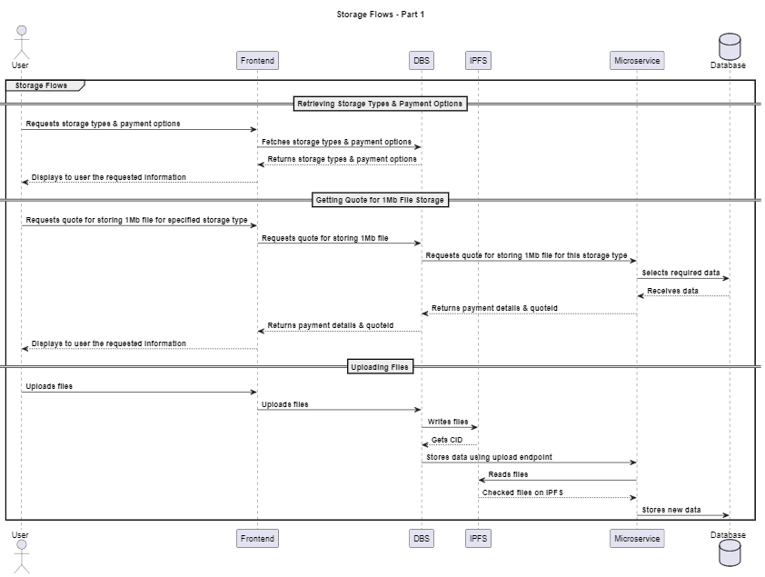
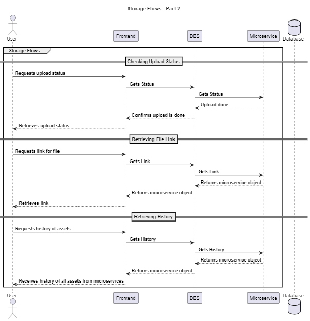

# Uploader

### What's Uploader?

The Uploader represents a cutting-edge solution designed to streamline the upload process within a decentralized network. Built with efficiency and scalability in mind, Uploader leverages advanced technologies to provide secure, reliable, and cost-effective storage solutions to users.

### Architecture Overview

Uploader is built on a robust architecture that seamlessly integrates various components to ensure optimal performance. The architecture consists of:

- Uploader API Layer: Exposes both public and private APIs for frontend and microservices interactions, respectively.
- 1-N Storage Microservices: Multiple microservices, each specializing in different storage types, responsible for handling storage operations.
- IPFS Integration: Temporary storage using the InterPlanetary File System (IPFS).

### Streamlined File Uploads

Uploader streamlines the file uploading process, providing users with a seamless experience to effortlessly incorporate their digital assets into a decentralized network. Whether you're uploading images, documents, or other media, Uploader enhances accessibility and ease of use, fostering a more decentralized and inclusive digital landscape.

### Unique Identifiers

Obtain unique identifiers such as hashes or CIDs for your uploaded files. These unique identifiers play a pivotal role in enabling efficient tracking and interaction with decentralized assets. By obtaining these identifiers, users gain a crucial toolset for managing, verifying, and engaging with their digital assets on the decentralized network, ensuring a robust and secure mechanism for overseeing the lifecycle of their contributed files.

### Features

Uploader offers a range of powerful features tailored to meet the needs of any decentralized storage:

- User Content Uploads: Users can seamlessly upload their content through the user-friendly frontend interface.
- Payment Handling: Uploader integrates with payment systems to manage the financial aspects of storage services.
- Decentralized Storage: Content is pushed to decentralized storage networks like Filecoin and Arweave for enhanced security and redundancy.
- API Documentation: Comprehensive API documentation on each repo to allow users to understand and interact with the system effortlessly.
- Uploader.js: a TypeScript library designed to simplify interaction with the Uploader API. This library provides a user-friendly and intuitive interface for calling API endpoints within the Uploader Storage system.

### Components

- [Uploader](https://github.com/oceanprotocol/decentralized_storage_backend)
- [Uploader.js](https://github.com/oceanprotocol/uploader.js)
- [Uploader UI](https://github.com/oceanprotocol/uploader-ui-lib)

### Microservices:

- [Filecoin](https://github.com/oceanprotocol/uploader_filecoin) (WIP)
- [Arweave](https://github.com/oceanprotocol/uploader_arweave)

### User Workflow

Uploader simplifies the user workflow, allowing for easy management of storage operations:

- Users fetch available storage types and payment options from the frontend.
- Quotes for storing files on the Microservice network.
Files are uploaded from the frontend to Uploader, which handles temporary storage via IPFS.
- The Microservice takes over, ensuring data is stored on the selected network securely.
- Users can monitor upload status and retrieve links to access their stored content.

<figure><figcaption>
Ocean Uploader - storage flow 1
</figcaption></figure>
<figure><figcaption>
Ocean Uploader - storage flow 1
</figcaption></figure>

### API Documentation

Documentation is provided in the repos to facilitate seamless integration and interaction with the Uploader. The documentation outlines all API endpoints, payload formats, and example use cases, empowering developers to effectively harness the capabilities of the Uploader solution.

### Troubleshooting

Did you encounter a problem? Open an issue in Ocean Protocol's repos:

- [Uploader](https://github.com/oceanprotocol/decentralized_storage_backend/issues)
- [Uploader.js](https://github.com/oceanprotocol/uploader.js/issues)
- [Filecoin Microservice](https://github.com/oceanprotocol/uploader_filecoin/issues)
- [Arweave Microservice](https://github.com/oceanprotocol/uploader_arweave/issues)
- [Uploader UI Library](https://github.com/oceanprotocol/uploader-ui-lib/issues)
