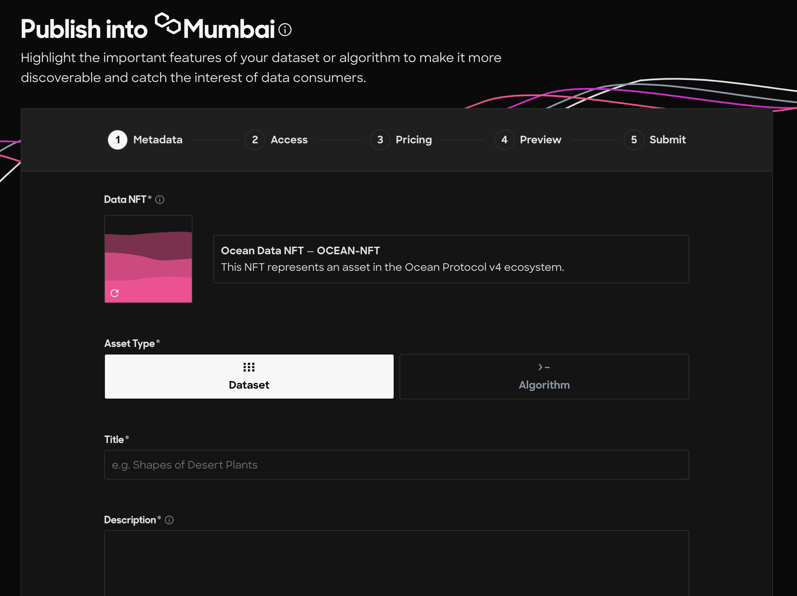
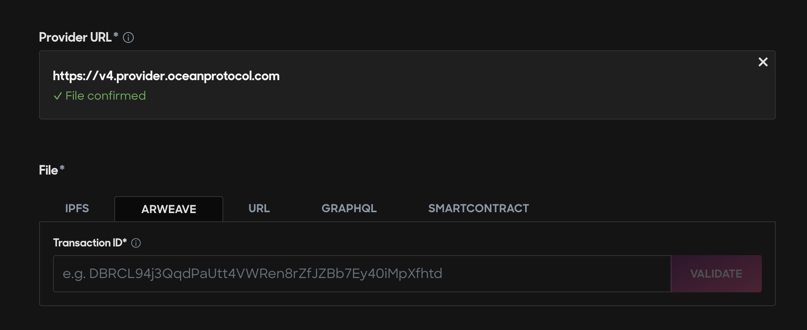
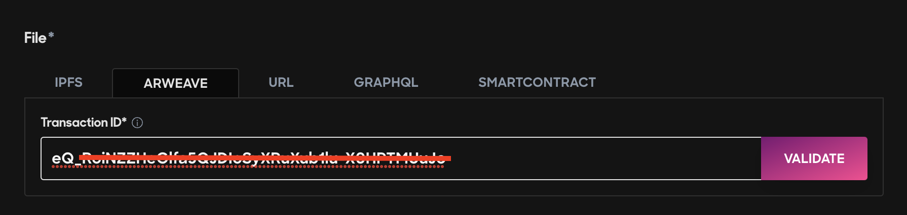
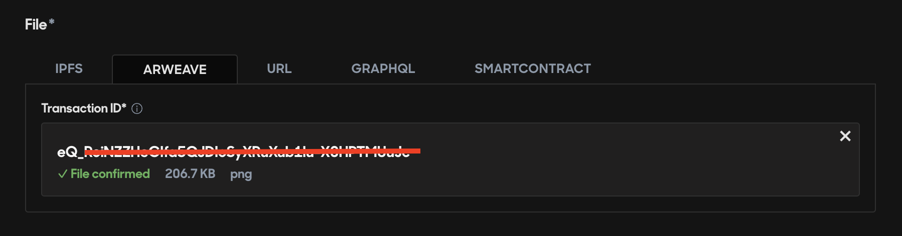

# Uploader UI Marketplace

<b>Step 1</b>: Copy the hash or CID from your upload.

<b>Step 2</b>: Open the Ocean Marketplace. Go to publish and fill in all the information for your dataset.

<b>Step 3</b>: When selecting the file to publish, open the hosting provider (e.g. "Arweave" tab)

<b>Step 4</b>: Paste the hash you copied earlier.

<b>Step 5</b>: Click on "VALIDATE" to ensure that your file gets validated correctly.

This feature not only simplifies the process of storing and managing files but also seamlessly integrates with the Ocean Marketplace. Once your file is uploaded via Uploader UI, you can conveniently use the generated hash or CID to interact with your assets on the Ocean Marketplace, streamlining the process of sharing, validating, and trading your digital content.