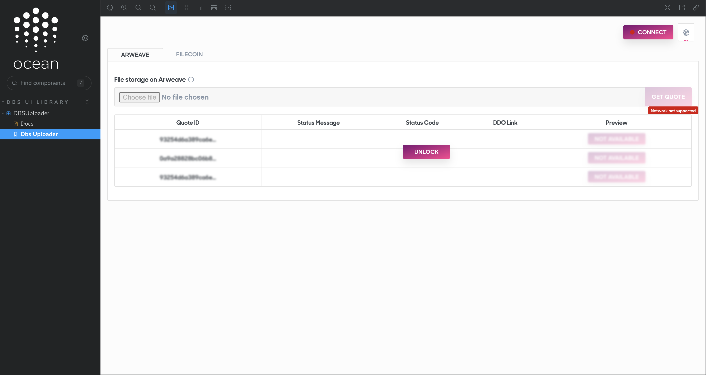
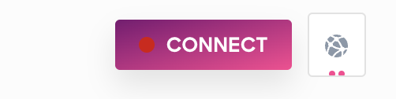
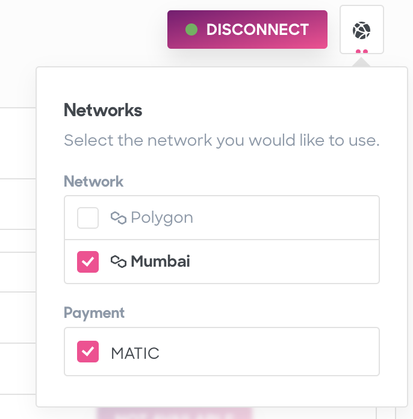
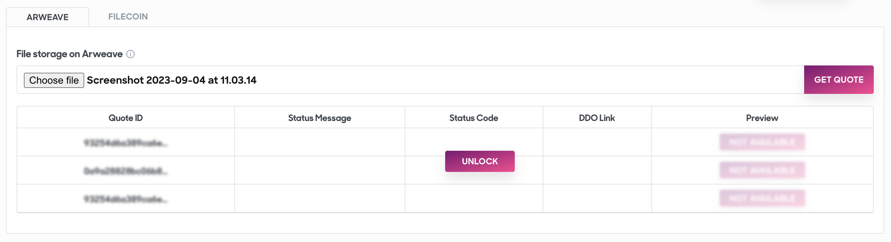
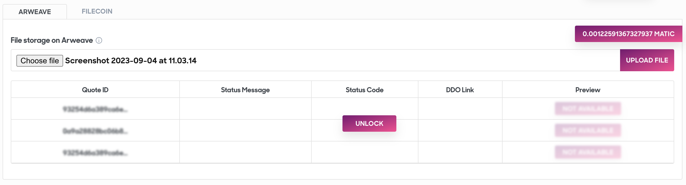
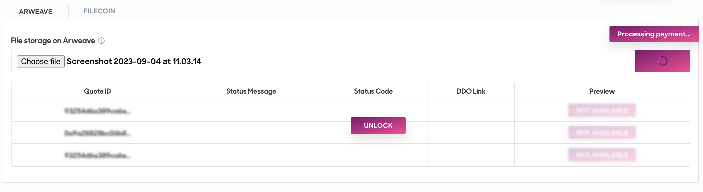
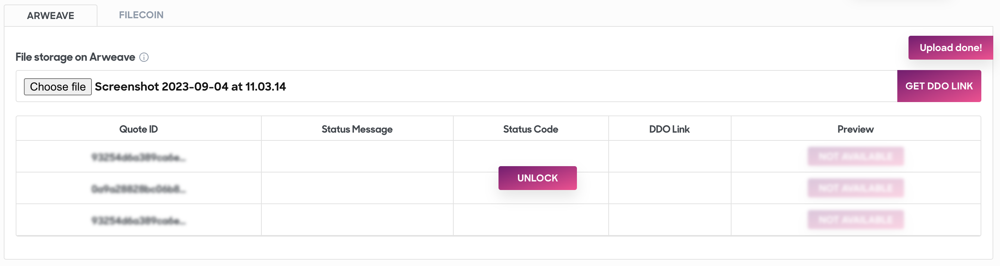
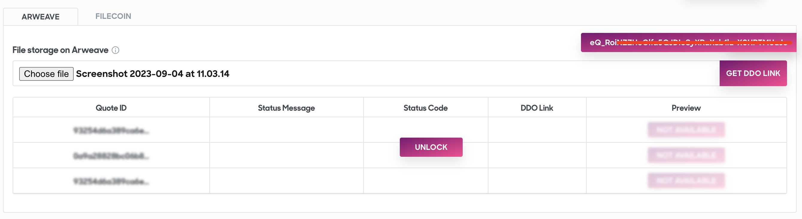
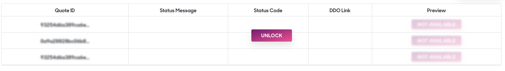
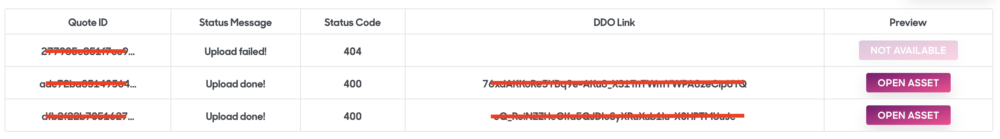

# Uploader UI

The Ocean Uploader User Interface, is a powerful web-based tool designed to simplify and streamline the process of managing, uploading, and interacting with digital assets on the Ocean Protocol ecosystem. This intuitive platform offers users a seamless experience for uploading files, obtaining unique identifiers (hashes or CIDs), and manage your decentralized assets.

<b>Step 1</b>: Open the Uploader UI Library.

<b>Step 2</b>: Click on the "CONNECT" button in the top right corner.

<b>Step 3</b>: Make sure you are conneted to the correct network.

<b>Step 4</b>: A Wallet Connect popup might appear. Follow the prompts if it shows up.

<b>Step 5</b>: Click on the Microservice you want to use (e.g. "Arweave" tab) and select a file to upload.

<b>Step 6</b>: Click on the "QUOTE" button. This will calculate the amount of tokens you'll be paying to store this asset.

<b>Step 7</b>: Click on the "UPLOAD FILE" button. You'll be asked to confirm and approve the tx.

<b>Step 8</b>: Wait for the upload to complete.

<b>Step 9</b>: Once the upload is done, you can click on the "GET DDO LINK" button to get the tx hash or CID of the file.

This step-by-step guide will help you navigate the Uploader UI Library and successfully upload a file, ensuring a smooth experience throughout the process.

(Optional Steps)

<b>Step 10</b>: Click on "UNLOCK."

<b>Step 11</b>: Check your historical information and quotes. To open the asset, click on "OPEN ASSET."

