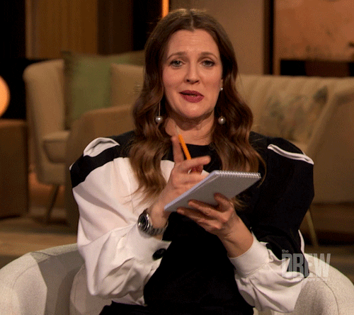

# Basic Concepts

You'll need to know a thing or two about **Web3** to fully understand Ocean Protocol's tech... Let's get started with the basics 🧑‍🏫

<figure><figcaption>
Prepare yourself, my friend
</figcaption></figure>

### Blockchain: The backbone of Ocean Protocol

Blockchain is a revolutionary technology that enables the decentralized nature of Ocean Protocol. At its core, blockchain is a **distributed ledger** that securely **records and verifies transactions across a network of computers**. It operates on the following key concepts that ensure trust and immutability:

* **Decentralization**: Blockchain eliminates the need for intermediaries by enabling a peer-to-peer network where transactions are validated collectively. This decentralized structure reduces reliance on centralized authorities, enhances transparency, and promotes a more inclusive data economy.
* **Immutability**: Once a transaction is recorded on the blockchain, it becomes virtually impossible to alter or tamper with. The data is stored in blocks, which are cryptographically linked together, forming an unchangeable chain of information. Immutability ensures the integrity and reliability of data, providing a foundation of trust in the Ocean Protocol ecosystem. Furthermore, it enables a reliable traceability of historical transactions.
* **Consensus Mechanisms**: Blockchain networks employ consensus mechanisms to validate and agree upon the state of the ledger. These mechanisms ensure that all participants validate transactions without relying on a central authority, crucially maintaining a reliable view of the blockchain's history. The consensus mechanisms make it difficult for malicious actors to manipulate the blockchain's history or conduct fraudulent transactions. Popular consensus mechanisms include Proof of Work (PoW) and Proof of Stake (PoS).

Ocean Protocol harnesses the power of blockchain to facilitate secure and auditable data exchange. This ensures that data transactions are transparent, verifiable, and tamper-proof. Here's how blockchain is utilized in the Ocean Protocol ecosystem:

* **Data Asset Representation**: Data assets in Ocean Protocol are represented as non-fungible tokens (NFTs) on the blockchain. NFTs provide a unique identifier for each data asset, allowing for seamless tracking, ownership verification, and access control. Through NFTs and datatokens, data assets become easily tradable and interoperable within the Ocean ecosystem.
* **Smart Contracts**: Ocean Protocol utilizes smart contracts to automate and enforce the terms of data exchange. Smart contracts act as self-executing agreements that facilitate the transfer of data assets between parties based on predefined conditions - they are the exact mechanisms of decentralization. This enables cyber secure data transactions and eliminate the need for intermediaries.
* **Tamper-Proof Audit Trail**: Every data transaction on Ocean Protocol is recorded on the blockchain, creating an immutable and tamper-proof audit trail. This ensures the transparency and traceability of data usage, providing data scientists with a verifiable record of the data transaction history. Data scientists can query addresses of data transfers on-chain to understand data usage.

By integrating blockchain technology, Ocean Protocol establishes a trusted infrastructure for data exchange. It empowers individuals and organizations to securely share, monetize, and leverage data assets while maintaining control and privacy.

### **OCEAN Tokens: Empowering Data Ownership and Monetization**

Ocean tokens (**OCEAN**) are the native cryptocurrency of the Ocean Protocol ecosystem. They serve as the medium of exchange for data services, enabling data owners, consumers, and service providers to participate in the data economy. Here's how Ocean tokens are used within the ecosystem:

1. **Data Ownership**: Ocean tokens empower data owners by providing them with control over their data assets. Through the use of smart contracts, data owners can define access permissions, usage rights, and pricing terms for their data. By holding and staking Ocean tokens, data owners can exercise even greater control over their data assets.
2. **Data Monetization and Consumption**: Ocean tokens facilitate seamless and secure transactions between data providers and consumers, fostering a thriving new data economy. Data owners can set a price in Ocean tokens for consumers to access and utilize their data. This creates opportunities for unlocking value from siloed or otherwise unused data.
3. **Stake for veOcean and Curate Datasets**: Through the Data Farming initiative, you are incentivized to lock Ocean tokens for [veOCEAN](../rewards/veocean.md). By staking your OCEAN and veOCEAN, you not only support the growth and sustainability of the ecosystem but also earn a share of data asset sales 💰. The Data Farming initiative offers participants a unique opportunity to earn [rewards](../rewards/) while making a meaningful impact in the data marketplace.
