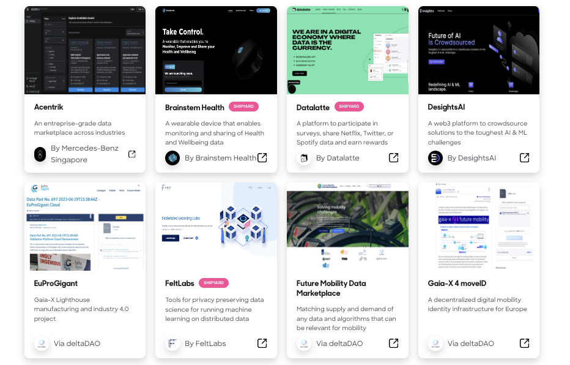
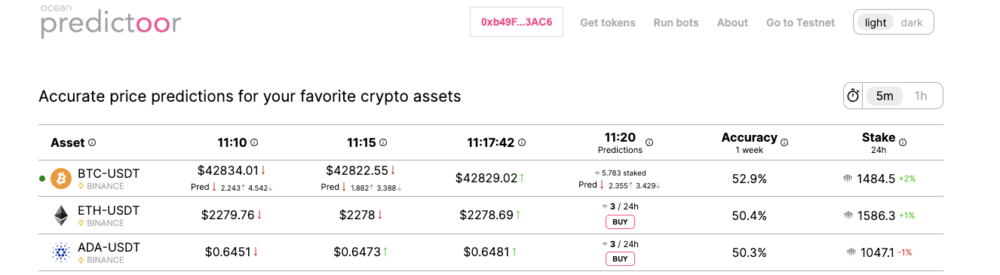

# What can you do with Ocean?

This page shows things you can do with Ocean...
- [As a builder](#what-builders-can-do)
- [As a data scientist](#what-data-scientists-can-do)
- [As an OCEAN holder](#what-ocean-holders-can-do)
- [Become an Ocean ambassador](#become-an-ocean-ambassador)

### What builders can do

<figure></figure>

<mark style="color:purple;">Build Your Token-gated AI dApp</mark>

Monetize by making your dApp token-gated. Users no longer have to use credit cards or manage OAuth credentials. Rather, they buy & spend ERC20 datatokens to access your dApp content.

Go further yet: rather than storing user profile data on your centralized server -- which exposes you to liability --  have it on-chain encrypted by the user's wallet, and just-in-time decrypt for the app.

<mark style="color:purple;">Build Your Token-gated REST API</mark>

Focus on the backend: make a Web3-native REST API. Like the token-gated dApps, consumers of the REST API buy access with crypto, not credit cards.

<mark style="color:purple;">Build Your Data Market</mark>

Build a decentralized data marketplace by [forking Ocean Market code](../developers/build-a-marketplace/) to quickly get something good, or by building up from Ocean components for a more custom look.

To dive deeper, please go to [Developers page](../developers/README.md).

### What data scientists can do

<figure></figure>

<mark style="color:red;">Use Ocean in Python</mark>

The **[ocean.py](../data-scientists/ocean.py/README.md)** library is built for the key environment of data scientists: Python. Use it to earn $ from your data, share your data, get more data from others, and see provenance of data usage.

<mark style="color:red;">Do crypto price predictions</mark>

With [Ocean Predictoor](../predictoor/README.md), you submit predictions for the future price of BTC, ETH etc, and earn. The more accurate your predictions, the more $ you can earn.

<mark style="color:red;">Compete in a Data Challenge</mark>

Ocean regularly offer [data science challenges](../data-scientists/join-a-data-challenge) on real-world problems. Showcase your skills, and earn $ prizes.

To dive deeper, please go to [Data Scientists page](../data-scientists/README.md).

### What OCEAN holders can do

<mark style="color:purple;">Earn Rewards via Data Farming</mark>

Ocean's [Data Farming](../data-farming/README.md) incentives program enables OCEAN holders to earn by locking OCEAN, and curating data.

### Become an Ocean Ambassador

<mark style="color:blue;">Become an Ambassador</mark>

As an ambassador, you are an advocate for the protocol, promoting its vision and mission. By sharing your knowledge and enthusiasm, you can educate others about the benefits of Ocean Protocol, inspiring them to join the ecosystem. As part of a global community of like-minded individuals, you gain access to exclusive resources, networking opportunities, and collaborations that further enhance your expertise in the data economy. Of course, the Ocean Protocol Ambassador Program rewards contributors with weekly bounties and discretionary grants for growing the Ocean Protocol communtiy worldwide.

Follow the steps below to become an ambassador:

To become a member of the Ambassador Program, follow these steps: 
1. Join Ocean Protocol's [Discord](https://discord.com/invite/TnXjkR5) server
2. Join the Discord channel called #treasure-hunter. 
3. Access the application form: "[Apply](https://discord.com/channels/612953348487905282/1133478278531911790) to use this channel."
4. Answer the questions in the application form. 
5. Once you've completed the application process, you can start earning experience points (XP) by actively engaging in discussions on various topics related to the Ocean Protocol.

----

_Next: [OCEAN: The Ocean token](ocean-token.md)_

_Back: [What is Ocean?](what-is-ocean.md)_
