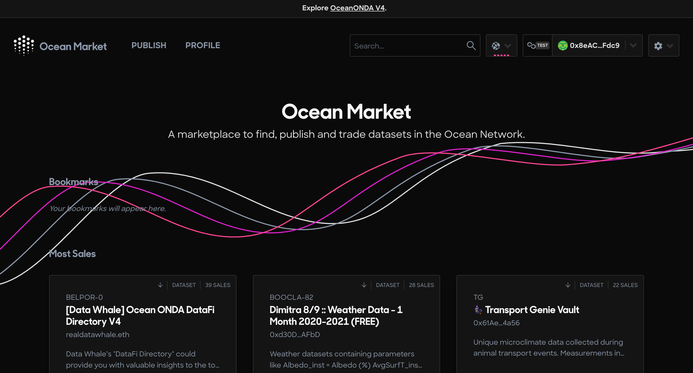
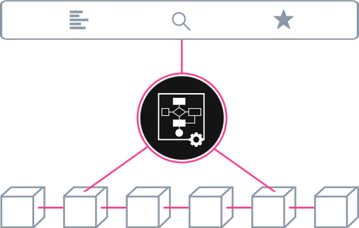

# 🌊 Discover

As AI becomes more prevalent, society is increasingly reliant on data. However, a few organizations with massive data assets and AI capabilities have gained worrying levels of control, which poses a threat to a free and open society ☢️

The concentration of vast datasets in the hands of a few organizations can lead to significant negative consequences for society. These include:

* 📛 **The centralization of power and influence**: With only a few organizations controlling large datasets, other entities may struggle to compete, leading to a concentration of resources and power in the hands of a select few.
* 📛  **Impaired innovation**: The lack of access to data by smaller players may stifle innovation in the industry. Smaller entities may not have the necessary resources to develop new products or services, limiting progress and competition.
* 📛  **Privacy concerns**: The concentrated control of data assets increases the risk of privacy breaches and abuses, leading to concerns over personal data use, surveillance, and the potential for discrimination based on data analysis.
* 📛  **Centralized decision-making**: With a small number of organizations controlling data, the decision-making process based on that data may become centralized and opaque, resulting in a lack of transparency and potentially detrimental outcomes for society.

By providing a decentralized and open platform and the tools for data sharing, **Ocean Protocol** aims to address these concerns and create a more equitable and collaborative data economy.

We believe that data is a valuable resource that should be accessible to everyone :people\_holding\_hands:, not just a select few large corporations. We aim to empower data providers to monetize their data and enable data consumers to access high-quality data for their projects. Ultimately, we seek to establish a more equitable and collaborative data economy that benefits businesses, researchers, and communities worldwide.

To find out more about the amazing team behind Ocean, you can visit our [website](https://oceanprotocol.com/about).

Are you curious about **Ocean Protocol**'s mission and how we're making a difference in the world? Then you won't want to miss this video featuring our co-founder, [Trent McConaghy](http://www.trent.st/). He'll share some fascinating insights into what we're doing and why it matters.


A new data economy with power to the people - Trent McConaghy


##

## What can you do with Ocean?

*   ### Build Your dApp

Building a [dApp](https://oceanprotocol.com/templates) on top of Ocean Protocol provides you with a powerful framework to create decentralized applications that leverage the capabilities of the protocol. By utilizing Ocean's technology stack, you can tap into a robust ecosystem designed for data exchange and collaboration.

When building a dApp on top of Ocean Protocol, you gain access to a wide range of features and functionalities:

1. **Data access and discovery**: Utilize Ocean's data marketplace infrastructure to access diverse and valuable data sets. Leverage the data discovery mechanisms to help users find relevant data assets for their applications.
2. **Data interoperability**: Seamlessly integrate and interact with various data sources using Ocean's standardized data representation formats. Ensure compatibility and easy data integration within your dApp.
3. **Data privacy and security**: Leverage the cryptographic capabilities of Ocean Protocol to ensure privacy and security of sensitive data. Implement access controls, encryption, and secure data sharing mechanisms within your dApp.
4. **Provenance and transparency**: Leverage the transparency and immutability of the blockchain to establish data provenance. Build trust among users by providing an auditable record of data sources, usage, and transactions.
5. **Tokenized incentives**: Utilize datatokens (ERC20) within your dApp to incentivize data providers and consumers. Design token economies that align with the specific requirements of your application, encouraging participation and value creation.
6. **Community participation**: Leverage the community-driven nature of Ocean Protocol to foster collaboration, feedback, and innovation. Engage with the Ocean community to share ideas, contribute to the ecosystem, and gather insights to enhance your dApp.

These are a few examples of what can be built on top of Ocean.

1. [Ocean Waves](https://waves.oceanprotocol.com/) - Music NFTs [marketplace](https://github.com/oceanprotocol/waves)
2. [Ocean Market](https://market.oceanprotocol.com) - Decentralised data [marketplace](https://github.com/oceanprotocol/market)
3. [Autobot](https://autobotocean.com/) - Tokengated [data farming](https://df.oceandao.org/) intelligence app
4. [Tokengate](https://tokengate.oceanprotocol.com/) - Tokengated content [marketplace](https://github.com/oceanprotocol/token-gating-template)
5. [Acentrik Market](https://market.acentrik.io/) - Enterprise decentralized data marketplace

* ### Buy or Sell Data

Within the Ocean ecosystem, users have the possibility to publish and sell data or explore and purchase data. Data is published in the form of interoperable [ERC721](https://github.com/ethereum/EIPs/blob/master/EIPS/eip-721.md) data NFTs and [ERC20](https://github.com/ethereum/EIPs/blob/7f4f0377730f5fc266824084188cc17cf246932e/EIPS/eip-20.md) datatokens. The platform acts as a decentralized exchange (DEX) specifically designed for data transactions. Every action, including publishing, purchasing, and consuming data, is securely recorded on the blockchain, creating a tamper-proof audit trail.

For data scientists and AI practitioners, Ocean presents opportunities such as increased access to a broader range of data, including private data, crypto-secured provenance for data and AI training, and potential income streams from selling and curating data.

To showcase these capabilities, Ocean developed a demonstrator marketplace known as the [Ocean Market](https://market.oceanprotocol.com/).

The following guides will help you get started with buying and selling data:

* [Publish an NFT](../how-tos/marketplace-publish-data-asset.md)
* [Download an NFT](../how-tos/marketplace-download-data-asset.md)
* [Host Assets](../how-tos/asset-hosting/)

*   ### Build Your Data Marketplace

With Ocean Protocol, you have the flexibility to create and launch your own data marketplace tailored to your specific requirements. Utilize the protocol's infrastructure and tools to establish a platform where data providers and consumers can connect and transact.&#x20;

You can choose from two options:

1. &#x20;**Fork the** [**Ocean Marketplace**](https://github.com/oceanprotocol/market) **and customize**: You have the ability to fork the existing [Ocean Marketplace](https://github.com/oceanprotocol/market) codebase and customize it according to your needs. This allows you to leverage the foundational infrastructure and functionality already built by Ocean Protocol while tailoring the user interface, features, and branding to align with your marketplace vision. Follow this [tutorial](../tutorials/build-a-marketplace/) to learn how to do it.
2. Build your marketplace with Ocean components: Alternatively, you can build your data marketplace from scratch using Ocean Protocol's modular components. Ocean provides a comprehensive set of building blocks, such as the [**Aquarius**](https://github.com/oceanprotocol/aquarius), [**Provider**](https://github.com/oceanprotocol/provider), Ocean [contracts](https://github.com/oceanprotocol/contracts), and Ocean libraries([**ocean.js**](https://github.com/oceanprotocol/ocean.js) & [**ocean.py**](https://github.com/oceanprotocol/ocean.py)), which you can integrate into your own marketplace development. This empowers you to create a unique and customized data marketplace experience while leveraging the underlying capabilities and standards provided by Ocean Protocol.

* ### Build tools- Templates

###

### Build Your Own Data Market

If you're interested in starting your own marketplace checkout the following guides:

* [Forking Ocean Market](../tutorials/build-a-marketplace/forking-ocean-market.md)
* [Customising your market](../tutorials/build-a-marketplace/customising-your-market.md)
* [Deploying your market](../tutorials/build-a-marketplace/deploying-market.md)

### Manage datatokens and data NFTs for use in DeFi

Ocean makes it easy to publish data services (deploy ERC721 data NFTs and ERC20 datatokens), and to consume data services (spend datatokens). Crypto wallets, exchanges, and DAOs become data wallets, exchanges, and DAOs.

Use Ocean [JavaScript](https://github.com/oceanprotocol/ocean.js) or [Python](https://github.com/oceanprotocol/ocean.py) drivers to manage data NFTs and datatokens:

Ocean-based apps make data asset on-ramps and off-ramps easy for end users. Ocean smart contracts and libraries make this easy for developers. The data itself does not need to be on-chain, just the access control.

Data NFTs are ERC721 tokens representing the unique asset and datatokens are ERC20 tokens to access data services. Each data service gets its own data NFT and one or more type of datatokens.

To access the dataset, you send 1.0 datatokens to the data provider (running Ocean Provider). To give access to someone else, send them 1.0 datatokens. That's it.

Since datatokens are ERC20, and live on Ethereum mainnet, there's a whole ecosystem to leverage.

* _Publish and access data services:_ downloadable files or compute-to-data. Use Ocean to deploy a new [ERC721](https://github.com/ethereum/EIPs/blob/master/EIPS/eip-721.md) and [ERC20](https://github.com/ethereum/EIPs/blob/7f4f0377730f5fc266824084188cc17cf246932e/EIPS/eip-20.md) datatoken contract for each data service, then mint datatokens.
* _Transfer datatokens_ to another owner (or approve & transferFrom).
* _And more._ Use ERC20 support in [web3.js](https://web3js.readthedocs.io/), [web3.py](https://web3py.readthedocs.io/en/stable/examples.html#working-with-an-erc20-token-contract) and Solidity to connect datatokens with crypto wallets and other DeFi services.

### Compute-to-Data

Ocean's "Compute-to-Data" feature enables private data to be bought & sold. You can sell compute access to privately-held data, which never leaves the data owner’s premises. Ocean-based marketplaces enable the monetization of private data while preserving privacy.

Compute-to-data resolves the tradeoff between the benefits of using private data, and the risks of exposing it. It lets the data stay on-premise, yet allows 3rd parties to run specific compute jobs on it to get useful compute results like averaging or building an AI model.

The most valuable data is private data — using it can improve research and business outcomes. But concerns over privacy and control make it hard to access. With Compute-to-Data, private data isn’t directly shared but rather specific access to it is granted.

It can be used for data sharing in science or technology contexts, or in marketplaces for selling private data while preserving privacy, as an opportunity for companies to monetize their data assets.

Private data can help research, leading to life-altering innovations in science and technology. For example, more data improves the predictive accuracy of modern Artificial Intelligence (AI) models. Private data is often considered the most valuable data because it’s so hard to get at, and using it can lead to potentially big payoffs.

Checkout these guides if you are aiming to get a deeper understanding on how compute-to-data works:

* [Architecture](../developers/core-concepts/compute-to-data-architecture.md)
* [Datasets & Algorithms](../developers/core-concepts/compute-to-data-datasets-algorithms.md)
* [Minikube Environment](../infrastructure/compute-to-data-minikube.md)
* [Writing Algorithms](../developers/core-concepts/compute-to-data-algorithms.md)
* [Private docker registry](../infrastructure/compute-to-data-docker-registry.md)

## How does it work?

In Ocean Protocol, each asset gets its own ERC721 **data NFT** and one(or more) ERC20 **datatokens**. This enables data wallets, data exchanges, and data co-ops by directly leveraging crypto wallets, exchanges, and more.

Ocean Protocol provides tools for developers to _build data markets_, and to _manage data NFTs and datatokens_ for use in DeFi.

If you are new to web3 and blockchain technologies then we suggest you first read these introductory guides:

* [Wallet Basics](wallets.md)
* [Set Up MetaMask Wallet](metamask-setup.md)
* [Manage Your OCEAN Tokens](wallets-and-ocean-tokens.md)

If ou are looking to get to grips with the inner workings of Ocean, then you'll be interested in the following guides:

* [Architecture Overview](../developers/core-concepts/architecture.md)
* [Data NFTs and Datatokens](../developers/core-concepts/datanft-and-datatoken.md)
* [Networks](networks/)
* [Fees](../developers/core-concepts/fees.md)
* [Asset pricing](../developers/core-concepts/asset-pricing.md)
* [DID & DDO](../developers/core-concepts/did-ddo.md)
* [Roles](../developers/core-concepts/roles.md)
* [Set Up a Marketplace](../tutorials/build-a-marketplace/marketplace.md)
* [Compute-to-Data](../developers/core-concepts/compute-to-data/)
* [Deploying components](../infrastructure/)
* [Contributing](../contribute/contributing.md)

## Supporters

[GitBook](https://www.gitbook.com/) is a supporter of this open source project by providing hosting for this documentation.
