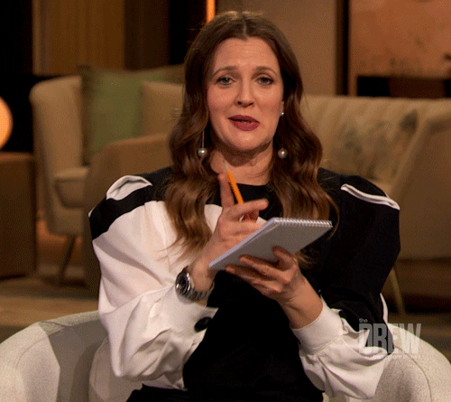

# Engage

You'll need to know a thing or two about **Web3** to fully understand Ocean Protocol's tech... Let's get started with the basics 🧑‍🏫

<figure><figcaption>
Prepare yourself, my friend
</figcaption></figure>

### Blockchain: The backbone of Ocean Protocol

Blockchain is a revolutionary technology that underpins the decentralized nature of Ocean Protocol. At its core, blockchain is a **distributed ledger** that securely **records and verifies transactions across a network of computers**. It operates on the following key concepts that ensure trust and immutability:

* **Decentralization**: Blockchain eliminates the need for intermediaries by enabling a peer-to-peer network where transactions are validated collectively. This decentralized structure enhances transparency, reduces reliance on centralized authorities, and promotes a more inclusive and democratic data economy.
* **Immutability**: Once a transaction is recorded on the blockchain, it becomes virtually impossible to alter or tamper with. The data is stored in blocks, which are cryptographically linked together, forming an unchangeable chain of information. Immutability ensures the integrity and reliability of data, providing a foundation of trust in the Ocean Protocol ecosystem.
* **Consensus Mechanisms**: Blockchain networks employ consensus mechanisms to validate and agree upon the state of the ledger. These mechanisms ensure that all participants in the network reach a consensus on the validity of transactions without relying on a central authority. Popular consensus mechanisms include Proof of Work (PoW) and Proof of Stake (PoS).

Ocean Protocol harnesses the power of blockchain to facilitate secure and auditable data exchange. By leveraging blockchain technology, Ocean ensures that data transactions are transparent, verifiable, and tamper-proof. Here's how blockchain is utilized in the Ocean Protocol ecosystem:

* **Data Asset Representation**: Data assets in Ocean Protocol are represented as non-fungible tokens (NFTs) on the blockchain. NFTs provide a unique identifier for each data asset, allowing for seamless tracking, ownership verification, and access control. Through NFTs, data assets become easily tradable and interoperable within the Ocean ecosystem.
* **Smart Contracts**: Ocean Protocol utilizes smart contracts to automate and enforce the terms of data exchange. Smart contracts act as self-executing agreements that facilitate the transfer of data assets between parties based on predefined conditions. This enables secure and efficient data transactions while eliminating the need for intermediaries.
* **Tamper-Proof Audit Trail**: Every data transaction on Ocean Protocol is recorded on the blockchain, creating an immutable and tamper-proof audit trail. This ensures the transparency and traceability of data usage, providing data owners and consumers with a verifiable record of the entire transaction history.

By integrating blockchain technology, Ocean Protocol establishes a trusted and decentralized infrastructure for data exchange. It empowers individuals and organizations to securely share, monetize, and leverage data assets while maintaining control and privacy.

### **OCEAN Tokens: Empowering Data Ownership and Monetization**

Ocean tokens (**OCEAN**) are the native cryptocurrency of the Ocean Protocol ecosystem. They serve as the medium of exchange for data services, enabling data owners, consumers, and service providers to participate in the data economy. Here's how Ocean tokens are used within the ecosystem:

1. **Data Ownership**: Ocean tokens empower data owners by providing them with control over their data assets. Through the use of smart contracts, data owners can define access permissions, usage rights, and pricing terms for their data. By holding and staking Ocean tokens, data owners can maintain ownership and exercise greater control over their data assets.
2. **Data Monetization**: Ocean tokens enable data owners to monetize their data assets. Data owners can set a price in Ocean tokens for accessing and utilizing their data. This creates opportunities for data owners to unlock value from their data assets by offering them for sale or licensing them to interested parties. The use of Ocean tokens ensures secure and transparent transactions, enabling data owners to be fairly compensated for their valuable data.
3. **Data Consumption**: Consumers of data services within the Ocean ecosystem utilize Ocean tokens to access and utilize data assets. By paying the required amount of Ocean tokens, consumers can obtain access to high-quality data, enabling them to enhance their research, analysis, and AI model training. Ocean tokens facilitate seamless and secure transactions between data providers and consumers, fostering a thriving data marketplace.
4. **Stake for veOcean and Curate Data sets**: Through the Data Farming initiative, you are incentivized to lock Ocean tokens for [veOCEAN](../rewards/veocean.md). By staking your tokens, you not only support the growth and sustainability of the ecosystem but also earn a share of the generated incentives💰. The Data Farming initiative offers participants a unique opportunity to earn [rewards](../rewards/) while making a meaningful impact in the data marketplace.

Get ready to engage with Ocean Protocol by understanding the key components required. Learn how to connect your web3 wallet, choose the appropriate network (mainnet or testnet), and interact with smart contracts to buy, sell, or trade data assets.
