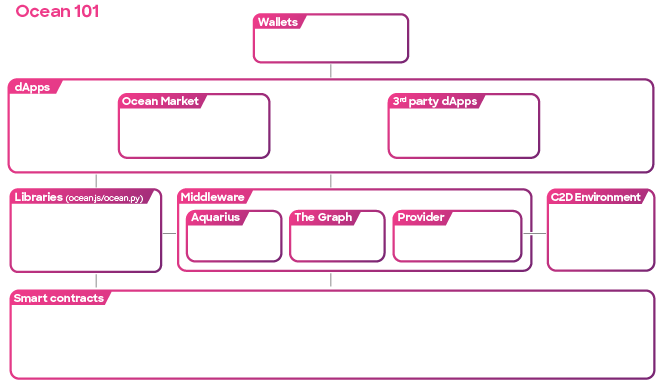
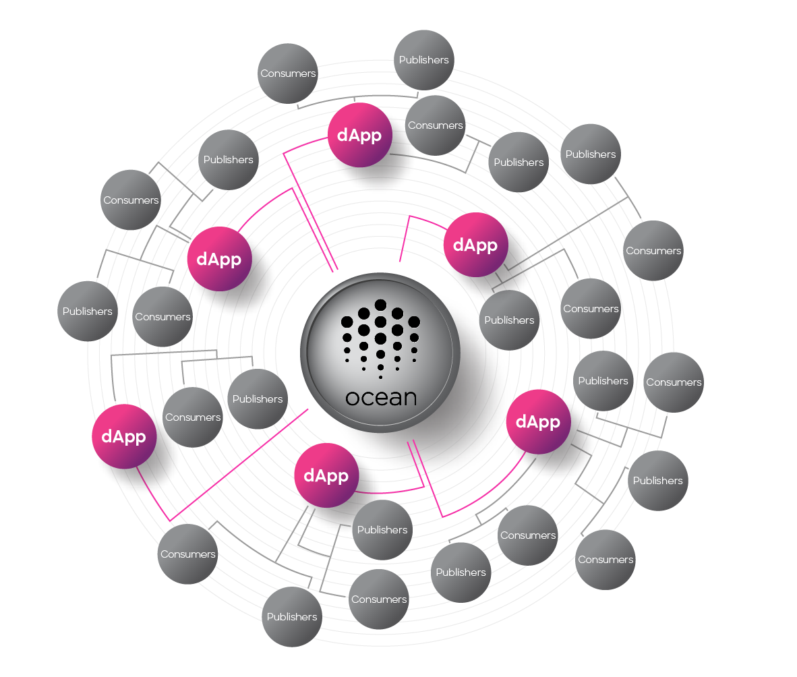

# Ocean 101

<figure><figcaption>
Let's see how it works
</figcaption></figure>

## How Does Ocean Work?

Ocean Protocol utilizes a combination of blockchain technology, decentralized networks, and cryptographic techniques to facilitate secure and privacy-preserving data sharing. Here's an overview of how Ocean works:

1. **Asset Registration**: Data providers register their data assets on the Ocean blockchain, providing metadata that describes the asset, its usage terms, and pricing information. This metadata is stored on-chain and can be accessed by potential data consumers.
2. **Discovery and Access Control**: Data consumers can discover available data assets through decentralized metadata services like Aquarius. Access control mechanisms, such as smart contracts, verify the consumer's permissions and handle the transfer of data access tokens.
3. **Secure Data Exchange**: When a data consumer purchases access to a data asset, the asset's metadata, and access instructions are encrypted by the data provider using the Provider service. The encrypted asset is then securely transferred to the consumer, who can decrypt and utilize it without revealing the asset's URL.
4. [**Compute-to-Data**](../developers/compute-to-data/README.md) **(C2D)**: Ocean Protocol supports C2D capabilities, allowing data consumers to perform computations on data assets without direct access to the underlying data. The compute operations are executed in a secure and controlled environment, ensuring data privacy and compliance.
5. **Incentives and Governance**: Ocean Protocol incorporates tokenomics and a governance framework to incentivize participants and ensure the sustainability and evolution of the ecosystem. Participants can earn and stake OCEAN for veOCEAN, curate data, contribute to the network and participate in governance decisions.

Ocean Protocol also combines advanced technologies and web components to create a robust and efficient data ecosystem.

<figure><figcaption>
Ocean architectural overview 
</figcaption></figure>

Powerful libraries such as [Ocean.js](../developers/ocean.js/README.md) (JavaScript) and [Ocean.py](../data-science/ocean.py/README.md) (Python) facilitate seamless integration and interaction with the protocol, offering a wide range of functionalities.

Ocean Protocol incorporates middleware components that enhance efficiency and streamline interactions. Components such as [Aquarius](../developers/aquarius/README.md) act as a metadata cache, improving search efficiency by caching on-chain data into Elasticsearch while [Provider](../developers/provider/README.md) plays a crucial role in various ecosystem operations, assisting in asset downloading, handling encryption of [Decentralized Data Objects](../developers/ddo-specification.md) (DDOs), and facilitating communication with the operator-service for Compute-to-Data jobs. And finally, the [Subgraph](../developers/subgraph/README.md), an off-chain service leveraging GraphQL, offers efficient access to information related to datatokens, users, and balances.

These libraries and middleware components contribute to efficient data discovery and secure interactions within the Ocean Protocol ecosystem.

By leveraging these tools and technologies, developers can harness the power of decentralized data while creating innovative applications and unlocking the true value of data assets.

<figure><figcaption>
Build dApps with Ocean
</figcaption></figure>

Ocean Protocol gives people and organizations the power to unleash the true value of their data. With its decentralized marketplaces, rock-solid data-sharing technologies, and privacy protection measures, Ocean Protocol opens the door for collaboration, sparks innovation, and encourages responsible and ethical data usage.

It's all about making data work for everyone in a fair and transparent data economy.
