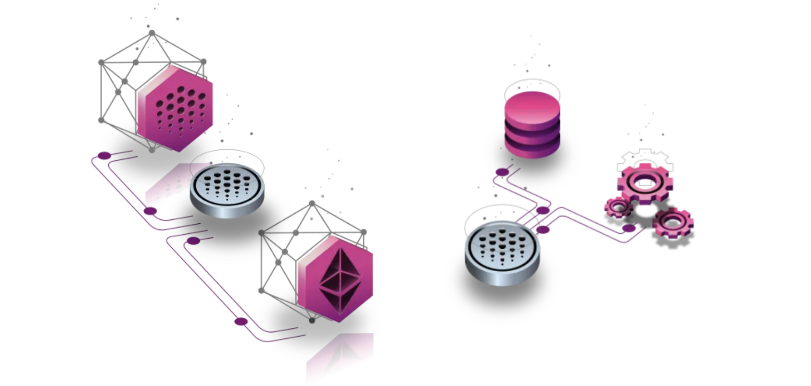
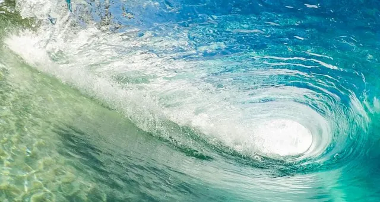

# OCEAN: The Ocean Token

OCEAN is a utility token. It's used to stake on data for curation, buy & sell data, and more. Its supply is disbursed over time to drive near-term growth and long-term sustainability.

**Contents:**
- [Getting and storing OCEAN](#getting-and-storing-ocean)
- [Staking OCEAN](#staking-ocean)
- [OCEAN supply](#ocean-supply)
- [Token design](#ocean-token-design)
- [OCEAN addresses](#ocean-addresses)

<figure></figure>

### Getting and Storing OCEAN

OCEAN is available on most leading CEXes and DEXes. The [Ocean Token page at oceanprotocol.com](https://oceanprotocol.com/about-us/ocean-token) has details. 

The [Wallets User Guide](../user-guides/wallets/README.md) here in Ocean docs shows how to set up wallets and store OCEAN.

### Staking OCEAN

You can lock OCEAN and earn rewards via [Ocean Data Farming](../data-farming/README.md).

### OCEAN supply

Total # tokens: 1.41B. All tokens are minted; all control is [revoked](https://blog.oceanprotocol.com/control-over-the-ocean-contract-to-be-revoked-soon-overview-6c5b15be2db).

OCEAN supply is divided as follows:

- 51% (719.1M OCEAN) - to Data Farming and incentives programs. Distributed via vesting: burn-in period then 4-year half-life. For details, see section 5.1 "OCEAN Emissions Schedule" of [Data Farming Main](https://blog.oceanprotocol.com/ocean-data-farming-main-is-here-49c99602419e#5a8f).
- 15% (211.5M OCEAN) - to Ocean community (grants, more) and foundation operations. 
- 10% (141.0M OCEAN) - to the founding company, and in turn to its investors, employees & operations
- 24% (338.4M OCEAN) - to token acquirors. This completed in early 2019. All acquiror vesting is complete as well.

### OCEAN Token Design

The system-level design of the OCEAN token is based on [The Web3 Sustainability Loop](https://blog.oceanprotocol.com/the-web3-sustainability-loop-b2a4097a36e), a general design pattern. The Ocean-specific version of this design is described in [section (7) of that same article](https://blog.oceanprotocol.com/the-web3-sustainability-loop-b2a4097a36e#e0f6).

This design gives flexibility to adapt the Ocean products for traction and growth. The flexibility is due to the goal to "drive network revenue", subject to the constraints of the mission & values of Ocean Protocol.

<figure></figure>

### OCEAN addresses

The "root" OCEAN token is deployed on Ethereum mainnet with address [`0x967da4048cd07ab37855c090aaf366e4ce1b9f48`](https://etherscan.io/token/0x967da4048cd07ab37855c090aaf366e4ce1b9f48).

The OCEAN token has bridges to several [other chains](networks/README.md). It has a unique address on each chain.

<mark style="color:black;"><i>OCEAN address per chain: (expand me)</i></mark>

<table data-full-width="false">
   <thead>
      <tr>
         <th width="161">Network name</th>
         <th width="444">Contract Address</th>
         <th width="105">Symbol</th>
         <th>Decimals</th>
      </tr>
   </thead>
   <tbody>
      <tr>
         <td><strong>Mainnet</strong></td>
         <td>0x967da4048cD07aB37855c090aAF366e4ce1b9F48</td>
         <td>OCEAN</td>
         <td>18</td>
      </tr>
      <tr>
         <td><strong>Polygon</strong> <strong>(ex Matic)</strong></td>
         <td>0x282d8efCe846A88B159800bd4130ad77443Fa1A1</td>
         <td>mOCEAN</td>
         <td>18</td>
      </tr>
      <tr>
         <td><strong>BNB</strong> <strong>BNB Smart Chain</strong></td>
         <td>0xdce07662ca8ebc241316a15b611c89711414dd1a</td>
         <td>OCEAN</td>
         <td>18</td>
      </tr>
       <tr>
         <td><strong>Oasis Sapphire</strong></td>
         <td>0x39d22B78A7651A76Ffbde2aaAB5FD92666Aca520</td>
         <td>OCEAN</td>
         <td>18</td>
      </tr>
      <tr>
         <td><strong>Optimism</strong></td>
         <td>0xf26c6c93f9f1d725e149d95f8e7b2334a406ad10</td>
         <td>OCEAN</td>
         <td>18</td>
      </tr>
      <tr>
         <td><strong>Görli</strong></td>
         <td>0xCfDdA22C9837aE76E0faA845354f33C62E03653a</td>
         <td>OCEAN</td>
         <td>18</td>
      </tr>
      <tr>
         <td><strong>Mumbai</strong></td>
         <td>0xd8992Ed72C445c35Cb4A2be468568Ed1079357c8</td>
         <td>OCEAN</td>
         <td>18</td>
      </tr>
      <tr>
         <td><strong>Sepolia</strong></td>
         <td>0x1B083D8584dd3e6Ff37d04a6e7e82b5F622f3985</td>
         <td>OCEAN</td>
         <td>18</td>
      </tr>
     <tr>
         <td><strong>Oasis Sapphire Testnet</strong></td>
         <td>0x973e69303259B0c2543a38665122b773D28405fB</td>
         <td>OCEAN</td>
         <td>18</td>
      </tr>
   </tbody>
</table>

----

_Next: [Networks](networks/README.md)_

_Back: [What can you do with Ocean?](benefits.md)_
