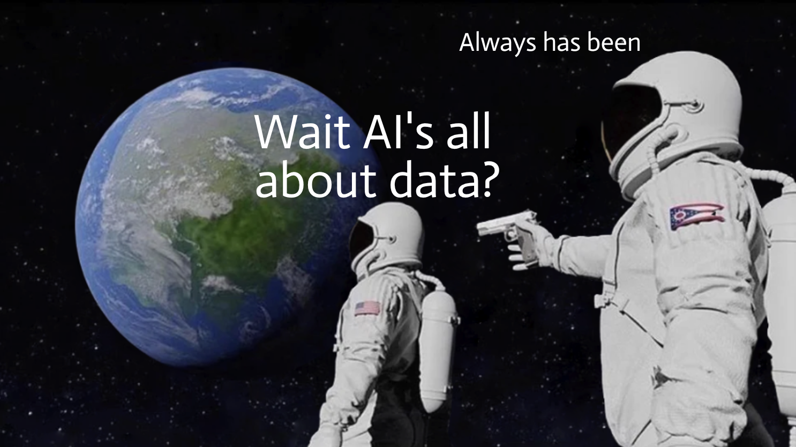
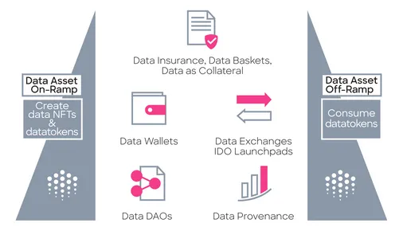
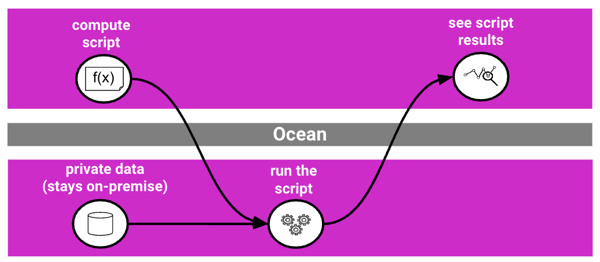
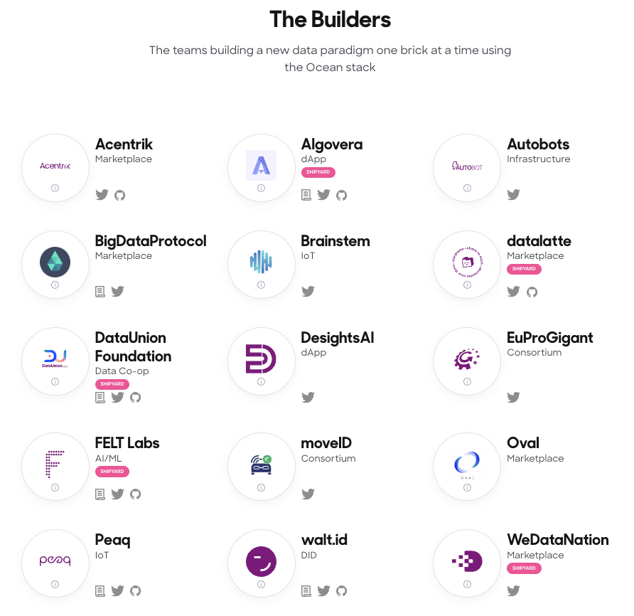
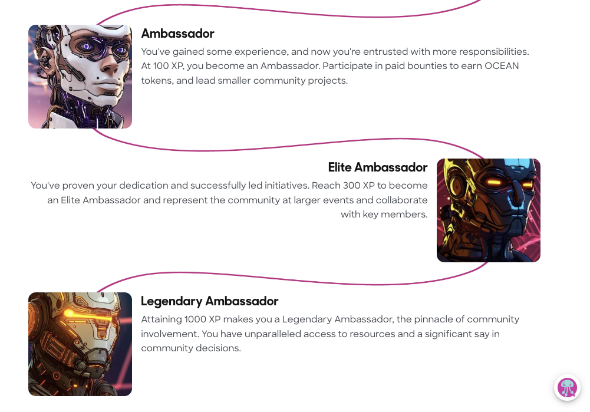

<figure></figure>

## What is Ocean?

Ocean is a decentralized data exchange protocol.

AI lives on data; Ocean facilitates it.

Ocean has two specific parts:
- A live tech stack. At the core is **Datatokens** and **Compute-to-Data**
- A lively community. This includes **builders, data scientists, OCEAN holders**, and **Ocean Ambassadors**. Ocean's community is active on **social media**.

Let's drill into each.

## Tech: Ocean data NFTs and datatokens

These enable decentralized access control, via token-gating. Key principles:

- Publish data services as ERC721 data NFTs and ERC20 datatokens
- You can access the dataset / data service if you hold 1.0 datatokens
- Consuming data services = spending datatokens

Crypto wallets, exchanges, and DAOs become _data_ wallets, exchanges, and DAOs.

<figure> <figcaption>Data NFTs & datatokens are an on-ramp and off-ramp for data assets into DeFi</figcaption></figure>

Data can be on Azure or AWS, Filecoin or Arweave, REST APIs or smart contract feeds. Data may be raw AI training data, feature vectors, trained models, even AI model predictions, or non-AI data.

## Tech: Ocean Compute-to-Data

This enables one buy & sell private data, while preserving privacy
- Private data is valuable: using it can improve research and business outcomes. But concerns over privacy and control make it hard to access.
- Compute-to-Data (C2D) grants access run compute against the data, _on the same premises of the data_. Only the results are visible to the consumer. The data never leaves the premises. Decentralized blockchain technology does the handshaking.
- C2D enables people to sell private data while preserving privacy, as an opportunity for companies to monetize their data assets.
- C2D can also be used for data sharing in science or technology contexts, with lower liability risk, because the data doesn't move.

<figure> <figcaption>Compute-to-Data flow</figcaption></figure>

## Community: Ocean Ecosystem

Ocean has a lively [ecosystem](https://oceanprotocol.com/explore/ecosystem) of dapps grown over years, built by enthusiastic developers.

<figure></figure>

The Ocean ecosystem also contains many data scientists and OCEAN holders, excited about the future of AI & data. You can find them doing predictions, data challenges, Data Farming, and more.

## Community: Ocean Ambassadors

Ocean has an excellent [community of ambassadors](https://oceanprotocol.com/explore/community). Anyone can join.

<figure></figure>

## Community: Social Media

Follow Ocean on [Twitter](https://twitter.com/OceanProtocol) or [Telegram](https://t.me/oceanprotocol_community) to keep up to date. Chat directly with the Ocean community on [Discord](https://discord.gg/TnXjkR5). Or, track Ocean progress directly on [GitHub](https://github.com/oceanprotocol).

Finally, the [Ocean blog](https://blog.oceanprotocol.com/) has regular updates.

----

_Next: [What can you do with Ocean?](benefits.md)_

_Back: [Why Ocean?](why-ocean.md)_