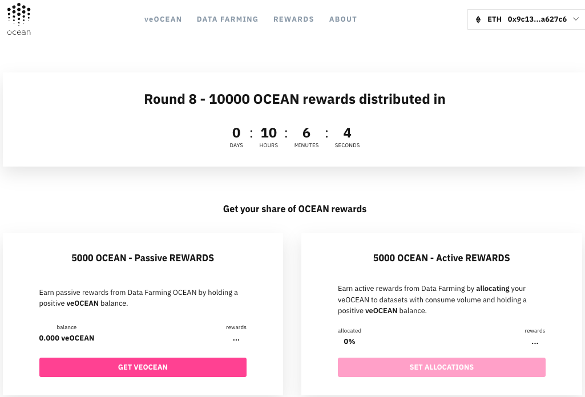
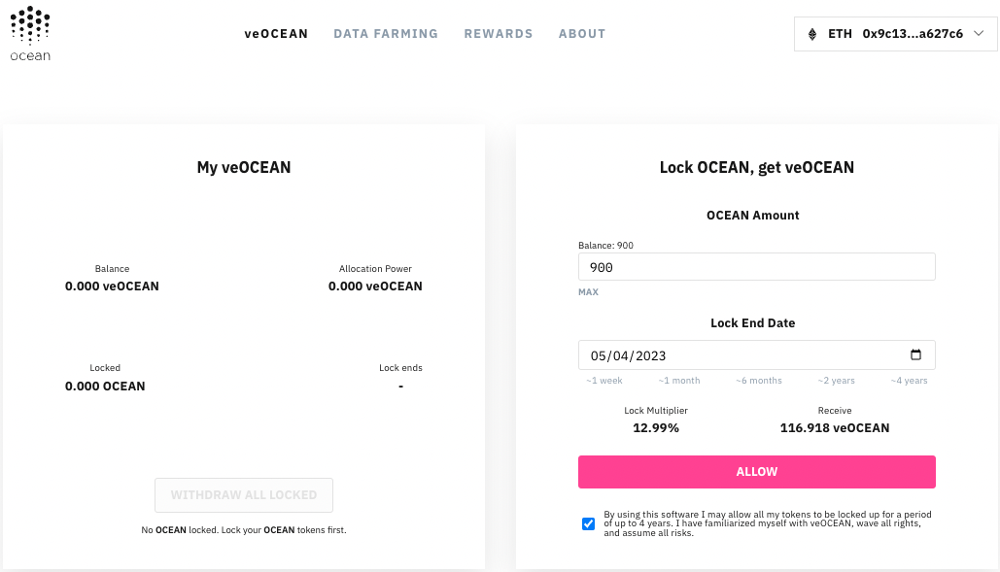
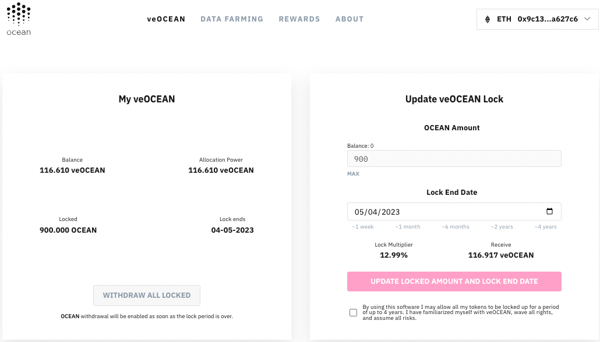
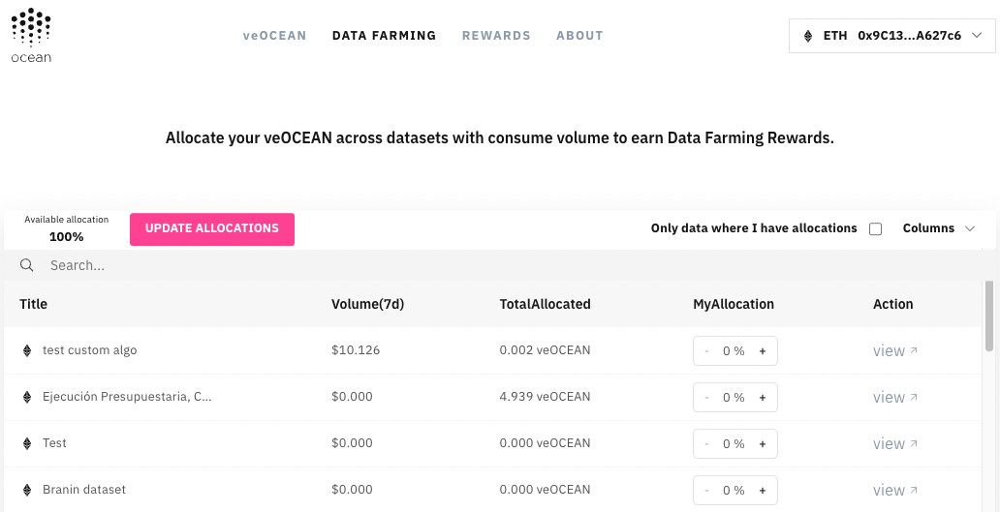
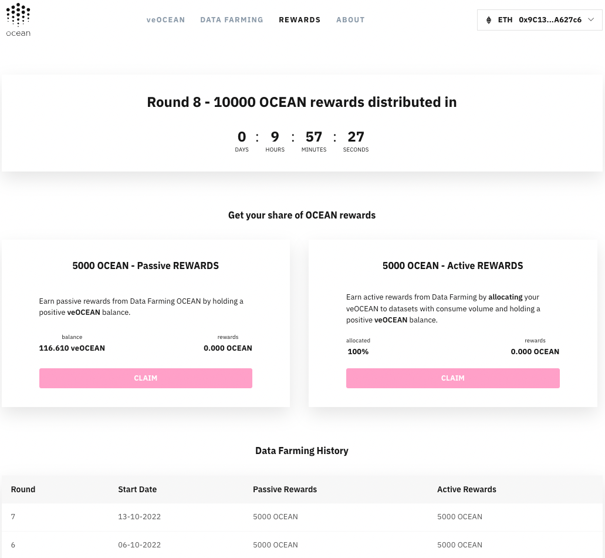

# Get OCEAN Rewards

Follow this step-by-step guide to get OCEAN rewards. There are two types of OCEAN rewards: passive and active rewards. OCEAN token holders may generate passive OCEAN rewards by locking up OCEAN in exchange for veOCEAN tokens. veOCEAN tokens can then be allocated to Ocean Market datasets and algorithms to generate active OCEAN rewards.

## How do I get rewards?

To generate rewards, start by navigating to [df.oceandao.org](https://df.oceandao.org). At the top of this page is the weekly round of OCEAN rewards and the quantity of OCEAN rewards to be distributed. The countdown timer shows the time until **each Thursday** when rewards are distributed. OCEAN rewards can be claimed every Thursday on the [Rewards page](https://df.oceandao.org/rewards).

- If you don't have veOCEAN tokens, then click the [Get veOCEAN](https://df.oceandao.org/veocean) button on the Passive Rewards panel on the left side of the page to navigate to the veOCEAN tab.

- If you already have veOCEAN tokens, then on the Active Rewards panel on the right side of the page, click the [Set Allocations](https://df.oceandao.org/data) button to navigate to the Data Farming tab.

## Passive Rewards

### How do I get veOCEAN?

After navigating to the [veOCEAN page](https://df.oceandao.org/veocean), you can generate passive OCEAN rewards by locking OCEAN tokens on the "Lock OCEAN, get veOCEAN" panel on the right side of the page. Connect a wallet to see the balance of OCEAN tokens update above the OCEAN Amount form field. Select a lock end date to see the Lock Multiplier and Receive veOcean fields update.

**The more OCEAN tokens you lock or if you lock them for a longer period of time, then the more rewards you get!**

Click the checkbox below the inactive pink ALLOW button, then click the activated pink ALLOW button. Sign the transaction with your wallet. Then, click the LOCK OCEAN button. Sign the transaction with your wallet.

Now the OCEAN tokens are locked in exchange for veOCEAN. The left side panel called "My veOCEAN" shows the corresponding balances of OCEAN and veOCEAN. You can withdraw your OCEAN tokens on this panel when the lock time ends.

**Note that your OCEAN tokens cannot be withdrawn until the Lock End Date!**

Notice the right side panel is now titled "Update veOCEAN Lock". You can add OCEAN tokens to your lock or you can increase the Lock End Date, but you cannot shorten your Lock End Date.

## Active Rewards

### How do I allocate veOCEAN?

You can generate active OCEAN rewards by allocating veOCEAN to various OCEAN Market projects to gain a portion of project sales.

Click on the Data Farming tab at the top of the page to navigate to the [Data Farming page](https://df.oceandao.org/data).

The OCEAN Market datasets and algorithms are listed in the grid. Each column is sortable, and there is a Search field on top of the grid to search for specific projects.

It is recommended to allocate all of your veOCEAN tokens to OCEAN Market projects to generate maximum rewards. When you allocate your veOCEAN to these datasets or algorithms, then you get a portion of those projects's sales. **If you allocate your veOCEAN to a project with many other allocators, then your portion of rewards will become diluted because there are more allocators to reward. You may be interested then in allocating veOCEAN to a project with fewer allocators to generate a greater percentage of rewards. However, if a project does not sell, then no rewards are generated.** Thus, it is important to allocate veOCEAN to projects you believe in, and do your research.

Once you allocate your percentage of veOCEAN to projects using the MyAllocation column, then click on the UPDATE ALLOCATIONS button and sign the transaction with your wallet.

## Claim Rewards

Click on the Rewards tab at the top of the page to come to the [same page](https://test-df.oceandao.org/rewards) as at the beginning of this tutorial. Now the balance of veOCEAN appears under the Passive Rewards panel on the left and the percentage allocated appears on the Active Rewards panel on the right.

**Your balance of veOCEAN may be less than the amount when you first locked your tokens because your veOCEAN balance decreases linearly over time until the Lock End Date when you can withdraw your OCEAN tokens.** This is because rewards are designed to be paid out weekly in a decreasing amount until you unlock your OCEAN tokens entirely. The veOCEAN code is a fork of Curve's battle tested veCRV token code.

## Learn More
If you would like to find out more details about veOCEAN, Data Farming, and rewards calculations, then please visit the About tab to read a great [blog post](https://blog.oceanprotocol.com/veocean-is-launching-data-farming-is-resuming-abed779211e3) on this topic.
