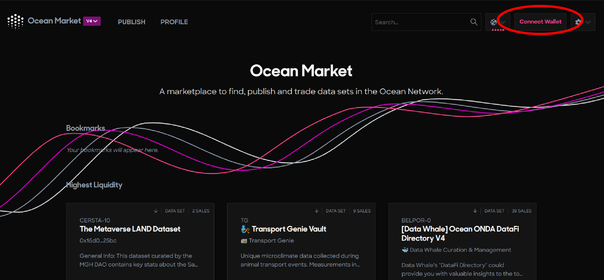
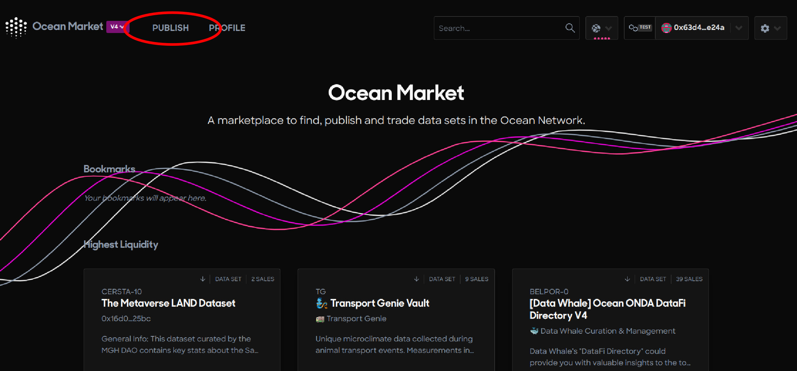

# Sell NFT Outputs

### Introducing, The Problem



**Anyone could buy your  NFT assets and then publicly share them all over the internet.** Pretty scary, right? But what if there was a way that buyers could access valuable insights from your data and algorithms without actually \*seeing\* the data or algorithms themselves? We have a solution for that!

Enter, **Compute-to-Data** (also lovingly called C2D). Ocean Protocol's C2D feature enables you to monetize the OUTPUT of compute jobs on your datasets without revealing the contents of the data/algorithms themselves. Let's dive in how!

## How to Compute-to-Data 💃

You will need to accomplish **2 main steps** in establishing a compute-to-data flow: publish your algorithm NFT, then publish your data NFT with configurations allowing the algorithm to compute on it. That's it! Then you'll be able to sell compute jobs 🤩

### First, Publish Your Algorithm NFT

#### Step 1 - Navigate to the Ocean Market

* Go to [https://market.oceanprotocol.com](https://market.oceanprotocol.com)

#### Step 2 - Connect your wallet

* Click the top right Connect Wallet button to connect your self-custody wallet to the Ocean Market

<figure><figcaption>
Connect your self-custody wallet
</figcaption></figure>

#### Step 3 - Click the Publish link in the top left corner of the page

* Click the Publish link

<figure><figcaption>
Navigate to the Publish page
</figcaption></figure>

#### Step 4 - Enter the metadata

