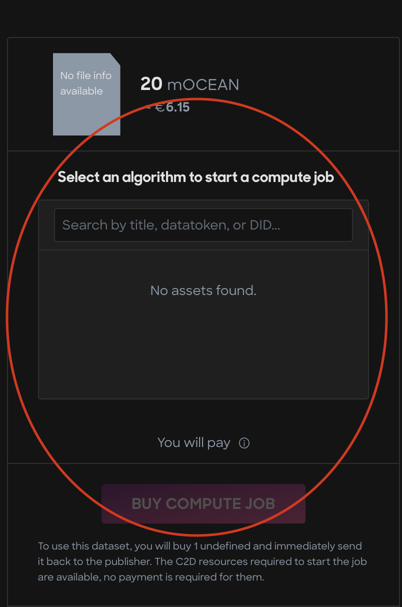
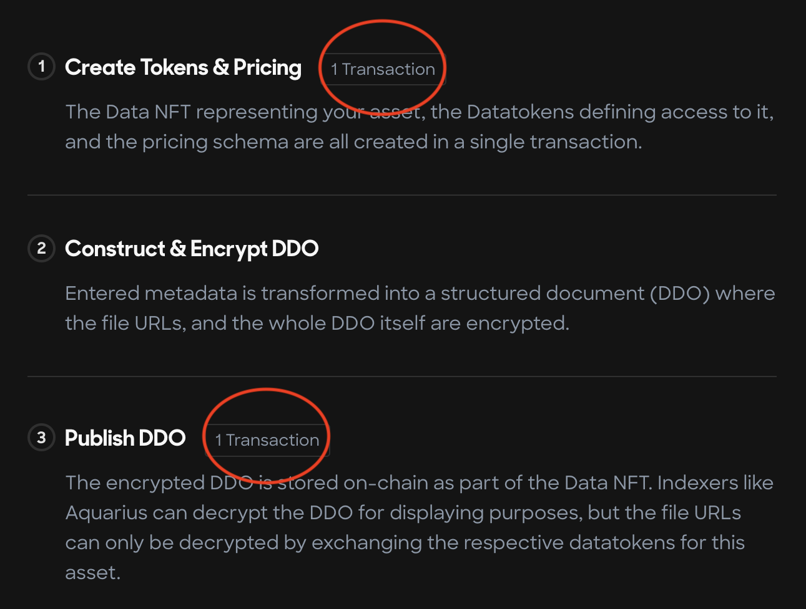
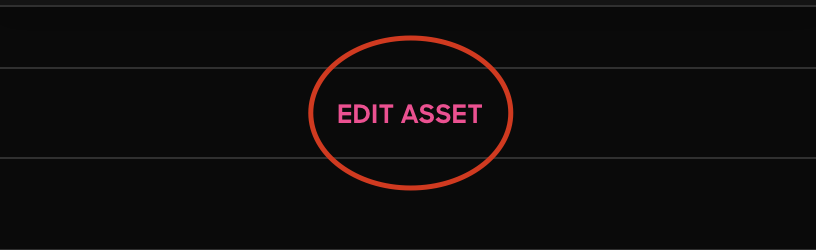

# Publish a C2D Data NFT

#### Step 1 - Navigate to the Ocean Market

* Go to [https://market.oceanprotocol.com](https://market.oceanprotocol.com)

#### Step 2 - Connect your wallet

* Click the top right Connect Wallet button to connect your self-custody wallet to the Ocean Market

<figure><figcaption>
Connect your self-custody wallet
</figcaption></figure>

#### Step 3 - Click the Publish link in the top left corner of the page

* Click the Publish link

<figure><figcaption>
Navigate to the Publish page
</figcaption></figure>

#### Step 4 - Enter the metadata

* Enter the metadata for your data NFT keeping the Dataset asset type selected by default:

<figure><figcaption>
Keep the default Dataset Asset Type selected
</figcaption></figure>

#### Step 5 - Enter the Access information

* You must select the Compute access type in this step!

<figure><figcaption>
Make sure that you select Compute access type
</figcaption></figure>

#### Step 6 - Set a price, Fixed or Free, for your dataset

* Toggle the tab to decide whether you want to set a fixed or free price for your dataset.

<figure><figcaption>
Set a price for your C2D data NFT
</figcaption></figure>

#### Step 7 - Approve the preview

* Your preview should look like the following (this will change soon!):

<figure><figcaption></figcaption></figure>

#### Step 8 - Submit the transactions

* Click the pink Submit button at the bottom of the page and sign the two transactions with your wallet. You'll have to pay for gas when you sign to publish your algorithm asset.

<figure><figcaption>
Sign and pay gas for 2 transactions on the final publishing step
</figcaption></figure>

**Ok, you've published a Data NFT that is \*almost\* ready for Compute-to-Data. Just a few tiny steps left and you're done!**

#### Step 9 - Edit the Metadata (yes, again!)

* On the webpage for your Data NFT, you need to click the Edit Asset link to change the C2D settings.

<figure><figcaption>
Click the Edit Asset link
</figcaption></figure>

