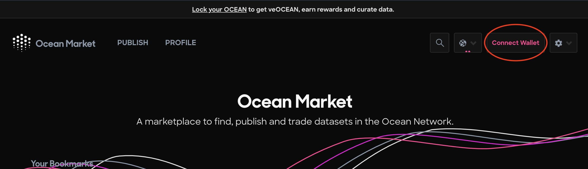

# Publish a C2D Data NFT

#### Step 1 - Navigate to the Ocean Market

* Go to [https://market.oceanprotocol.com](https://market.oceanprotocol.com)

#### Step 2 - Connect your wallet

* Click the top right Connect Wallet button to connect your self-custody wallet to the Ocean Market

<figure><figcaption>
Connect your self-custody wallet
</figcaption></figure>

#### Step 3 - Click the Publish link in the top left corner of the page

* Click the Publish link

<figure><figcaption>
Navigate to the Publish page
</figcaption></figure>

#### Step 4 - Enter the metadata

* Enter the metadata for your data NFT keeping the Dataset asset type selected by default:

<figure><figcaption>
Keep the default Dataset Asset Type selected
</figcaption></figure>

#### Step 5 - Enter the Access information

* You must select the Compute access type in this step!

<figure><figcaption>
Make sure that you select Compute access type
</figcaption></figure>

