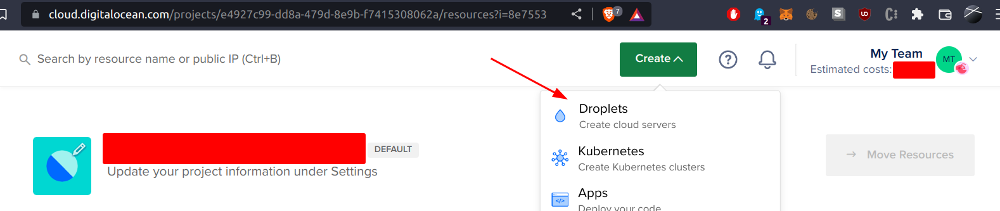
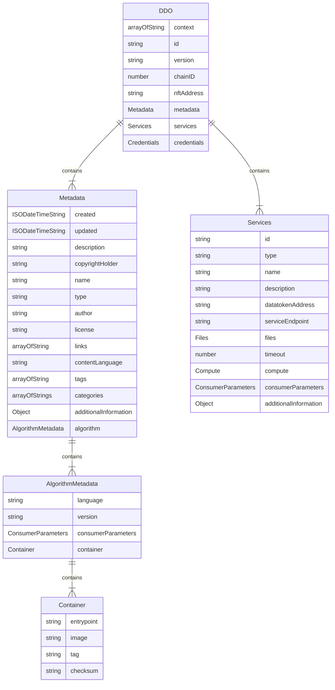

# Setup a Server

Now that you know the components of the Ocean Protocol stack and what each does, it's time to learn how to deploy these components in your environment. There are many ways in which the components can be deployed, from simple configurations used for development and testing to complex configurations, used for production systems.&#x20;

All the Ocean Protocol components (Provider, Aquarius, Subgraph) are designed to run in Docker containers, on a Linux operating system. For simple configurations, we rely on Docker Engine and Docker Compose products to deploy and run our components, while for complex configurations we use Kubernetes with Docker Engine.&#x20;

Each deployment starts with setting up a server on which the component will be installed, either on-premise or hosted in a cloud platform.

## Prerequisites

For simple configurations:

* Operating System: Linux distribution supported by the Docker Engine and Docker Compose products. Please refer to these links for choosing a compatible operating system: [Docker Compose supported platforms](https://docs.docker.com/desktop/install/linux-install/); [Docker Engine supported platforms](https://docs.docker.com/engine/install/).

For complex configurations:

* Operating System: Linux distribution supported by Kubernetes and Docker Engine. Please refer to this link for details: [Kubernetes with Docker Engine](https://kubernetes.io/docs/setup/production-environment/container-runtimes/#docker).&#x20;

&#x20;

## Server Size

The required CPU and memory for the server depend on the number of requests the component is expected to serve, however, the minimum configuration of the server is:

* 1 core
* 1 GB RAM

## Steps

The steps for setting up a server on which to deploy the Ocean components are the following:

For simple configurations:

1. [Install the operating system](setup-server.md#install-the-operating-system)
2. [Install Docker Engine and Docker Compose](setup-server.md#install-docker-engine-and-docker-compose)


For complex configurations:

1. [Install the operating system](setup-server.md#install-the-operating-system)
2. [Install Kubernetes with Docker Engine](setup-server.md#install-kubernetes-with-docker-engine)

### Install the operating system

As mentioned earlier, you can use either an on-premise server or one hosted in the cloud (AWS, Azure, Digitalocean, etc.). To install the operating system on an on-premise server, please refer to the installation documentation of the operating system.

If you choose to use a server hosted in the cloud, you need to create the server using the user interface provided by the cloud platform. Following is an example of how to create a server in Digitalocean.&#x20;

#### Example: Creating an Ubuntu Linux server in the Digitalocean cloud

1. Creating account and setting billing

Go to [https://www.digitalocean.com/](https://www.digitalocean.com/) and create an account. Provide the appropriate information for billing and accounting.


2. Create a server

Click on **`Create`** button and choose **`Droplets`** options from dropdown.

<figure><figcaption><p>Select Droplet</p></figcaption></figure>


3. Select a server configuration

Select Ubuntu OS, and choose a plan and a configuration.

<figure><figcaption><p>Configure the server</p></figcaption></figure>

###

4. Select the region and set the root password

Select the region where you want the component to be hosted and a root password.

<figure><figcaption><p>Select the region and set the root password</p></figcaption></figure>


5. Finish the configuration and create the server

Specify a hostname for the server, specify the project to which you assign the server and then click on `Create Droplet.`&#x20;

<figure><figcaption><p>Finalize and create the server</p></figcaption></figure>


6. Access the server's console

After the server is ready, select the `Access console` option from the dropdown list to open a terminal window.

<figure><figcaption><p>Access the server's console</p></figcaption></figure>

### Install Docker Engine and Docker Compose

From the terminal window, run the following commands to install Docker and Docker Compose.

```
sudo apt-get update
sudo apt-get install ca-certificates curl gnupg lsb-release
sudo mkdir -p /etc/apt/keyrings
curl -fsSL https://download.docker.com/linux/ubuntu/gpg | sudo gpg --dearmor -o /etc/apt/keyrings/docker.gpg
echo \
  "deb [arch=$(dpkg --print-architecture) signed-by=/etc/apt/keyrings/docker.gpg] https://download.docker.com/linux/ubuntu \
  $(lsb_release -cs) stable" | sudo tee /etc/apt/sources.list.d/docker.list > /dev/null
sudo apt-get update
sudo apt-get install docker-ce docker-ce-cli containerd.io docker-compose-plugin

# Now install docker-compose
sudo apt-get update
sudo apt-get install docker-compose-plugin
```


### Install Kubernetes with Docker Engine

Kubernetes is an orchestration engine for containerized applications and the initial setup is dependent on the platform on which it is deployed - presenting how this product must be installed and configured is outside the scope of this document.&#x20;

For cloud deployment, most of the cloud providers have dedicated turnkey solutions for Kubernetes. A comprehensive list of such cloud providers in presented [here](https://kubernetes.io/docs/setup/production-environment/turnkey-solutions/).&#x20;

For an on-premise deployment of Kubernetes, please refer to this [link](https://kubernetes.io/docs/setup/).


Now that the execution environment is prepared and the prerequisites installed, we can proceed to deploy the Ocean's components.


<< test Mermaid Entity Relationship Diagram >>



