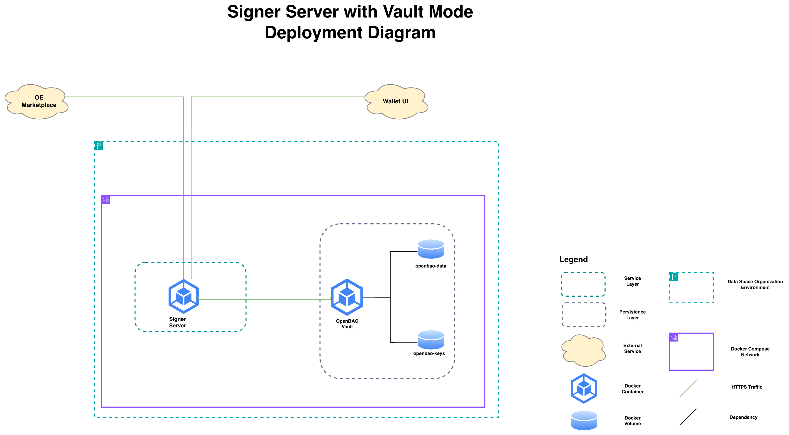

# Signer Server Installation and Configuration

## Deployment Architecture

<figure><figcaption></figcaption></figure>


<mark style="background-color:yellow;">Descriere diagrama.</mark>


## Prerequisites


### Hardware requirements

The minimum hardware requirements for the server that will run this component are:

* Number of cores: 1
* RAM: 8 GB
* disk: 50 GB

### Software requirements

* **Operating System:** Any Linux distribution supported by the Docker Engine and Docker Compose products. For guidance on compatible platforms, see the [Docker Compose supported platforms](https://docs.docker.com/desktop/setup/install/linux/) and [Docker Engine supported platforms](https://docs.docker.com/engine/install/) documentation.
* **Software products:**
  * Docker Engine
  * Docker Compose

### Other requirements

* **Blockchain RPC provider**: The Signer Server needs a blockchain RPC provider to sign blockchain transactions. Use a service such as Alchemy, Infura, or Chainstack. Ensure your subscription tier supports enough requests per second to meet the Signer Server's demand.


## Pre-installation Steps


**SSL Certificates Generation & Configuration**

**Add Private keys to the secrets vault (for vault operating mode): &#x20;**<mark style="color:red;">**Link to Key Generation and Management in OpenBao Secrets Vault**</mark>


##


## Deployment Steps


### Deployment of Signer Server in Local Mode


### Deployment of Signer Server in Vault Mode


<br>

## Post-installation Steps

* Verify that the Signer Server uses HTTPS communication (check the container's log);
* Ensure that the Signer Server can access the Authnetik server instance against which the authentication tokens will be validated (the Central Identity Provider deployed by the Dataspace Operator)
* Ensure that the Signer Server is accessible from the Internet


## Environment Variables


### Operation mode

#### SIGNER\_MODE

**Description:** Sets the operation mode of the Signer Server, which can be `local` (with the private keys loaded into the signer server's environment, recommended for demo environments) or `vault` (with the private keys stored in a secrets vault, recommended for production environments).

**Value:** string `(local/vault)`

**Example:** `vault`

**Default Value:** `null`


### Private Keys

#### PRIVATE\_KEYS

**Description:** This variable is valid only if the Signer Server's operating mode ([SIGNER\_MODE](./#signer_mode)) is set to `local` . It lists the private keys the Signer Server uses to sign web3 transactions. Each private key has an ID and the actual value.

**Value:** Array of objects&#x20;

**Example:**&#x20;

```
PRIVATE_KEYS=[{"id":1,"key":"0x..."},{"id":2,"key":"0x..."}]
```

**Default Value:** `null`


### Blockchain RPCs

#### NODE\_URI\_MAP

**Description:** Sets the list of blockchains in which the Signer Server signs transactions. For each blockchain, the following details are specified:

* the RPC endpoint used to access the blockchain
* gas multiplier: Scales the per‑unit gas price that the Signer Server uses when submitting blockchain transactions. The network‑estimated fee is multiplied by this value, and the result becomes the effective gas price paid per gas unit. Increasing the multiplier raises the transaction’s competitiveness and helps ensure timely inclusion during periods of network congestion. \
  **Note**: We recommend using the default values provided in this variable for each blockchain. If the multiplier is not set for a blockchain, the default value is used, which is as follows:
  * Ethereum Sepolia (chain no. 11155111) = 3
  * OP Sepolia (chain no. 11155420) = 2
  * OP Mainnet (chain no. 10) = 1.5
  * Ethereum Mainnet (chain no. 1) = 2.

**Value:** Array of objects&#x20;

**Example:** &#x20;


```json
NODE_URI_MAP= [{"11155111":{"key":"https://eth-sepolia.g.alchemy.com/v2/<ALCHEMY_API_KEY>","multiplier":3}},{"11155420":{"key":"https://opt-sepolia.g.alchemy.com/v2/<ALCHEMY_API_KEY>","multiplier":2}},{"10":{"key":"https://opt-mainnet.g.alchemy.com/v2/<ALCHEMY_API_KEY>","multiplier":1.5}},{"1":{"key":"https://eth-mainnet.g.alchemy.com/v2/<ALCHEMY_API_KEY>","multiplier":2}}]
```


Here's the structured format of the same value.

```json
NODE_URI_MAP=[
  {
    "11155111": {
      "key": "https://eth-sepolia.g.alchemy.com/v2/<ALCHEMY_API_KEY>",
      "multiplier": 3
    }
  },
  {
    "11155420": {
      "key": "https://opt-sepolia.g.alchemy.com/v2/<ALCHEMY_API_KEY>",
      "multiplier": 2
    }
  },
  {
    "10": {
      "key": "https://opt-mainnet.g.alchemy.com/v2/<ALCHEMY_API_KEY>",
      "multiplier": 1.5
    }
  },
  {
    "1": {
      "key": "https://eth-mainnet.g.alchemy.com/v2/<ALCHEMY_API_KEY>",
      "multiplier": 2
    }
  }
]
```

**Default Value:** `null`


### Authentik Server Integration

The Signer Server APIs are protected by an Authentik JWT guard, meaning that every call to the Signer Server is validated against the following checks:

* JWT signature
* Issuer
* Audience
* `upstream_idp` claim

The following environment variables set the Authentik JWT guard for Signer Server.&#x20;

#### AUTHENTIK\_ISSUER

**Description:** Defines the **issuer URL** of the Authentik provider used to validate the JWT tokens presented by users calling the Signer Server’s endpoints. This must match the issuer URL of the Authentik provider that authenticates users in the OE Marketplace, ensuring that the Signer Server accepts tokens only from the same trusted identity source.

**Value:** String (URL)

**Example:** `https://ocean-node-vm3.oceanenterprise.io:9443/application/o/oe-market-vm3/`

**Default Value:** `null`


#### AUTHENTIK\_AUDIENCE

**Description:** Defines the **client ID** of the Authentik provider used to validate the JWT tokens presented by users calling the Signer Server’s endpoints. This must match the client ID of the Authentik provider that authenticates users in the OE Marketplace, ensuring that the Signer Server accepts tokens only from the same trusted identity source.

**Value:** String (URL)

**Example:** `https://ocean-node-vm3.oceanenterprise.io:9443/application/o/oe-market-vm3/`

**Default Value:** `null`


#### AUTHENTIK\_JWKS\_URI

**Description:** Defines the **JWKS endpoint URL** of the Authentik provider used to validate the JWT tokens presented by users calling the Signer Server’s endpoints. This must match the JWKS endpoint of the Authentik provider that authenticates users in the OE Marketplace, ensuring that the Signer Server accepts tokens only from the same trusted identity source.

**Value:** String (URL)

**Example:** `https://ocean-node-vm3.oceanenterprise.io:9443/application/o/oe-market-vm3/`

**Default Value:** `null`


#### UPSTREAM\_IDP

**Description:** Specifies the identity provider (IDP) from which users must originate to call the Signer Server’s APIs. The Signer Server enforces this by checking the `upstream_idp` claim in the JWT included with each API request. If the value of this claim matches the value of `UPSTREAM_IDP`, the request is accepted; if it differs, the request is rejected.&#x20;

When `UPSTREAM_IDP` is not set, the Signer Server allows any request that passes standard JWT validation.

**Value:** String

**Example:** `"ocean-enterprise"` . This value translates into: only requests from users who have a valid JWT with the `"upstream_idp"` claim set to `"ocean-enterprise"` are accepted.

**Default Value:** `null`


### OpenBao Vault

The following variables need to be set only when the Signer Server is operating in vault mode (Signer Server's operating mode ([SIGNER\_MODE](./#signer_mode)) is set to `vault`),&#x20;

#### VAULT\_URL

**Description:** Sets the URL where the OpenBao service is available, which is based on the internal OpenBao container hostname.

**Values:** String (URL)

**Example:** `https://openbao:8200`&#x20;

**Default Value:** `null`


#### VAULT\_ETHEREUM\_MOUNT

**Description:** Sets the vault path where the private keys used by Signer Server to sign transactions are located.

**Values:** String&#x20;

**Example:** `ethereum`

**Default Value:** `null`

&#x20;

#### VAULT\_KV\_STORE\_PATH

**Description:** Sets the vault path where the walletID-to-wallet address mappings are located.

**Values:** String&#x20;

**Example:** `secret`

**Default Value:** `null`


#### VAULT\_TIMEOUT\_MS

**Description:** Sets the timeout of the vault requests (in miliseconds)&#x20;

**Values:** Integer

**Example:** `10000`

**Default Value:** `null`


### HTTPS connection

Set the following environment variables to enable HTTPS connections on Signer Server.

**Note**: The Signer Server start commands shown in this guide mount the `certs` directory from the repository into the container at `/etc/ssl/certs/`. To enable HTTPS with minimal setup, place your certificate files in this directory and adjust the environment variable to reference the correct certificate file name.

#### **HTTP\_CERT\_PATH**

**Description:** Sets the location where the TLS certificate of the Signer Server resides. If the value is null, the HTTPS connection is not enabled. Make sure that the referenced file includes both the digital certificate and the intermediate certificate.

Please note that the

**Values:** string

**Example:** `/etc/ssl/certs/cert.pem`

**Default Value:** `null`

#### **HTTP\_KEY\_PATH**

**Description:** Sets the location where the private key file of the TLS certificate resides. If the value is null, the HTTPS connection is not enabled.

**Values:** string

**Example:** `/etc/ssl/certs/key.pem`

**Default Value:** `null`

&#x20;

### Accepted URL origins

#### ALLOWED\_ORIGINS

**Description:** Specifies the list of permitted origins (URLs) from which requests to Signer Server's endpoints are allowed. Only requests originating from the values defined in this variable will pass the validation and be accepted by the server.

**Values:** Array of strings (URL)

**Example:** `["https://market2.demo.oceanenterprise.io/", "https://waltid-ui.oceanenterprise.io"]`

**Default Value:** `null`


### TCP Port

#### PORT

**Description:** Defines the port on which the application listens inside the container. In the `docker-compose.yml` file, the host port 8443 is mapped to the default container port (3001). In case you changed the default value, make sure you update the port mapping in the `docker-compose.yml` file.

**Values:** number

**Example:** `3001`

**Default Value:** `3001`&#x20;


### Node.js environment

#### NODE\_ENV

**Description:** built-in environment variable convention in [Node.js](https://nodejs.org/learn/getting-started/nodejs-the-difference-between-development-and-production) used to tell your application and its libraries whether it is running in development, production, or testing. For production environments, set it to `production`. For an explanation of other values, see this [link](https://nodejs.org/learn/getting-started/nodejs-the-difference-between-development-and-production).

**Values:** string (production/development/testing)

**Example:** `production`

**Default value:** `none`
