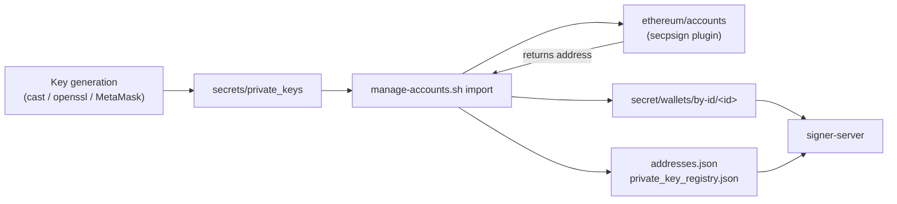

# Key Generation & Management in OpenBao Secrets Vault

The Signer Server uses the OpenBao secrets vault to store the web3 private keys of an entity in a dataspace. &#x20;

This section describes how web3 private keys are generated, imported, inspected, and removed within the OpenBao vault included in the Signer Server component.

### OpenBao main components

At deployment time, the OpenBao Docker image builds the [`vault-plugin-secp256k1`](https://github.com/pelipas/vault-plugin-secp256k1) plugin (registered as `secpsign`), which enables two secrets engines:

| **Mount**  | **Type**          | **Purpose**                                                          |
| ---------- | ----------------- | -------------------------------------------------------------------- |
| `ethereum` | `secpsign` plugin | Stores private keys; derives and returns the Ethereum address; signs |
| `secret`   | `kv-v2`           | Stores the wallet-ID → address mapping consumed by the Signer Server |

Three state files live in the `openbao-keys` Docker volume, mounted at `/vault/keys` (and mounted read-only into `signer-server`):

| **Path**                                | **Content**                                                                      |
| --------------------------------------- | -------------------------------------------------------------------------------- |
| `/vault/keys/addresses.json`            | `{"<wallet_id>": "<address>"}` — authoritative wallet-ID map                     |
| `/vault/keys/private_key_registry.json` | `{"<sha256_of_key>": {"id": <int>, "address": "<address>"}}` — idempotency index |
| `/vault/keys/init.json`, `root_token`   | Unseal keys and root token written on first initialisation (mode `600`)          |

> **Note**: The private keys file used for adding or deleting private keys to/from the secrets vault resides in `openbao/secrets/private_keys.`

The registry indexes keys by **SHA-256 hash of the normalised key**, never by the key itself. This is what makes imports idempotent and what allows logs to reference a specific key (`key_hash=…`) without ever printing it.

