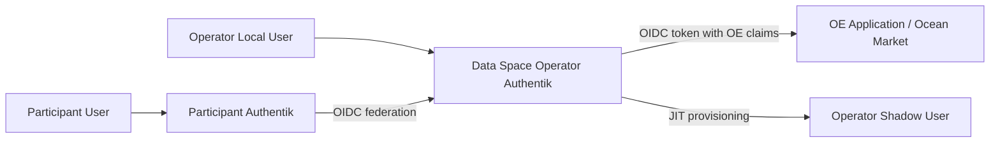
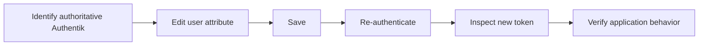

# Operational Guidelines

### Table of Contents

* [Overview](./#overview)
  * [Operational Model](./#operational-model)
* [User Directory Management](user-directory-management/)
* 3\. Overview
  * 3.1 User Directory Management
    * 3.1.1 Users Enrollment in Authentik
      * 3.1.1.1 Create Invitation
      * 3.1.1.2 User Claims Assignment for Data Space Operator
      * 3.1.1.3 User Claims Assignment for Data Space Participant
    * 3.1.2 Create User Group
    * 3.1.3 Modify User Claims Values
    * 3.1.4 User Deactivation
  * 3.2 Onboarding Data Space Participant Authentik

***

### Overview

This chapter describes the operational procedures used to manage users and federated Data Space Participant identity providers in the Ocean Enterprise (OE) Authentik deployment.

The procedures are based on:

* the Authentik invitation and enrollment flows described in the supplied operational documents;
* the federated identity model in which the Data Space Operator Authentik instance acts as the primary identity broker and a Participant Authentik instance acts as an external OIDC Identity Provider;
* the current repository Authentik blueprints for `dataspace-operator` and `participant`; and
* the repository automation script `dataspace_operator_add_participant.py`.

Two Authentik deployment roles are important throughout this chapter:

| Role                                 | Description                                                                                                                                                                                                        |
| ------------------------------------ | ------------------------------------------------------------------------------------------------------------------------------------------------------------------------------------------------------------------ |
| **Data Space Operator Authentik**    | Central/primary Authentik instance. It authenticates local Operator users and brokers authentication from Participant Authentik instances. It supports federated JIT enrollment and emits OE-specific OIDC claims. |
| **Data Space Participant Authentik** | External/partner Authentik instance. It manages Participant users and exposes an OIDC provider that can be trusted by the Data Space Operator.                                                                     |

The current repository defines the following OE user attributes and OIDC claims:

| User attribute | OIDC scope/mapping              | Purpose                                                                                                            |
| -------------- | ------------------------------- | ------------------------------------------------------------------------------------------------------------------ |
| `orgId`        | `oe-organizationId`             | Identifies the organization/dataspace entity associated with the user.                                             |
| `walletId`     | `oe-walletId`                   | Identifies the wallet/key mapping used by OE services.                                                             |
| `signerServer` | `oe-signerServer`               | URL of the Signer Server associated with the organization/user.                                                    |
| `wellKnownUrl` | `oe-wellKnownUrl`               | OE endpoint metadata associated with the participant/operator identity.                                            |
| `upstream_idp` | `oe-central-federated_identity` | Operator-side federation metadata identifying the upstream Authentik/source used to authenticate a federated user. |

> **Source alignment note:** The supplied PDF procedures document `orgId`, `walletId`, and `signerServer` extensively. The current repository extends those flows with `wellKnownUrl`. The Operator blueprint additionally maps `upstream_idp` for federated identities. This guide follows the current repository behavior where it is more specific than the older examples in the PDFs.

#### Operational model



For a local user, the account and OE-specific attributes are stored directly in the Authentik instance where the user is enrolled.

For a federated Participant user, authentication remains with the Participant Authentik instance. On the first federated login, the Operator Authentik instance creates a local shadow/JIT user and stores normalized federation attributes such as the upstream IdP, external subject, organization identifier, wallet identifier, signer server, and well-known URL.

***


### 3.1.3 Modify User Claims Values

OE claims are generated from Authentik user attributes. Therefore, changing an OE claim normally means changing the underlying user attribute, not editing an already-issued JWT.

#### Procedure

1. Sign in as an Authentik administrator.
2.  Navigate to:

    **Directory → Users**
3. Open the target user.
4. Open the **Attributes** section/editor.
5. Modify only the required attribute.

Typical fields are:

```json
{
  "orgId": "...",
  "walletId": "...",
  "signerServer": "...",
  "wellKnownUrl": "..."
}
```

For federated users, additional attributes can include:

```json
{
  "upstream_idp": "...",
  "external_subject": "...",
  "idp_issuer": "..."
}
```

6. Save the user.
7. Have the user start a new authentication session so a new token is issued.
8. Verify the new token values.

#### Important rules

**Do not edit issued tokens**

JWT access/ID tokens are immutable after issuance. A changed user attribute is reflected only in a subsequently issued token.

**Treat identity-linking metadata carefully**

For federated users, avoid manually changing:

* `external_subject`
* `idp_issuer`
* `upstream_idp`

unless correcting a known federation configuration issue.

These values are used to identify the upstream identity and source.

**Avoid overwriting federated values unintentionally**

The Operator's OAuth Source Mapping may re-populate upstream-derived attributes on future logins. If an attribute is authoritative in the Participant Authentik instance, update it at the Participant source rather than applying a temporary local override to the Operator shadow user.

#### Recommended modification workflow



For a Participant user federated into the Operator, the authoritative directory is normally the Participant Authentik instance.

***

### 3.1.4 User Deactivation

The supplied OE PDFs do not define a dedicated production deactivation/offboarding procedure. They do, however, show that Authentik user creation can use an inactive state during enrollment until validation is complete.

The following is therefore an **operational recommendation** for OE deployments rather than a repository-automated workflow.

#### Objective

Deactivate a user without deleting their identity record, allowing administrators to preserve auditability and federation metadata while preventing new authentication.

#### Recommended procedure

1. Sign in to the Authentik Admin Interface.
2.  Navigate to:

    **Directory → Users**
3. Open the user.
4. Set the user's account to **inactive/disabled** using the Authentik user status control available in the deployed version.
5. Save the change.
6. Remove the user from privileged groups when applicable.
7. Review active sessions and terminate/revoke them where required by the organization's security policy.
8. Verify that the user can no longer establish a new authenticated session.

#### Federated user considerations

Deactivating only the Operator shadow user does not disable the account in the Participant Authentik instance.

For a Participant employee/user who must be fully offboarded:

1. Deactivate the authoritative account in the Participant Authentik instance.
2. Deactivate or restrict the corresponding Operator shadow account if the deployment's JIT/source behavior could recreate or reactivate access.
3. Remove application/group access where necessary.
4. Verify sign-in from the Participant source is denied.

#### Do not delete by default

Prefer deactivation over deletion when:

* audit history must be retained;
* the account is linked to federation identifiers;
* transactions or wallet operations need historical attribution; or
* the user may be reactivated later.

Delete users only under a separately approved data-retention/offboarding policy.

***

## 3.2 Onboarding Data Space Participant Authentik

