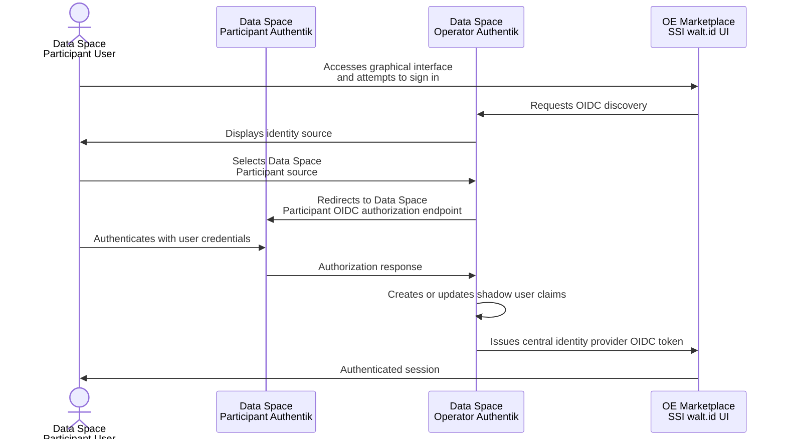
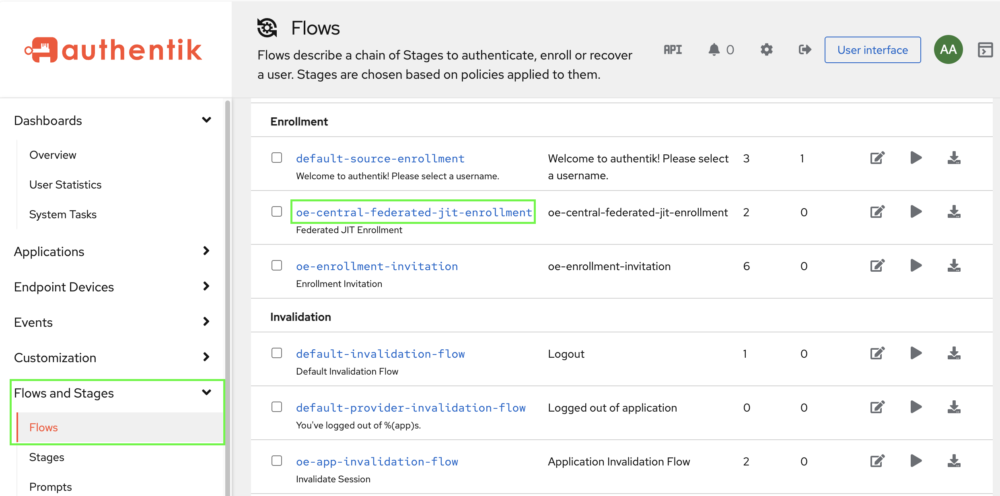
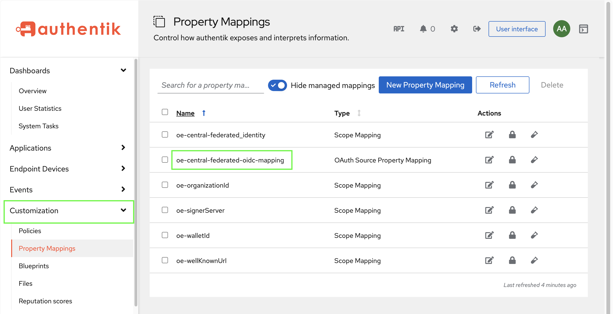
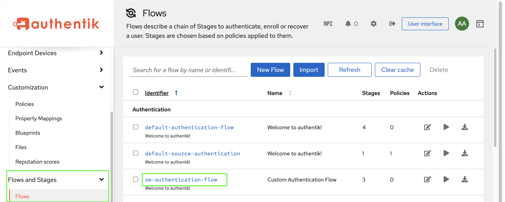
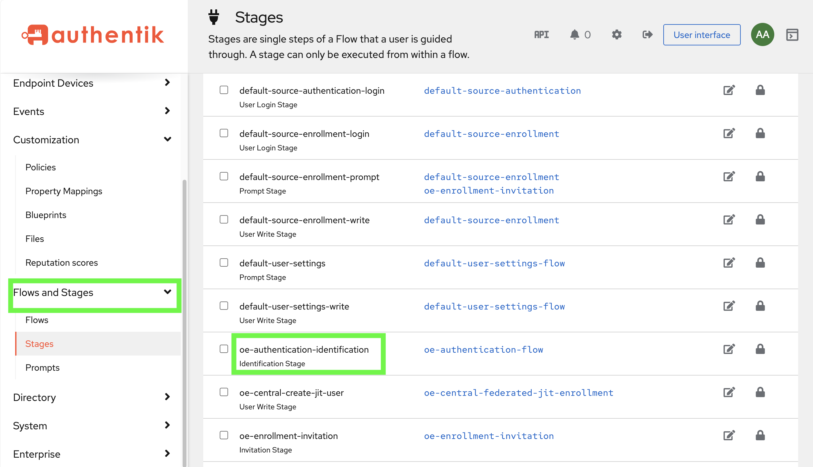
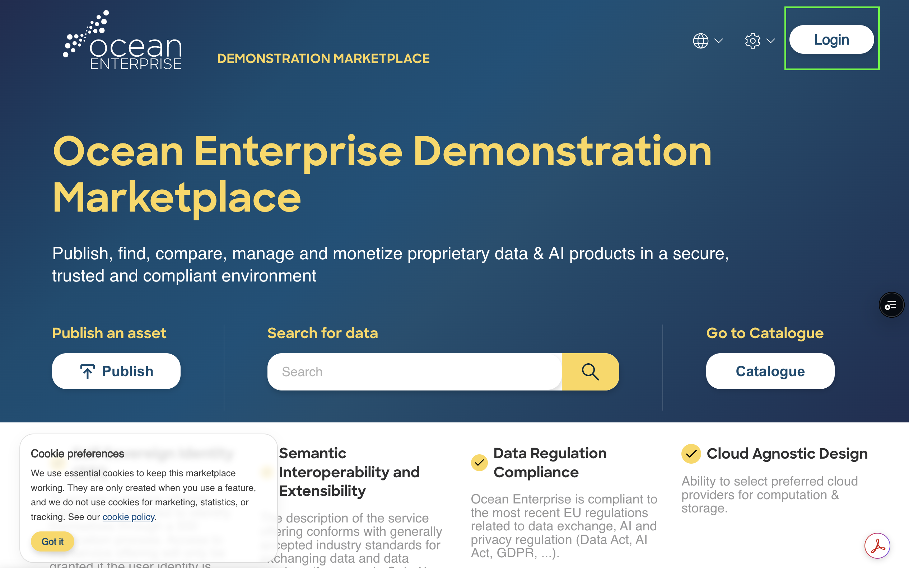
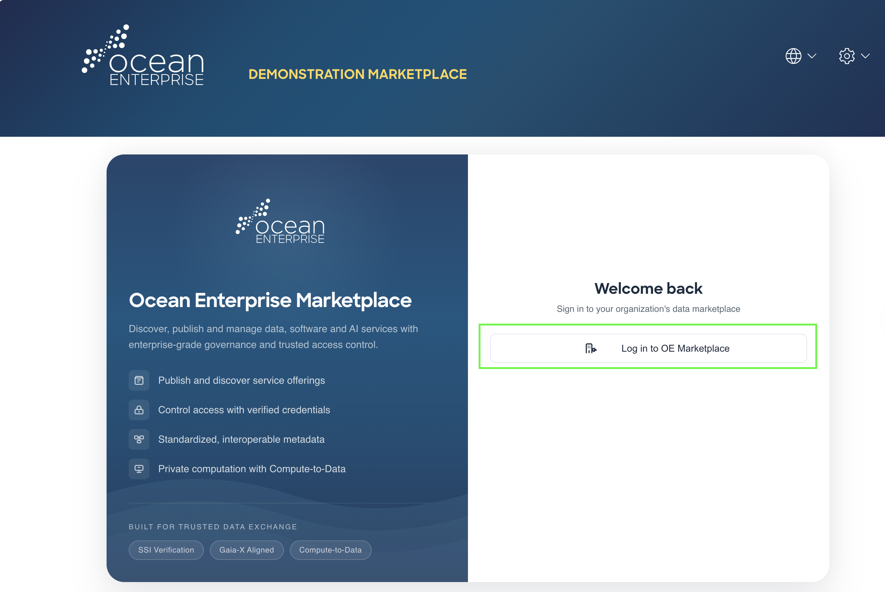
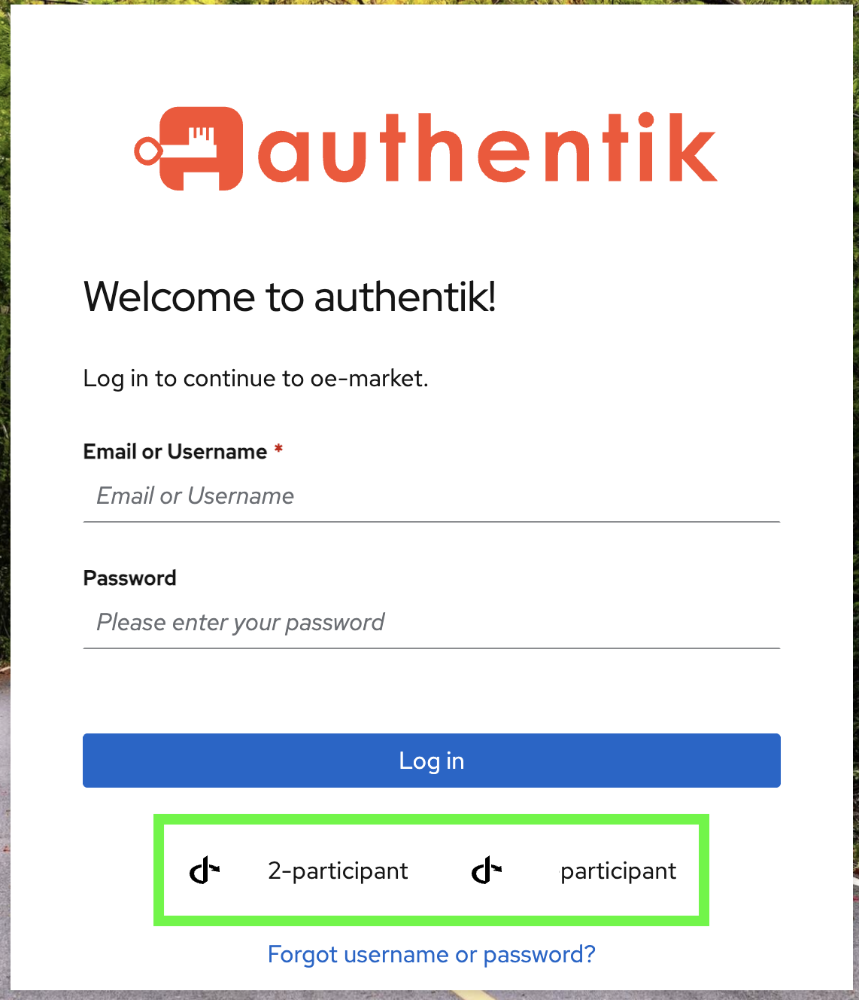
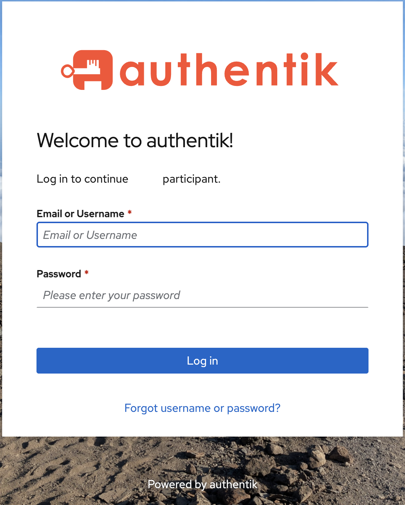
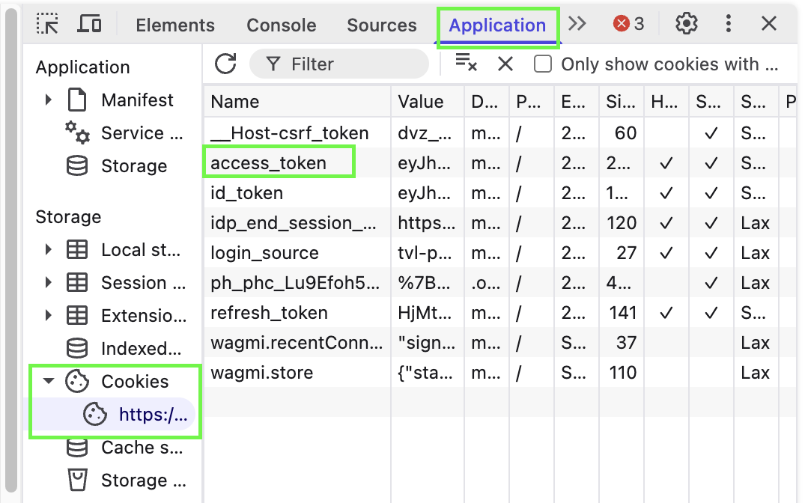

# Onboarding Data Space Participant in Data Space Operator Authentik

### Table of Contents

* [Overview](onboarding-data-space-participant-in-data-space-operator-authentik.md#overview)
* [Directory Structure](onboarding-data-space-participant-in-data-space-operator-authentik.md#directory-structure)
* [Sequence Flow](onboarding-data-space-participant-in-data-space-operator-authentik.md#sequence-flow)
* [Prerequisites](onboarding-data-space-participant-in-data-space-operator-authentik.md#prerequisites)
  * [Data Space Participant Side](onboarding-data-space-participant-in-data-space-operator-authentik.md#data-space-participant-side)
  * [Data Space Operator Side](onboarding-data-space-participant-in-data-space-operator-authentik.md#data-space-operator-side)
* [Prepare Participant Configuration on Data Space Operator](onboarding-data-space-participant-in-data-space-operator-authentik.md#prepare-participant-configuration-on-data-space-operator)
  * [Field Descriptions](onboarding-data-space-participant-in-data-space-operator-authentik.md#field-descriptions)
* [Participant onboarding steps](onboarding-data-space-participant-in-data-space-operator-authentik.md#onboarding-steps)
  * [Copy the Participant Configuration file on the Dataspace Operator Authentik Server](onboarding-data-space-participant-in-data-space-operator-authentik.md#copy-the-participant-configuration-file-on-the-dataspace-operator-authentik-server)
  * [Run the onboarding Script](onboarding-data-space-participant-in-data-space-operator-authentik.md#run-onboarding-script)
* [Verification](onboarding-data-space-participant-in-data-space-operator-authentik.md#verification)
  * [Federated Authentication](onboarding-data-space-participant-in-data-space-operator-authentik.md#federated-authentication)
  * [Token Claims Verification](onboarding-data-space-participant-in-data-space-operator-authentik.md#token-claims-verification)
* [Troubleshooting](onboarding-data-space-participant-in-data-space-operator-authentik.md#troubleshooting)
  * [Operator cannot fetch the Participant well-known URL](onboarding-data-space-participant-in-data-space-operator-authentik.md#operator-cannot-fetch-the-participant-well-known-url)
  * [Federation source exists, but login is not offered](onboarding-data-space-participant-in-data-space-operator-authentik.md#federation-source-exists-but-login-is-not-offered)
  * [OE claims are missing](onboarding-data-space-participant-in-data-space-operator-authentik.md#oe-claims-are-missing)
  * [User is created with unknown values](onboarding-data-space-participant-in-data-space-operator-authentik.md#user-is-created-with-unknown-values)
* [Operational Security Notes](onboarding-data-space-participant-in-data-space-operator-authentik.md#operational-security-notes)
* [Appendix](onboarding-data-space-participant-in-data-space-operator-authentik.md#appendix)
  * [Implementation Details for Onboarding Python Script](onboarding-data-space-participant-in-data-space-operator-authentik.md#implementation-details-for-onboarding-python-script)

### Overview

This section describes the operational procedure for federated authentication by connecting a Data Space Participant Authentik instance to the Data Space Operator Authentik.

The supplied federation model uses:

* **Data Space** **Participant Authentik** as the external Identity Provider;
* **Data Space** **Operator Authentik** as the central identity broker;
* OIDC discovery between Authentik instances;
* A central OAuth Source in the Operator;
* JIT enrollment based on invitations for the Operator shadow user;
* Source-property mappings for OE attributes.

### Directory Structure

&#x20;`user-management` repository additionally provides:


```
dataspace-operator/docker-compose/authentik/
    onboard_participant.sh
```


The above shell script calls&#x20;

```
dataspace-operator/docker-compose/authentik/scripts/
  dataspace_operator_add_participant.py
```

This script automates the creation or update of the Data Space Operator OAuth federation source and appends Participant redirect URIs to the central OIDC provider.&#x20;

For an implementation-oriented view, please consult the [Implementation Details for Onboarding Python Script](onboarding-data-space-participant-in-data-space-operator-authentik.md#implementation-details-for-onboarding-python-script) section.

### Sequence Flow




On first login, Data Space Operator creates a local shadow user and stores upstream identity metadata.


***

### Prerequisites

Before onboarding a Data Space Participant, verify the following:

#### On the Data Space Participant Side

The Data Space Participant Administrator must make sure the following&#x20;

* Data Space Participant Authentik is deployed and reachable.
* Data Space Participant Authentik uses a valid SSL certificate.
* Data Space Participant OE blueprint has been applied.
* Data Space Participant users can authenticate on the Data Space Participant Authentik instance.
* Data Space Participant provider exposes the OE JWT claims:
  * `orgId`
  * `walletId`
  * `signerServer`
  * `wellKnownUrl`
* Operational Administrator access is available by creating an initial setup account in Authentik.
* The Data Space Participant OIDC well-known configuration URL is reachable from the Data Space Operator environment.
* Checks if, within `/participant` directory, the JSON configuration file `config-for-onboarding-<participant_app_slug>.json` has been generated. \
  For detailed JSON configuration content, please consult [Prepare Participant Configuration on Data Space Operator](onboarding-data-space-participant-in-data-space-operator-authentik.md#prepare-participant-configuration-on-data-space-operator) section.


#### On the Data Space Operator Side

* Data Space Operator Authentik is deployed and reachable.
* The Dataspace Operator blueprint has been applied.
* The central OIDC provider exists.
*   Data Space Operator Authentik Server contains the following artifacts after deploying the User Management Package:

    * `oe-central-federated-jit-enrollment`&#x20;

    <figure><figcaption></figcaption></figure>


    * `oe-central-federated-oidc-mapping` - this sets automatically `upstream_idp` claim within the JWT in federated authentication

    <figure><figcaption></figcaption></figure>

    &#x20;

    *   `oe-authentication-flow`  - central authentication flow

        <figure><figcaption></figcaption></figure>

        &#x20;

        * `oe-authentication-identification`  - central identification stage

        <figure><figcaption></figcaption></figure>


* Administrator- or container-level execution access is available for the onboarding script.

***

### Onboarding steps


The Data Space Participant initialization script generates a JSON file containing the configuration details of the Participant’s Authentik Server. The Data Space Operator **must receive this file from the Participant** before completing this procedure, as it provides the necessary parameters for integrating the Participant’s Identity Provider into the dataspace.


The User Management Package repository includes the participant onboarding script in the  `<user-management>/dataspace-operator/docker-compose/authentik/scripts` directory. This shell script accepts a JSON file ( `config-for-onboarding-<participant_app_slug>.json` ) with the following required keys:

```json
{
  "authentik_app_slug": "<participant-source-slug>",
  "participant_idp_consumer_key": "<participant-client-id>",
  "participant_idp_consumer_secret": "<participant-client-secret>",
  "participant_idp_well_known_url": "<participant-discovery-url>",
  "central_idp_provider_name": "<operator-central-provider-name>",
  "participant_redirect_uris": [
    "<redirect-uri-1>",
    "<redirect-uri-2>"
  ]
}
```

#### Field Description

<table><thead><tr><th width="300.36328125">Field</th><th>Type</th><th>Description</th></tr></thead><tbody><tr><td><code>authentik_app_slug</code></td><td><code>string</code></td><td>Application Slug used for the Operator OAuth federation source.</td></tr><tr><td><code>participant_idp_consumer_key</code></td><td><code>string</code></td><td>Client ID created on the Participant Authentik OIDC provider.</td></tr><tr><td><code>participant_idp_consumer_secret</code></td><td><code>string</code></td><td>Client secret created on the Participant Authentik OIDC provider. <strong>Treat it as sensitive information.</strong></td></tr><tr><td><code>participant_idp_well_known_url</code></td><td><code>string</code></td><td>Participant OIDC discovery endpoint.</td></tr><tr><td><code>central_idp_provider_name</code></td><td><code>string</code></td><td>Existing Data Space Operator OIDC provider whose redirect URI set is updated.</td></tr><tr><td><code>participant_redirect_uris</code></td><td><code>Array&#x3C;string></code></td><td>Redirect URIs that must be appended to the existing central provider without removing existing URIs.</td></tr></tbody></table>

***

#### Copy the Participant Configuration file on the Dataspace Operator Authentik Server

Copy the participant configuration file to the  `<user-management>/dataspace-operator/docker-compose/authentik/participant-configs` directory on the server that runs the Dataspace Operator Authentik server.


```bash
cp <participant-config-file.json> <user-management>/dataspace-operator/docker-compose/authentik/participant-configs/
```


#### Run the onboarding Script

From a terminal on the server that hosts the Data Space Operator Authentik server, run the onboarding script as follows:

```bash
 cd <user-management>/dataspace-operator/docker-compose/authentik/
 ./onboard-participant.sh <participant-config-file.json>
```

or

```bash
 bash onboard-participant.sh <participant-config=file.json>
```

***

### Verification

Perform the following verification steps:

#### Federated Authentication

1. Access Ocean Enterprise Marketplace in a browser as a Data Space Participant user, and click on **Login.**

<figure><figcaption></figcaption></figure>


2. Select **Login in to OE Marketplace**

<figure><figcaption></figcaption></figure>


3. Marketplace Interface forwards the login request to its Data Space Operator Authentik instance, and if the OAuth source has been added successfully, it will be displayed where it is highlighted in green in the screenshot below.

<figure><figcaption></figcaption></figure>


4. Select the correct authentication source for the dedicated Participant user and provide the credentials username or e-mail and password for the Participant user

<figure><figcaption></figcaption></figure>


#### Token Claims Verification

1. After logging in to OE Marketplace with the Participant OAuth source from the [Federated Authentication](onboarding-data-space-participant-in-data-space-operator-authentik.md#federated-authentication) section, the JWT token issued by the Data Space Operator can be retrieved from **Broswer's Application tab, under OE Marketplace Cookies,** if DevTools are installed on specific Browser.

<figure><figcaption></figcaption></figure>


2. Inspect the token claims issued by the Operator to the OE application by accessing [https://www.jwt.io/](https://www.jwt.io/) and paste encoded JWT token extracted from Cookies, from step 1.

<figure><figcaption></figcaption></figure>


3. Verify the required OE claims according to the application's requested scopes in **the decoded payload:**

* `upstream_idp`
* `signerServer`
* `walletId`
* `wellKnownUrl`
* `orgId`
* `name`
* `email`

***

### Troubleshooting

This section targets common error resolution for Participant onboarding in the federated authentication procedure.&#x20;

It will be updated based on errors and issues encountered by organizations during deployment and operation.

#### Operator cannot fetch the Participant well-known URL

Check:

* DNS resolution;
* routing or firewall rules;
* TLS certificate;
* Participant Authentik availability;
* discovery URL correctness.

The repository script currently performs the discovery HTTP request for connectivity testing.


Production operators should still deploy valid TLS certificates for the Authentik instance.


#### Federation source exists, but login is not offered

Verify that:

* the source is enabled;
* it is attached to the Operator Identification Stage;
* **source labels are enabled to be displayed in the Authentik login form;**

<figure><figcaption></figcaption></figure>

* the authentication flow being used by the application is the expected flow.

#### OE claims are missing

Verify:

* the Participant user actually has `orgId`, `walletId`, `signerServer`, and `wellKnownUrl`;
* the Participant provider emits the corresponding scopes;
* the Operator OAuth source requests the corresponding scopes;
* the Operator source mapping copies the upstream values;
* the Operator provider exposes the claims required by the OE application.

#### User is created with unknown values

The current Operator mapping uses fallback values when upstream claims are absent. Treat `unknown*` values as a configuration error, not valid production identity data.

Correct the Participant scope within OAuth Source from **Federation and Social Login** and re-test authentication.

<figure><figcaption></figcaption></figure>

***

### Operational Security Notes

* Store Participant OAuth client secrets outside source control.
* Use unique OAuth credentials for each Participant.
* Use HTTPS and valid TLS certificates for both Authentik instances.

***

### Appendix

#### Implementation Details for Onboarding Python Script

1. Loads the Participant configuration JSON.
2. Validates that all required configuration keys are present.
3. Fetches the Participant OIDC discovery document.
4. Requires at least:
   * `authorization_endpoint`
   * `token_endpoint`
   * `jwks_uri`
5. Attempts to load the Participant JWKS.
6. Finds the configured Operator authentication flow.
7. Finds the central federated JIT enrollment flow.
8. Finds the central federated OIDC property mapping.
9. Creates or updates an Authentik `OAuthSource`.
10. Configures the source as OpenID Connect.
11. Configures the Participant client ID and secret.
12. Configures the Participant well-known URL and discovered OIDC endpoints.
13. Attaches the central OE OAuth Source property mapping.
14. Requests the OE scopes used by the federation.
15. Adds the source to the Operator authentication Identification Stage.
16. Enables source labels so users can select the Participant source.
17. Appends the supplied Participant redirect URIs to the existing central Operator OIDC provider while preserving existing redirect URIs.


The script is designed to be idempotent at the source level: it gets or creates the source by slug and updates an existing source when one is already present.

