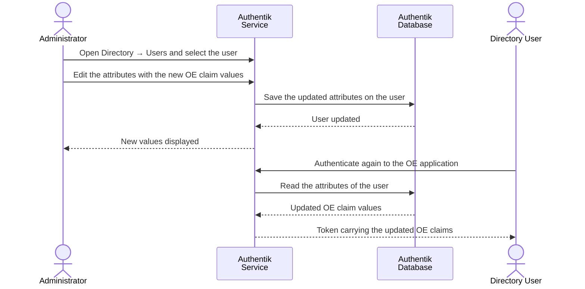

# Modify User Claim Values

### Overview

The OE claims `orgId`, `walletId`, `signerServer`, `wellKnownUrl` and, on the Data Space Operator, `upstream_idp` are stored as attributes of the user and emitted through the OE scope mappings.

For detail-oriented flow illustration, please consult [Sequence Flow](modify-user-claim-values.md#sequence-flow).

### Procedure

1. Authenticate in Authentik Dashboard as `akadmin` , Administrator account which was created at [initial setup](../../infrastructure/user-management-package/deployment-steps/post-installation-steps.md#set-the-authentik-server-administrator-account).
2. Navigate to **Directory → Users** and search for the user.
3. Select the user and select **Edit**.

<figure><figcaption></figcaption></figure>

4. Update the **Attributes** field, keeping all attributes that must be retained:


```yaml
orgId: ocean_enterprise
walletId: "3"
signerServer: https://<host>:8443
wellKnownUrl: https://<idp-host>:9443/application/o/<app-slug>/.well-known/openid-configuration
upstream_idp: <app-slug>
```


5. Select **Save Changes**.

<figure><figcaption></figcaption></figure>

### Verification

1. The **Attributes** section of the user shows the intended values.
2. After the user authenticates again, the decoded JWT contains `orgId`, `walletId`, `signerServer`, `wellKnownUrl`, `upstream_idp`, `name` and `email`.

### Notes

* Federated shadow users must not be corrected on the Data Space Operator. Their attributes are rewritten from the upstream token at every federated login. Correct the Participant user or the Participant scope mappings instead.
* A missing `upstream_idp` attribute produces the fallback value `unknown3` in the token. Treat any `unknown*` value as a configuration error.

### Appendix

#### Sequence Flow


