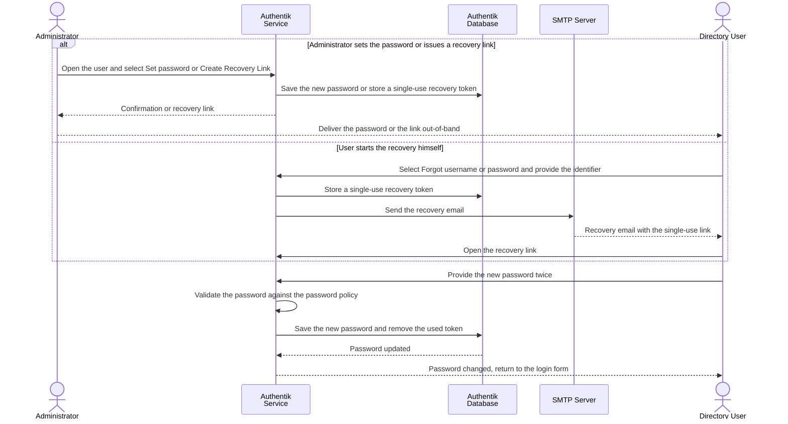

# Updating User Password

### Overview

Passwords can be set by an Administrator or changed by the user through the `oe-recovery` flow.

For detail-oriented flow illustration, please consult [Sequence Flow](updating-user-password.md#sequence-flow).

### Procedure

**Administrator initiated**

1. Navigate to **Directory → Users** and select the user.
2. Select **Set password** to set it directly, or **Create Recovery Link** to let the user choose their own password.

<figure><figcaption></figcaption></figure>

1. Deliver the password or the link.

**User initiated**

1. The user selects **Forgot username or password?** on the login form.

<figure><figcaption></figcaption></figure>

1. The user opens the link from the recovery email and sets a new password.

### Verification

* The user can authenticate with the new password.

### Notes

* The password policy requires at least 8 characters. It applies to the recovery and password change flow, not to the enrollment prompt.
* The recovery token is valid for 30 minutes, with a maximum of 5 recovery attempts.
* Recovery email delivery requires the `AUTHENTIK_EMAIL__*` variables to be configured.
* Prefer **Create Recovery Link** over **Set password**, so that the administrator never handles the user's password.

### Appendix

#### Sequence Flow

