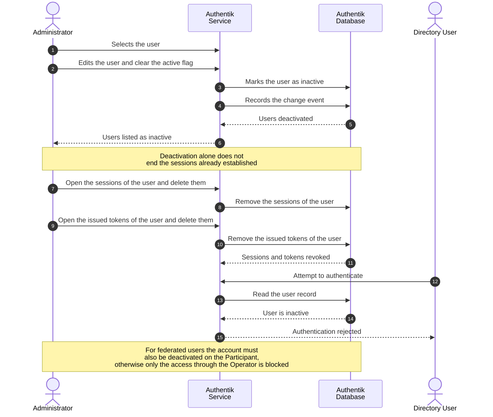

# User Deactivation

### Overview

Deactivation blocks authentication for a user while preserving the user record, its attributes and its group membership. Use deactivation instead of removal whenever the identity may need to be restored, or when audit records must retain a resolvable user.

For detail-oriented flow illustration, please consult [Sequence Flow](user-deactivation.md#sequence-flow).

### Procedure

1. Authenticate in Authentik Dashboard as `akadmin` , Administrator account which was created at [initial setup](../../infrastructure/user-management-package/deployment-steps/post-installation-steps.md#set-the-authentik-server-administrator-account).
2. Navigate to **Directory → Users** and select the user.
3. Select **Deactivate User**.

<figure><figcaption></figcaption></figure>

3. Revoke the credentials already issued to the user. On the user detail page:

| Tab                      | Action                                                                                 |
| ------------------------ | -------------------------------------------------------------------------------------- |
| **Sessions**             | Delete the active Authentik sessions of the user                                       |
| **OAuth Refresh Tokens** | Delete the refresh tokens issued to the user                                           |
| **Explicit Consent**     | Delete the consents granted by the user, if the application must request consent again |

### Verification

Check if Active flag for specific user is set to **No** like in the screenshot belo&#x77;**.**

<figure><figcaption></figcaption></figure>

### Notes

* Deactivation alone does not terminate access immediately. The provider issues access tokens with a validity of one hour and refresh tokens with a validity of 30 days. Access ends immediately only when the sessions and refresh tokens are revoked as described in step 4.
* **Federated users.** Deactivating the Operator shadow user prevents the user from accessing the OE Marketplace through the Operator, but it does **not** deactivate the account on the Participant Authentik. Conversely, deactivating the user on the Participant Authentik prevents new federated logins, but existing Operator sessions and refresh tokens remain valid until they are revoked. Deactivate on both sides, and revoke Operator sessions, when access must end immediately.
* To suspend all users of a Participant at once, disable the Participant OAuth Source instead of deactivating individual users. Navigate to **Directory → Federation and Social login**, select the Participant source, and disable it.

<figure><figcaption></figcaption></figure>

<figure><figcaption></figcaption></figure>

### Appendix

#### Sequence Flow

