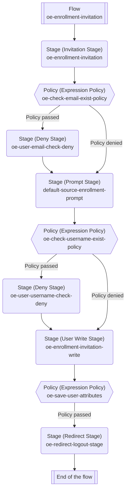

# User Enrolment in Authentik

### Table of Contents

* [Overview](./#overview)
* [Data Separation](./#data-separation)
  * [Administrator-controlled values](./#administrator-controlled-values)
  * [User-entered values](./#user-entered-values)
* [Appendix](./#appendix)
  * [Detailed Flow](./#detailed-flow)

### Overview

OE uses an invitation-based enrolment flow for controlled account creation.

The supplied enrolment design is split into two high-level steps:



#### Invitation flow

1. Creates an invitation flow in the Authentik User Interface authenticated as `akadmin` which was created at [initial setup](../../../infrastructure/user-management-package/deployment-steps/post-installation-steps.md#set-the-authentik-server-administrator-account).
2. Assigns user claims within the invitation object according to the Authentik instance type: a Data Space Operator Authentik or Data Space Participant Authentik.



#### Enrollment execution

1. Validates the invitation token sent as e-mail notification.
2. Reject enrolment if the email already belongs to an existing user.
3. Collect the user's account information.
4. Reject enrolment if the requested username already exists.
5. Create the Authentik user.
6. Store OE-specific user attributes.
7. Redirect the user to the OE application.




Enrolment flow requires e-mail notifications. Ensure organization has configured a SMTP server for sending an receiving e-mail notification from Authentik.


To visualise enrolment flow composition with Authentik objects, please consult [Detailed Flow](./#detailed-flow).&#x20;

### Data Separation

The invitation supplies organization-specific values. The user normally supplies only their account credentials.

#### Administrator-controlled values

* `email`
* `orgId`
* `walletId`
* `signerServer`
* `wellKnownUrl`
* `upstream_idp` - It must be explicitly set w<mark style="background-color:yellow;">hen enrolling a user on the Data Space Operator Authentik server. For users registered on the Participant Authentik server, it is automatically set.</mark>

#### User-entered values

* Username
* Full name
* Password
* Password confirmation

This separation prevents the enrolling user from arbitrarily choosing security-sensitive OE routing or wallet metadata.

### Appendix

#### Detailed Flow

