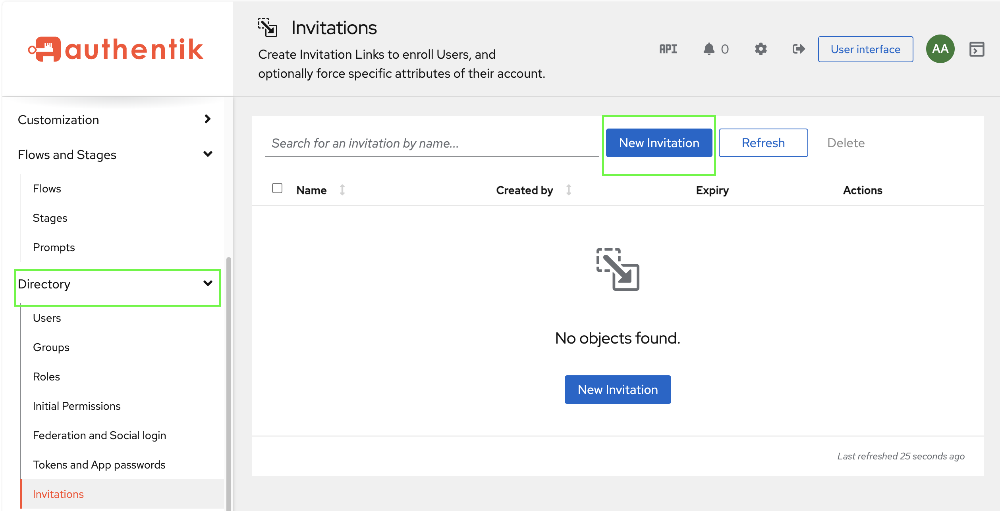
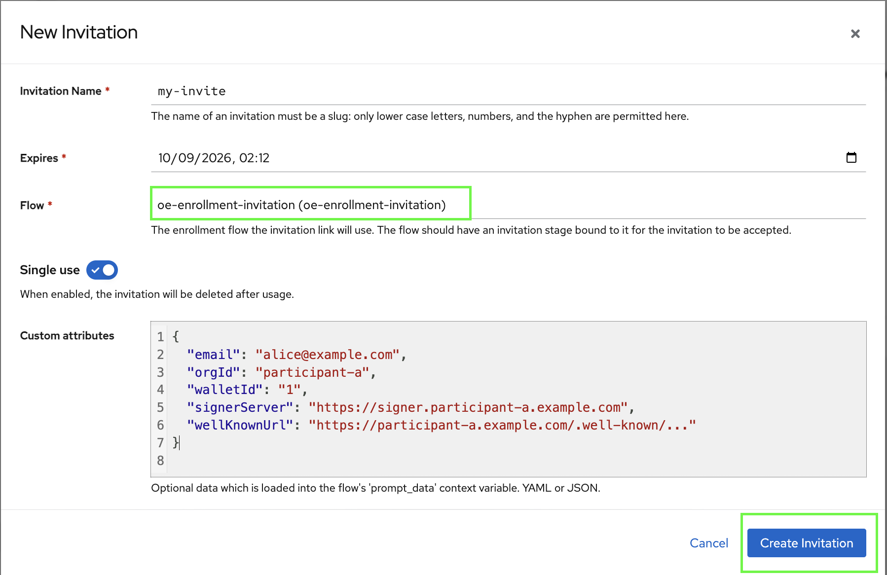
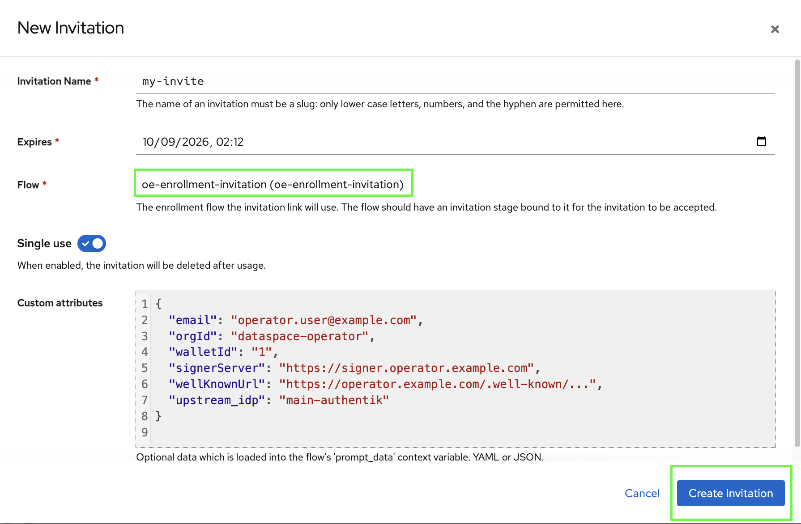

# Create an Invitation

### Prerequisites

Before creating an invitation, verify that the Authentik deployment contains the required enrollment resources.

For a Participant/IDP deployment, the blueprint should provide an invitation enrollment flow and a policy that saves OE attributes to the new user.

For the Operator deployment, the central Authentik blueprint must additionally support federated identity metadata and the central federated JIT enrollment flow.

### Procedure

1. Sign in to the target Authentik Admin Interface with an administrator account which was created at [initial setup](../../../../infrastructure/user-management-package/deployment-steps/post-installation-steps.md#set-the-authentik-server-administrator-account).
2. Navigate to: **Directory → Invitations**
3. Click **New invitation**.

<figure><figcaption></figcaption></figure>

4. Configure the invitation.

| Field          | Recommended value                                                                   |
| -------------- | ----------------------------------------------------------------------------------- |
| **Name**       | Descriptive operational name, for example `OE Participant User - alice@example.com` |
| **Flow**       | OE invitation enrollment flow configured by the blueprint                           |
| **Expires**    | Set according to the organization's onboarding policy                               |
| **Single Use** | Enabled/recommended for individual onboarding                                       |
| **Attributes** | Populate the OE user metadata described below                                       |

5. Add the user-specific custom attributes.

#### Data Space Participant Authentik invitation example

```json
{
  "email": "alice@example.com",
  "orgId": "participant-a",
  "walletId": "1",
  "signerServer": "https://signer.participant-a.example.com",
  "wellKnownUrl": "https://participant-a.example.com/.well-known/..."
}
```

<figure><figcaption></figcaption></figure>

#### Data Space Operator Authentik invitation example

```json
{
  "email": "operator.user@example.com",
  "orgId": "dataspace-operator",
  "walletId": "1",
  "signerServer": "https://signer.operator.example.com",
  "wellKnownUrl": "https://operator.example.com/.well-known/...",
  "upstream_idp": "main-authentik"
}
```


`upstream_idp` is primarily meaningful for federation. For a purely local Data Space Operator account, use it for Signer Server request authorisation and it is a required parameter.


<figure><figcaption></figcaption></figure>

6. Create the invitation.
7. Open the invitation and obtain the generated invitation URL.
8.  Deliver the invitation through an approved channel.

    If SMTP is configured, Authentik can send the invitation by email as highlighted within the orange rectangle. Otherwise, securely copy and distribute the unique invitation URL as illustrated within the green rectangle.

<figure><figcaption></figcaption></figure>

#### Enrollment behavior

When the user opens the invitation URL:

1. Authentik validates the invitation token.
2. Invitation attributes are loaded into the enrollment flow.
3. The user enters their username, full name, and password.
4. Authentik creates the account.
5. The OE enrollment policy copies the invitation values into the Authentik user attributes.
6. The user is redirected to the configured application.

#### Post-enrollment verification

Navigate to:

**Directory → Users → `<user>` → Custom Attributes** or **Directory → Users → `<user>` → Edit User → Advanced settings → Attributes**

<figure><figcaption></figcaption></figure>


Verify the expected values.

Example:

```json
{
  "orgId": "participant-a",
  "walletId": "1",
  "signerServer": "https://signer.participant-a.example.com",
  "wellKnownUrl": "https://participant-a.example.com/.well-known/..."
}
```

Then authenticate as the user and verify that the OIDC token contains the corresponding claims.

#### Troubleshooting

This section targets common occurred errors resolution for this procedure.&#x20;

It will be updated based on errors and issues encountered by organizations during deployment and operation.

| Symptom                                     | Checks                                                                                                                                        |
| ------------------------------------------- | --------------------------------------------------------------------------------------------------------------------------------------------- |
| Invitation link is invalid                  | Verify expiration, enabled status, and whether a single-use invitation has already been redeemed.                                             |
| Email already exists                        | Check whether the email is already assigned to another Authentik user. The documented OE enrollment flow can deny duplicate-email enrollment. |
| Username already exists                     | Select another username. The documented flow can deny duplicate usernames.                                                                    |
| User created but OE attributes are missing  | Verify the attribute-saving policy and the invitation custom attributes.                                                                      |
| Attributes exist but JWT claims are missing | Verify provider scope mappings and confirm that the client requests the required OE scopes.                                                   |
