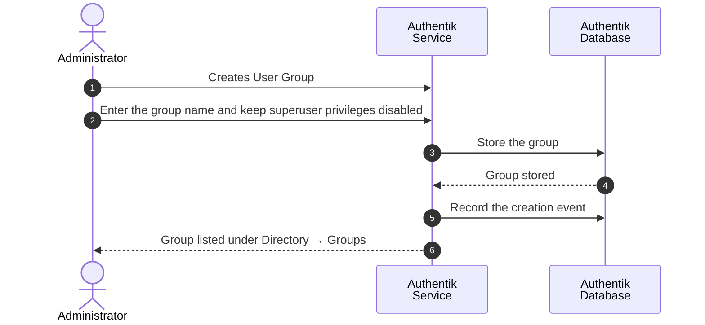

# Create Admin User Group

### Overview

Creating the Authentik group whose members are permitted to use the SSI Wallet UI.

The group is created in Authentik and then bound to the deployment through `NUXT_ADMIN_USER_GROUP_NAME`. Both steps are required: a group that exists only in Authentik grants no Wallet UI access, and a configured name that matches no group grants access to nobody.

For detail-oriented flow illustration, please consult [Sequence Flow](create-admin-user-group.md#sequence-flow).

### Procedure

1. Authenticate in Authentik Dashboard as `akadmin` , Administrator account which was created at [initial setup](../../../infrastructure/user-management-package/deployment-steps/post-installation-steps.md#set-the-authentik-server-administrator-account).
2. Access the Authentik interface and navigate to **Directory → Groups** and select **New Group** button.

<figure><figcaption></figcaption></figure>

3. Complete the group fields as described below.

| Field                  | Type    | Description                                                                                                                             |
| ---------------------- | ------- | --------------------------------------------------------------------------------------------------------------------------------------- |
| `Name`                 | string  | Name of the group. Emitted in the `groups` claim, and matched against `NUXT_ADMIN_USER_GROUP_NAME` for Wallet UI access.                |
| `Superuser privileges` | boolean | Grants Authentik administrative permissions to all members. Leave disabled unless the group is intended to administer Authentik itself. |

4. Select **Create**.&#x20;

<figure><figcaption></figcaption></figure>

### Verification

1. The group is displayed in the group list.

<figure><figcaption></figcaption></figure>

### Appendix

#### Sequence Flow

