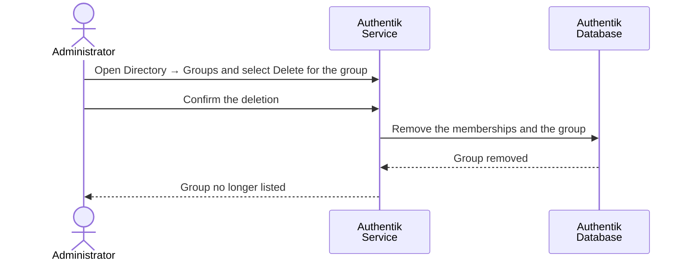

# Delete User Group

### Overview

Deleting a group removes the group and all of its memberships. The user records themselves are preserved.

For detail-oriented flow illustration, please consult [Sequence Flow](delete-user-group.md#sequence-flow).

### Procedure

1. Authenticate in Authentik Dashboard as `akadmin` , Administrator account which was created at [initial setup](../../../infrastructure/user-management-package/deployment-steps/post-installation-steps.md#set-the-authentik-server-administrator-account).
2. Navigate to **Directory → Groups** and select the checkbox of the group.
3. Select **Delete**.

<figure><figcaption></figcaption></figure>

### Verification

* The group is no longer listed under **Directory → Groups**.
* Former members are still listed under **Directory → Users**, without the deleted group.
* A newly issued token for a former member no longer contains the group in the `groups` claim.

### Notes

* If the deleted group was the group configured in `NUXT_ADMIN_USER_GROUP_NAME`, every former member loses access to the SSI Wallet UI. Create the replacement group and update the configuration before deleting the previous one.
* Tokens issued before the deletion keep the previous `groups` claim until they expire.

### Appendix

#### Sequence Flow

