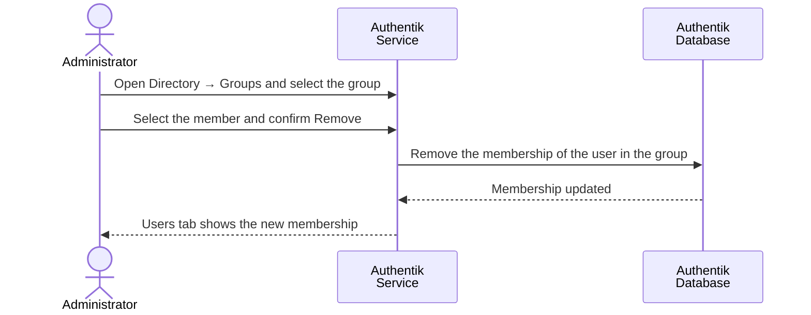

# Remove User from Group

### Overview

Group membership controls application level authorization, in particular access to the SSI Wallet UI.

For detail-oriented flow illustration, please consult [Sequence Flow](remove-user-from-group.md#sequence-flow).

### Procedure

1. Authenticate in Authentik Dashboard as `akadmin` , Administrator account which was created at [initial setup](../../../infrastructure/user-management-package/deployment-steps/post-installation-steps.md#set-the-authentik-server-administrator-account).
2. Navigate to **Directory → Groups** and select the group.
3. Open the **Users** tab.
4. To remove, select the member and select **Remove**, then confirm.

<figure><figcaption></figcaption></figure>


The same change can be made from **Directory → Users**, in the **Groups** tab of the user.


### Verification

* The membership change is visible in the **Users** tab of the group and in the **Groups** tab of the user.

<figure><figcaption></figcaption></figure>

* After the user authenticates again, the `groups` claim of the new token reflects the change.

### Notes

* Group membership is not federated. It must be assigned on the Data Space Operator shadow user of a Participant user.
* When authorization must change immediately, revoke the user's sessions and issued tokens from the **Sessions** and **OAuth Refresh Tokens** tabs of the user.

### Appendix

#### Sequence Flow

