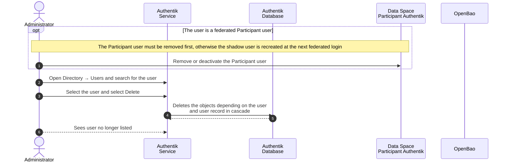

# User Removal

### Overview

User removal is an irreversible operation which deletes the user record together with its attributes, sessions, tokens, consents and source connections from Authentik database - PostgreSQL.

For detail-oriented flow illustration, please consult [Sequence Flow](user-removal.md#sequence-flow).

### Procedure

1. Authenticate in Authentik Dashboard as `akadmin` , Administrator account which was created at [initial setup](../../infrastructure/user-management-package/deployment-steps/post-installation-steps.md#set-the-authentik-server-administrator-account).
2. Navigate to **Directory → Users** and search for the user to be deleted.
3. Select the checkbox of the user, and select **Delete**.

<figure><figcaption></figcaption></figure>

### Verification

1. The user is no longer listed under **Directory → Users** after refresh.
2. Authentication with the user's credentials is rejected.

### Notes

*   **Removing a federated shadow user is not permanent.** The Participant OAuth Source is created with `user_matching_mode: identifier` and the JIT enrollment flow `oe-central-federated-jit-enrollment`, whose user write stage creates users when required. The next successful upstream authentication therefore creates a new shadow user with newly mapped attributes, and any authorization groups previously assigned to the shadow user are lost.

    To remove a Participant user's access permanently, remove or deactivate the user on the **Participant** Authentik instance first, then remove the Operator shadow user.
* **Pending invitations.** A user who has not yet completed enrollment has no user record. Revoke the access by deleting the invitation under **Directory → Invitations** instead.

### Appendix

#### Sequence Flow

