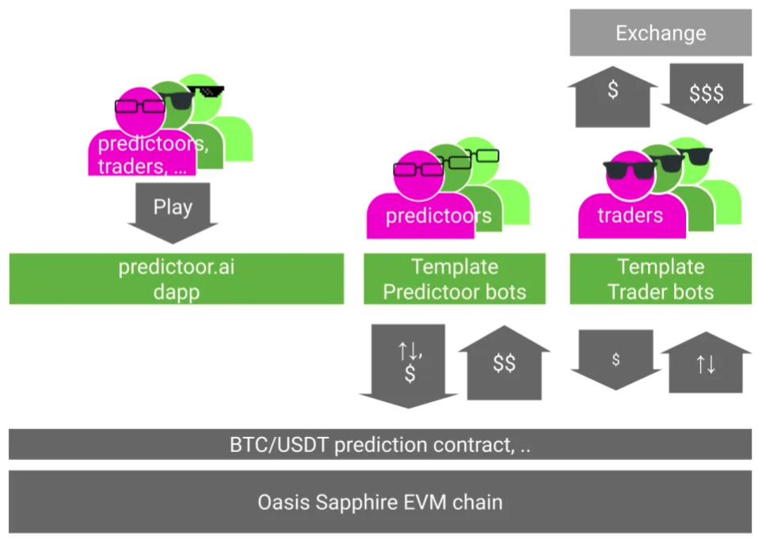
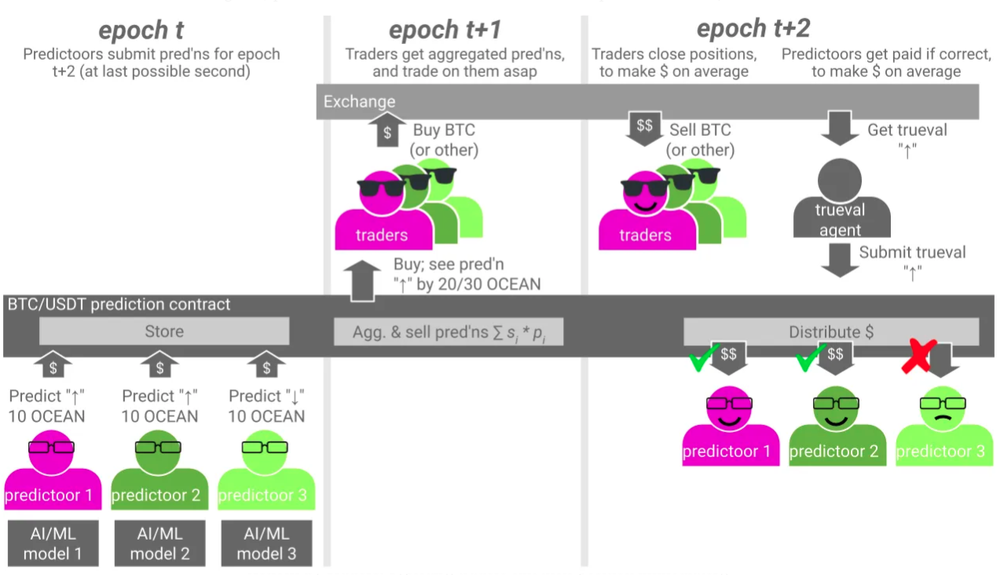
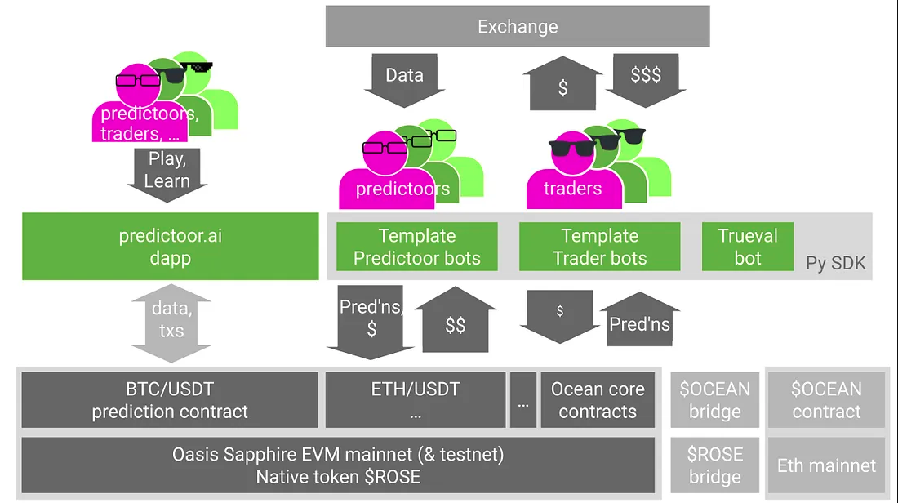

# Predictoor Architecture

Contents:
- [Predictoor Structure](#predictoor-structure)
- [Predictoor Behavior](#predictoor-behavior)
- [Privacy & Oasis Sapphire](#privacy-and-oasis-sapphire)
- [Software Implementation](#software-implementation)
- [Backend & Contract Details](#backend-and-contract-details)

## Predictoor Structure

The image below gives an overview of Predictoor structure.

In the image top left, predictoors, traders, or anyone play with predictoor.ai to build an understanding how predictoor works. One feed is free; the rest are available for purchase. At first, only the free feed is visible. Users can connect their web3 wallet and buy another feed.

In the image top middle, predictoors graduate to building & deploying Python "Template Predictoor bots" (agents), which submit predictions every 5 minutes. Now, predictoors can see how to make revenue from making predictions, with plenty of room to improve AI/ML modeling accuracy and make more \$.

<figure><figcaption>Predictoor Structure</figcaption></figure>

In the image top right, traders graduate from predictoor.ai to building & deploying Python "Template Trader bots" (agents), which grab the latest prediction every 5 minutes, as soon as it's available, then trade using that prediction (and other info). Now, Traders can see how to make \$ from buying predictions, with plenty of room to improve trading strategy and make more \$.

In the image bottom is the Oasis Sapphire chain, with Predictoor feed contracts deployed to it. There's one contract deployed for each {pair, exchange, timescale} such as {ETH/USDT, Binance, 5m}.

## Predictoor Behavior

We just covered Predictoor structure. Let's now layer on some Predictoor behavior, with the help of the image below. We'll walk through actions by Predictoors and Traders related to predictions for time slot "epoch t+1", and show how they make \$. 

We assume predictions on BTC, and where epoch t ends at 5:00pm, t+1 ends 5:05pm, and t+2 ends 5:10pm. We assume that Traders already purchased a subscription via predictoor.ai, Python, or otherwise. When we discuss an action by a Predictoor or Trader, we recognize that it's typically executed by their agent (bot).

**Epoch t.** This is left 1/3 of the image. It starts at 4:55pm and ends at 5:00pm. Predictoor 1 (pink) predicts that BTC close price for epoch t+1 will be higher ("↑") than close price for epoch t. He submits a tx to that chain with that prediction, and some OCEAN stake of his choice (higher stake = more confident). Predictoor 2 (dark green) does the same. Predictoor 3 (light green) predicts "↓" and stakes. The chain stores these prediction values, privately.

<figure><figcaption>Predictoor Behavior</figcaption></figure>

**Epoch t+1.** The middle 1/3 of the image covers epoch t+1. It starts at 5:00pm and ends at 5:05pm. The BTC Predictoor contract computes the aggregated predicted value (agg_predval) as stake-weighted sum across individual predictions.

> agg_predval = (stake1 x predval1 + stake2 x predval2 + …) / (stake1 + stake2 + …)

The contract then makes agg_predval visible to its subscribers. The predicted value is the stake-weighted sum across predictions. Smart traders may take the information and act immediately. A baseline strategy is "if it predicts ↑ then buy; if it predicts ↓ then sell or short".

**Epoch t+2.** This is the right 1/3 of the image. It starts at 5:05pm and ends at 5:10pm. Both traders and trueval agent take action (and, predictoors get paid).

- **Actions by Traders.** Typically, traders exit their position immediately, exactly 5 minutes since they got the 5-minute-ahead prediction and acted*. If the prediction feed was accurate enough and trading fees & slippage weren't too high, then the trader makes money on average.

- **Actions by Trueval agent; predictoors get paid.** The trueval agent is a process that grabs price feeds from e.g. Binance and submits it to chain, inside the smart contract*. The "submit" transaction also takes the opportunity to calculate each Predictoor's reward or slashing, and update their OCEAN holdings in the contract accordingly. (Funds aren't sent per se, they're made available via ERC20 "approve", for the predictoor to transfer at some later point). Predictoor 3 got his OCEAN slashed because he was wrong; predictoors 1 and 2 receive that as income, in addition to receiving income from prediction feed sales to traders. Predictoors can claim their balance anytime.

## Privacy and Oasis Sapphire
Predictoor needs privacy for:
- Submitted predictions
- Compute aggregate predictions; and
- Aggregated predictions — only subscribers can see

This could all be done on fully-centralized infrastructure. But doing so would fail on our other goals: **being globally distributed, censorship resistant, and non-custodial**.

Targeting these needs, we researched & prototyped many privacy technologies. [Oasis Sapphire](https://oasisprotocol.org/sapphire) emerged as the best choice because, as the only privacy-preserving EVM chain in production, it could handle these needs cleanly end-to-end.

## Software Implementation
Most of [predictoor.ai](https://predictoor.ai) dapp is implemented in the [pdr-web repo](https://github.com/oceanprotocol/pdr-web), with help from [pdr-websocket](https://github.com/oceanprotocol/pdr-websocket/) to fetch feed data and [Ocean Aquarius](https://github.com/oceanprotocol/aquarius) for metadata caching.

The template Predictoor bots, trader bots, trueval bot, and prediction feed publishing are all in the [pdr-backend repo](https://github.com/oceanprotocol/pdr-backend). Contracts are in the Ocean [contracts](https://github.com/oceanprotocol/contracts) repo.

Events emitted by contracts are indexed as Ocean subgraphs, to be consumed by predictoor.ai and the bots. The backend [subgraph README](https://github.com/oceanprotocol/pdr-backend/blob/main/READMEs/subgraph.md) has more info.

## Backend and Contract Details
The section [Predictoor Structure](pdr-intro.md) presented much of the Predictoor architecture.  

The image below adds detail around the backend (bottom 1/3 of diagram). Let’s discuss.

<figure><figcaption>Details of Predictoor Structure (Architecture)</figcaption></figure>

**Smart Contracts.** There’s one Predictoor contract for each prediction feed, at each exchange/timescale: BTC/USDT at Binance/5m, ETH/USDT at Binance/5m, and so on. Each contract is an Ocean datatoken contract, with a new template for prediction feeds. 

The implementation is in templates/ERC20Template3.sol at at [Ocean’s contracts repo](https://github.com/oceanprotocol/contracts). It implements ERC20, Ocean, and Predictoor-specific behavior as follows.  

**- ERC20 behavior.** It implements the ERC20 interface and therefore plays well with ERC20-friendly crypto wallets, DEXes, etc.  

**- Ocean behavior.** Being part of Ocean, having 1.0 datatokens means you can access the underlying data asset for the duration of the subscription (once you’ve initiated the order). For Predictoor contracts this is 24h. Each datatoken contract has a parent Ocean data NFT with metadata, means to specify & collect fees, and more.  

**- Predictoor behavior.** Each datatoken contract has additional methods specific to Predictoor: submitting predictions, submitting truevals, computing aggregated predictions, etc.

----

_Next: [How to earn](pdr-earn.md)_

_Back: [Introduction](pdr-intro.md)_

