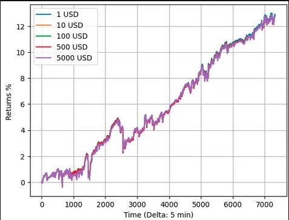

# How to Earn

## How to Earn as a Predictoor
If you have background in AI, ML, data science or statistics (and these overlap!) then you’re well suited to become a predictoor to make \$.

<figure></figure>

Typical steps as a Predictoor:
1. **Play with predictoor.ai.** Go to [predictoor.ai](https://predictoor.ai) to build intuition: observe the free feed, perhaps buy a few feeds, and watch them change over time.
1. **Do Challenge DF: one-off predictions.** Then, practice making accurate AI/ML based predictions via [Challenge Data Farming](https://df.oceandao.org/challenge-df). Submissions are due Wednesdays at midnight, for ETH price predictions 5 min, 10 min, …, 60 min ahead. Every week, 5000 OCEAN prize money is distributed to the three lowest-error submissions.
1. **Run a predictoor bot: continuous predictions.** Follow the steps in the [Run a Predictoor Bot README](https://github.com/oceanprotocol/pdr-backend/blob/main/READMEs/predictoor.md). You’ll start by deploying a bot locally that submits a random prediction every 5 minutes. Then you’ll add AI/ML model predictions. Then you’ll do it on a remote testnet staking fake OCEAN. Finally, you’ll do it on mainnet staking real OCEAN.
1. **Optimize the bot.** Improve model prediction accuracy via more data and better algorithms. Extend to predict >1 prediction feeds (Predictoor has many). Wash, rinse, repeat.  

The actions as a predictoor give the following ways to earn:  
* **Feed sales.** At an epoch, sales revenue (minus fees) for that epoch goes to predictoors. It’s distributed pro-rata by stake among the predictoors who predicted the true value correctly. The revenue for an epoch is the fraction of sales, spread uniformly across subscription length. A price of 3 OCEAN, 5m epochs, and 24h (1440m) subscriptions gives a revenue of (# subscribers) * (3 OCEAN) * / (1440m / 5m).
* **Stake reshuffling.** At an epoch, incorrect predictoors have their stake slashed. This slashed stake is distributed to the correct predictoors pro-rata on their stake.
* **Predictoor DF.** The third phase of Predictoor rollout will have an incentives program that amounts to additional earning for predictoors. 37,000 OCEAN/week rewards.
Don’t expect to be 100% accurate in your up/down predictions. Marginally better than 50% might be enough, and be skeptical if you’re greatly above 50%, you probably have a bug in your testing.
[Learn more about Predictoor DF](/rewards/df-predictoordf.md)

Predictoors can earn even more, via complementary actions:
* **[Challenge DF](../rewards/df-intro.md#what-is-challenge-df).** Predict accurately for weekly prizes. 

Every week there’s [150,000 total OCEAN rewards](../rewards/df-intro.md#reward-schedule) for Ocean Data Farming. This will increase in early 2024, and more yet later.


You will lose money as a predictoor if your \$ out exceeds your \$ in. If you have low accuracy you’ll have your stake slashed a lot. Do account for gas fees, compute costs, and more. Everything you do is your responsibility, at your discretion. None of this blog is financial advice.


## How to Earn as a Trader

You can make \$ by buying prediction feeds, and using it as an input — as “alpha” — to your trading approach.

<figure></figure>

Typical steps as a Trader:
1. **Play with dapp, and trade.** First, go to [predictoor.ai](https://test.predictoor.ai/) to build intuition: observe the free feed, perhaps buy a few feeds, and watch them change over time. In a second window, have Binance open. Employ a baseline trading strategy: when a new Predictoor prediction pops in, buy if “↑”, and sell or short if “↓”; exit the position 5 min later.  
1. **Run a trader bot.** Follow the steps in the [Trader README](https://github.com/oceanprotocol/pdr-backend/blob/main/READMEs/trader.md). You’ll start by deploying a bot locally that follows the baseline trading strategy: when a new Predictoor prediction pops in, it buys if “↑”, and sells if “↓”. Then you’ll do it on a remote testnet with fake tokens. Finally, you’ll do it on mainnet with real tokens on a real exchange.  
1. **Improve & extend.** Improve trading performance via more sophisticated trading strategies. This is a universe all of its own! Extend to >1 prediction feeds (Predictoor has many). Wash, rinse, repeat.  

The actions as a trader offer a single yet powerful way to earn: **trading revenue.** Buy low and sell high! (And the opposite with shorting)  

Traders can earn even more via a complementary action: **[Volume DF](../rewards/df-intro.md#what-are-active-rewards).**. Lock veOCEAN for OCEAN, then point the veOCEAN to data assets with high DCV. Predictoor feeds are great candidates for high-DCV assets.  

⚠️ You will lose money trading if your \$ out exceeds your \$ in. Do account for trading fees, order book slippage, cost of prediction feeds, and more. Everything you do is your responsibility, at your discretion. None of this blog is financial advice.  

## How to Earn as a Data Farmer

Even if you’re not active as a predictoor or a trader, you can earn nonetheless.

* **[Passive DF](../rewards/df-intro.md#what-are-passive-rewards).** By simply locking your OCEAN for veOCEAN, you can earn passive rewards.  
* **[Volume DF](../rewards/df-intro.md#what-are-active-rewards).** Point the veOCEAN to data assets with high data consume volume (DCV). Predictoor feeds are great candidates for high-DCV assets (Predictoor assets are a good choice).  

## Early Earnings Benchmarks

Predictoor aims to make it easy for people to make \$ doing predictions (as predictoors), and taking actions against those predictions (as traders).

Before we started building Predictoor, we first asked: _can we predict ETH (etc) up/down with accuracy?_ Then we conducted intensive AI/ML research towards this question. The results of this investigation were positive 😎. TBH, we were surprised at the degree of market inefficiency.

Our next question was: _with these predictions, can we make \$ trading?_ Again, we conducted intensive AI/ML research, and again found positive results 😎😎.

Here we share some results of that research — a glimpse of how deep the rabbit hole goes — to inspire would-be predictoors and traders in their own work. The model was trained on data from January 1, 2021 to June 30, 2023, with simulated results the first 24 days of July 2023. A “baseline” trading strategy was used:

The image below shows simulated returns as a function of order size, for BTC/USDT on Binance. Duration = 7000 ticks x 5m/tick = 24.3 days of trading. It simulates spread effects. It assumes 0% fees. Note how the size of the order affects the return. This is because BTC/USDT is not very liquid; therefore larger amounts cause slippage.

Simulated returns vs time of BTC/USDT trading on Binance. Trade size has an impact.
The image below has the same experimental setup, but for BTC/USDT pair. The size of the order does not affect the return, because BTC/USDT is more liquid than BTC/USDT.

<figure><figcaption>Simulated returns vs time of BTC/USDT trading on Binance. Trade size has little impact.</figcaption></figure>
