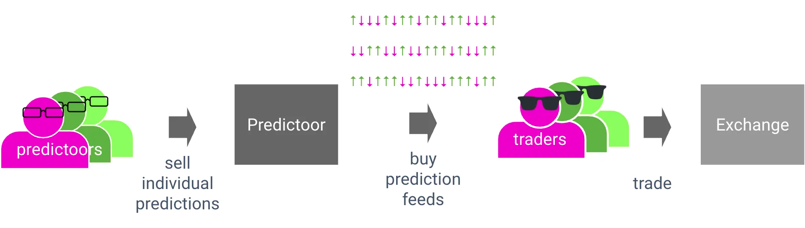
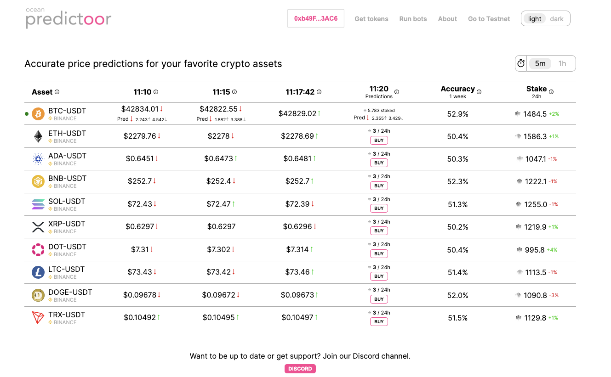

# Motivation: Why Predictoor?

[Prediction is intelligence](https://www.explainablestartup.com/2017/06/why-prediction-is-the-essence-of-intelligence.html), artificial or otherwise. We dream of a world of 10,000 truly accurate prediction feeds, for everything from rain forecasts to sea level rise, or traffic congestion to ETH price. [Ocean Predictoor](https://predictoor.ai/) is an on-chain, privacy-enabled, AI-powered application and stack that is bringing this dream to reality.

**Accurate predictions are valuable.** With them, one can take action and create value. Conversely, inaccurate predictions lead to disaster. Predictions have value because they're the [final step in a data supply chain](https://blog.oceanprotocol.com/the-data-value-creation-loop-68e23575be02), right before action is taken by the user.

**Prediction feeds** are a stream of predictions for a given time series. This could be predicting the price of ETH every 5 minutes, or the sea temperature daily. A feed may be binary, i.e. whether a time series changes up or down: ↑↓↓↓↑↓↑↑. Accurate prediction feeds are valuable.

Alas, accurate predictions are *hard*. Worse, typical prediction feeds have no accountability on accuracy. If the weatherman says "no rain for today" and then it rains, a farmer could get stuck in the mud, wrecking a portion of his crops. The weatherman doesn't feel the impact of wrong predictions, but the farmers sure care! 

**Accountable Predictions** - Imagine if there was accountability. Accuracy would go up; the farmer would be stuck less. Imagine accountable prediction feeds for not only for rain, but also wind, sea temperature, road congestion, train delays, ETH prices, NVID prices, housing prices, and more. **Imagine tens of thousands of prediction feeds with accountable accuracy.** Imagine them **globally distributed**, and censorship resistant. Imagine **accuracy improving with time**. 

# What's Predictoor?

**Ocean Predictoor is a stack and a dapp for prediction feeds.** It has accountability for accuracy, via staking. It’s globally distributed and censorship-resistant, by being on-chain. We expect its accuracy to improve over time, due to its incentive structure. Its first use case is DeFi token prediction because users can [close the data value-creation loop](https://blog.oceanprotocol.com/the-data-value-creation-loop-68e23575be02) quickly to make tangible \$.

<figure><figcaption>Conceptual overview of Predictoor</figcaption></figure>

**Prediction feeds are crowd-sourced. "Predictoor" agents submit individual predictions and stake on them.** They make money when they're correct and lose money when not. This drives accurate prediction feeds, because only accurate predictoors will be making \$ and sticking around.

**“Trader” agents buy aggregate predictions,** then use them to take action like buying or selling. The more accurate the predictions, the more easily they make \$, the longer they stick around to keep buying prediction feeds from trading profits.

**Predictoor is built on the Ocean Protocol stack**, including contracts for tokenized data and middleware to cache metadata. To keep predictions private unless paid for, Predictoor uses **[Oasis Sapphire](https://oasisprotocol.org/sapphire)** privacy-preserving EVM chain.

**The initial dapp is live at [predictoor.ai](https://predictoor.ai).** It’s for up/down predictions of BTC, ETH, and other tokens’ prices. The dapp helps users build a mental model of Predictoor behavior. Predictoors and traders’ main workflow is to do run predicting / trading bots with the help of the Py SDK. We have seeded Predictoor with bots that have AI/ML models of accuracy comfortably above 50% — a precondition to make \$ trading.

<figure><figcaption>Screenshot from predictoor.ai</figcaption></figure>

----

_Next: [Architecture](pdr-architecture.md)_

_Back: [Predictoor Docs main](README.md)_
